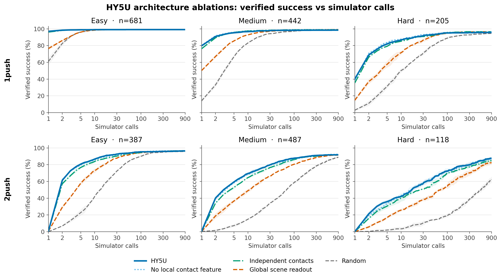
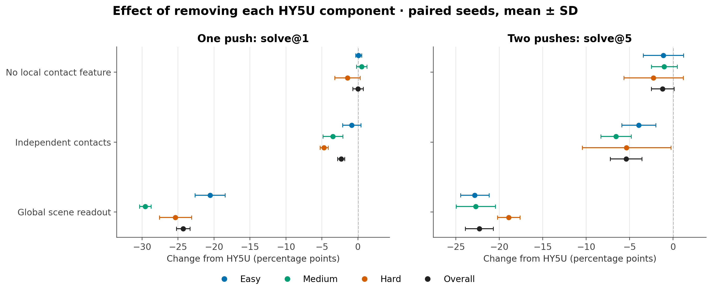
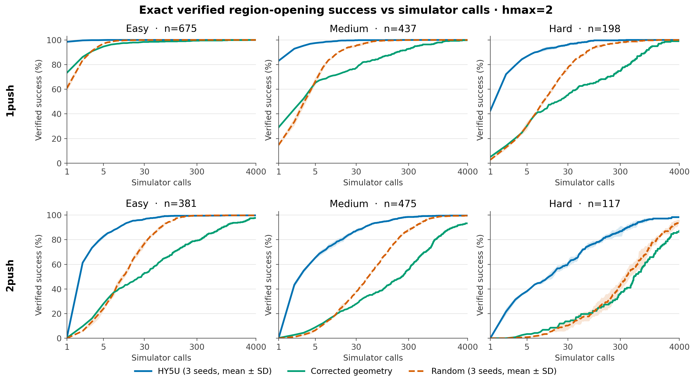
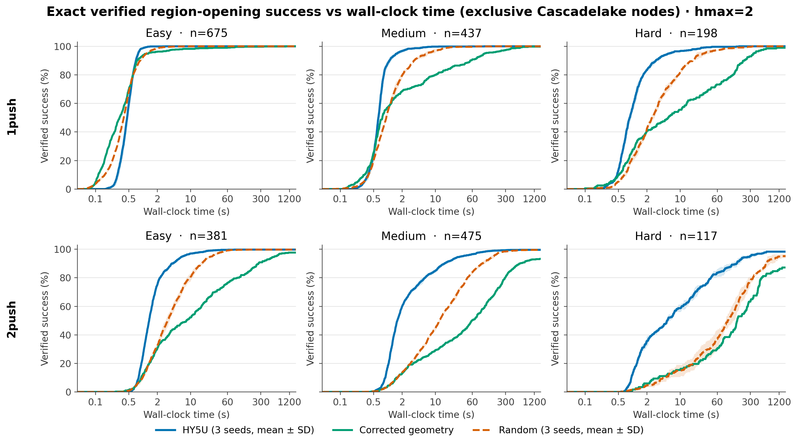
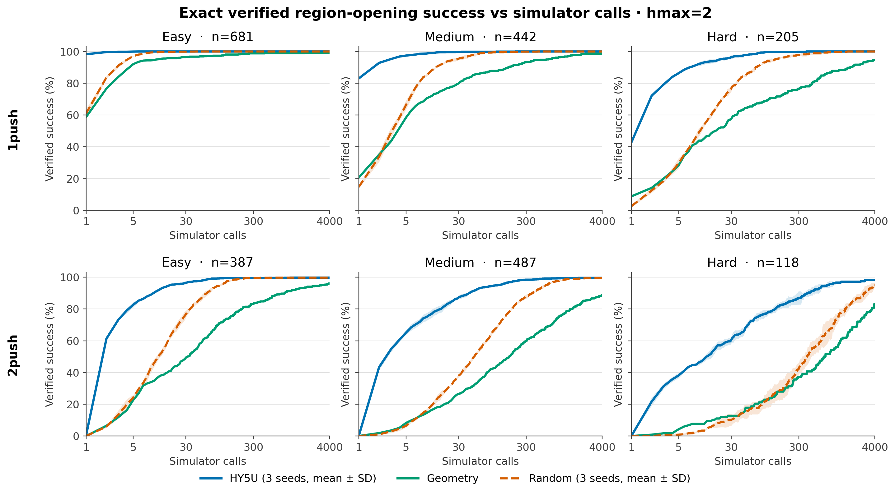
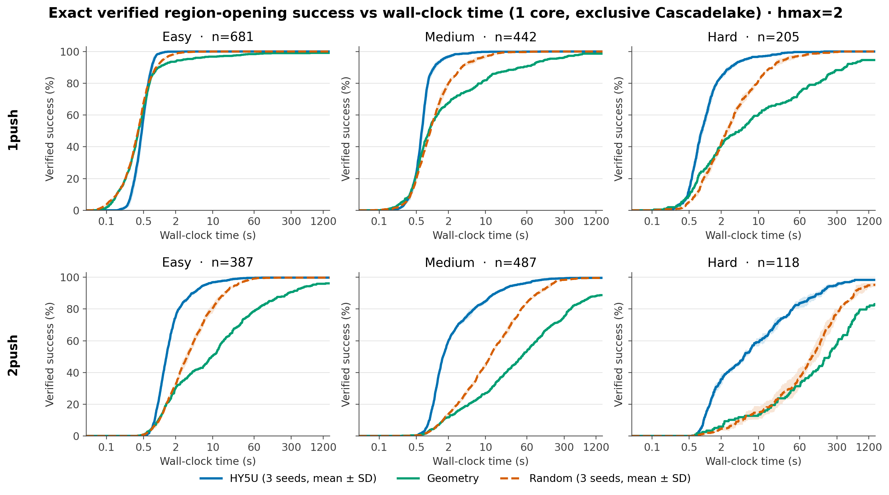
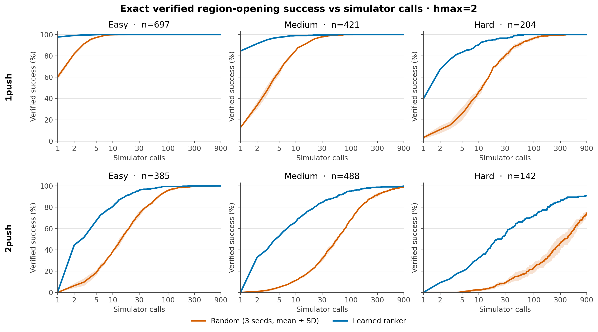
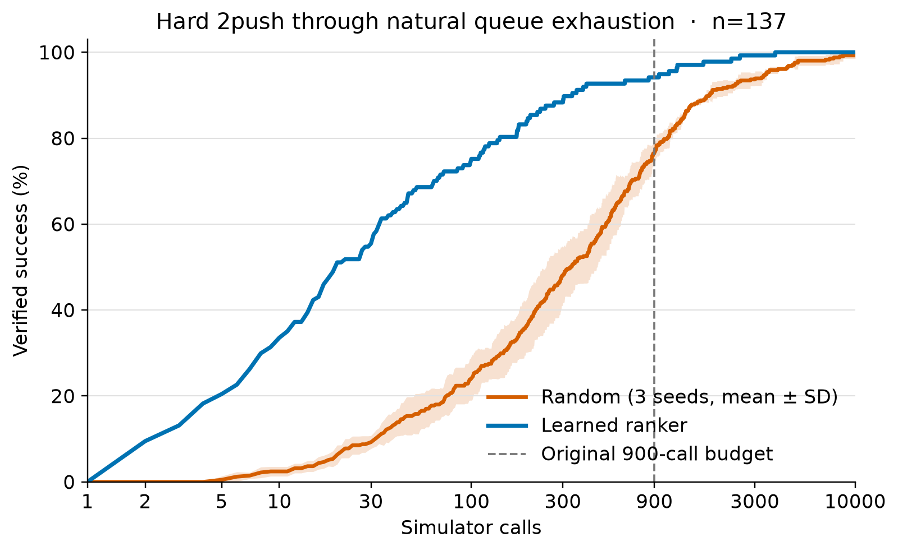

# Results — DAgger curriculum training framework

The maintained approach. A clean seed, then rounds of **{ generate fresh scenes → screen with the current model → keep its mistakes → label → accumulate → retrain → eval }**, laddering **1-push → 2-push → …** (Ant-Man → Beast → …). Each stage's model also produces the *next* stage's dataset for free (screened-dead scenes become the multi-push bank).

**Setting:** CAR robot, testset `namo_testset_v1`, region-opening criterion. Every result split by **difficulty (easy/med/hard)**. Difficulty is defined *per horizon* (compare within a horizon, not across): **1-push** = `solve_rate` fixed cuts (hard < 0.05 / med 0.05–0.30 / easy ≥ 0.30); **2-push** = exhaustive-GT setup density with the same fixed percentage cuts, with the two unfinished GT roots reported as unknown. Full per-experiment detail lives in each card under `log/`.

**Archive:** the pre-curriculum line — horizon-Q / NoHz single-ranker, RL-only self-imitation, horizon-role probe, prior-work ledger — is preserved verbatim in [archive/RESULTS_pre_dagger_horizonq_2026-07.md](archive/RESULTS_pre_dagger_horizonq_2026-07.md).

---

## 📒 CHANGE LEDGER — one line per change, with its verdict [added 2026-08-12]

The scannable cross-campaign index: **what we changed, why, and whether it helped.** Deep per-change detail (numbers, autopsies, pre-registrations) stays in the card named on each row — this table is a map, not a replacement. Cards are never merged; provenance lives with the original question.

**Reading rule:** verdicts are against each change's OWN control, not the global best, and a "neutral" is often the finding (proving something is unnecessary is a result). Metric basis differs by era — see each card; the common-episode caveat below applies to any cross-campaign comparison.

| date | change | why | verdict | card |
|---|---|---|---|---|
| 07-22 | push-depth-aware final-pose head | represent all 60×5 pushes with pose-aware depth | ❌ negative (3 seeds) | [push-depth-aware](log/EXP-2026-07-22-push-depth-aware-ranker.md) |
| 07-22 | exact-value ranking loss (verified setups outrank known-worse) | teach order, not magnitude | ✅ positive — split-budget variant adopted | [exact-value-ranking](log/EXP-2026-07-22-exact-value-ranking-loss.md) |
| 07-23 | crop-relative motion + Fourier depth identity | geometric grounding of the depth axis | ❌ negative (3 seeds) | [depth-token](log/EXP-2026-08-02-depth-token-push-motion.md) |
| 07-24 | failure-discount best-first (`--discount conf --tau 0.15`) | demote a board's siblings when its child fails | ✅ ADOPTED — s2s 46→27.8 | [failure-discount](log/EXP-2026-07-24-failure-discount-search.md) |
| 07-26 | drop the deploy sigmoid; `--combine q` | the inference sigmoid crushed the trained value scale | ✅ adopted — ordering unaffected, q beats blend on every tier | [scorer-scale](log/EXP-2026-07-26-scorer-scale-and-combine-mode.md) |
| 08-02 | five-depth local attention | better shortlist recall | ⚠️ mixed — recall up, single ranker regressed | [depth-token](log/EXP-2026-08-02-depth-token-push-motion.md) |
| 08-02 | bootstrap value loop (fitted-Q/ExIt, arms A/B/Bfix/BNG) | guess values for censored cells, iterate | ⚠️ mixed — BNG became the standing champion; loop hit its stop-rule at round 2 | [bootstrap-loop](log/EXP-2026-08-02-bootstrap-value-loop.md) |
| 08-08 | hard labels — exact zeros instead of ceilings (AJ2) | give the model a floor it never had | ⚠️ neutral on V5 (0.533 vs 0.543); AJ2 became the deploy control | [arjuna](log/EXP-2026-08-08-arjuna-hard-labels.md) |
| 08-09 | **XB** — batch-flat cross-board softmax | per-board softmax is shift-invariant; nothing supervises across boards | ⚠️ mildly positive, wrong mechanism (V5 flat; gain was finish ordering) | [crossboard](log/EXP-2026-08-09-crossboard-ranking.md) |
| 08-09 | **RP** — delete regression entirely | is the value head needed when deploy consumes order only? | ⚖️ neutral = the finding — regression is scaffolding | [crossboard](log/EXP-2026-08-09-crossboard-ranking.md) |
| 08-09 | **MM** — margin-vs-max hinge (batch-flat) | softmax CE stalls at its floor; a hinge cannot | ✅ positive — best early curve of its round | [crossboard](log/EXP-2026-08-09-crossboard-ranking.md) |
| 08-09 | **EG** — softmax over the episode family | V5's pair almost never co-occurs in a random batch | ✅ positive — best mid-curve | [crossboard](log/EXP-2026-08-09-crossboard-ranking.md) |
| 08-09 | **EGMM** — margin-vs-max within the family | the deploy duel written as a loss | ⚠️ mixed — only robust offline V5 mover, worst front curve | [crossboard](log/EXP-2026-08-09-crossboard-ranking.md) |
| 08-10 | **RPG / RPEG** — unanchored family softmax | grid completion | ❌❌ strongly negative — the grind law | [crossboard](log/EXP-2026-08-09-crossboard-ranking.md) |
| 08-10 | **RPL → RPL2** — unbounded head, margin 1.0 then 0.2 | is boundedness binding? | ⚖️ neutral once the margin was sized in σ — boundedness is a free choice | [crossboard](log/EXP-2026-08-09-crossboard-ranking.md) |
| 08-10 | **RPEA** — binary plates on openers/dead | absolute down-force on dead champions | ⚖️ null — **and the QED**: anchors cannot separate what features cannot distinguish → data is the only door | [crossboard](log/EXP-2026-08-09-crossboard-ranking.md) |
| 08-11 | **family corpus (EGMMF)** — +1.045M child boards | 94% of deploy pops are children; training had 16% | ⚠️ pivotal mixed — **V5 wall fell 0.455→0.682**, but 1-push cratered 38→24.7 | [crossboard](log/EXP-2026-08-09-crossboard-ranking.md) |
| 08-11 | **R1 / R2 / G2** — root rebalance × proven labels (2×2) | isolate the crater's cause | ❌ both rejected — exposure worth +4, label truth moved V6 only | [crossboard](log/EXP-2026-08-09-crossboard-ranking.md) |
| 08-12 | *(diagnosis)* per-board label census | why did the 2×2 fail? | 🔍 **opener-bearing root fraction** (49-55% family vs 73-76% old) predicts 1-push; roots are 95-98% labeled everywhere | [crossboard](log/EXP-2026-08-09-crossboard-ranking.md) |
| 08-12 | **{0, 0.5, 1} ladder** [USER] | opener-setup gap (0.1) was smaller than the hinge margin (0.2) | ✅ positive, corpus-dependent — +5.9 1-push on family0 with V5 held | [crossboard](log/EXP-2026-08-09-crossboard-ranking.md) |
| 08-12 | **HY / HY5** — hybrid corpus (old roots + family children) | supply both ingredients instead of trading them | ✅✅ strongly positive — 1p **42.1**, @900 **96.3**, V5 0.690 held | [crossboard](log/EXP-2026-08-09-crossboard-ranking.md) |
| 08-12 | **HY5U** — unreachable cells as exact zeros (regression only, w=0.1) [USER] | deploy never scores unreachable pushes; teach the geometry for free | ✅✅ **largest single gain of the campaign** — wins every column; @5 31.1→**39.5** closed the early-curve gap | [crossboard](log/EXP-2026-08-09-crossboard-ranking.md) |
| 08-12 | *(method)* common-episode aggregation | family-era and BNG-era evals scored **different episode lists** | 🔧 fix — cross-campaign numbers shift 1-7 pts; use `aquaman_agg_common.py` for any cross-era claim | [crossboard](log/EXP-2026-08-09-crossboard-ranking.md) |
| 08-13 | unreachable-rule **dose sweep** (w = 0.1 / 0.3 / 1.0) | is 0.1 underdosed? | ⚖️ **0.1 near-optimal, effect non-monotone** — 1.0 regresses toward the no-rule baseline | [crossboard](log/EXP-2026-08-09-crossboard-ranking.md) |
| 08-13 | unreachable rule on the **old corpus** (AJ2U) | is it a general training fix or hybrid-specific? | ❌ **does not transfer** — solve rates flat; only sims-to-solve improves (114→80). Rule belongs with child-heavy corpora | [crossboard](log/EXP-2026-08-09-crossboard-ranking.md) |
| 08-13 | **deep budget: 4000 simulator calls** (model ×3 vs random ×3, both re-run under identical settings) | does the model just solve MORE, or solve FASTER? | 📊 **efficiency, not capability** — at 4000 calls hard-tier solve rates converge (model 100.0 vs random 97.2, vs a 30-point gap at 900); the durable claim is **6.6× fewer calls on hard (mean) / 39× (median), paired on episodes both solved** — an earlier 7.2× was inflated by charging unsolved episodes the full ceiling | [crossboard](log/EXP-2026-08-09-crossboard-ranking.md) |
| 08-13 | **wall-clock campaign at 4000 calls** (model ×3 vs random ×3, exclusive single-generation nodes) | does the simulator-call advantage survive in SECONDS? | ⏱ **mostly, on 2push** — hard 2push 10.9× on the MEDIAN INSTANCE (per-RO-instance speed-up, the canonical statistic; slower on 5.9% of instances); hard 1push 3.71×; easy 1push a tie (1.03×). Scoring overhead is minor (3.7% on hard 2push); the real leak is that the model's calls cost 1.25-1.5× more each, so **call-count flatters the model** | [crossboard](log/EXP-2026-08-09-crossboard-ranking.md) |
| 08-13 | *(validity)* train/test leakage audit | HY5U's numbers needed a held-out guarantee | ✅ **clean** — 0 of 978 two-push test rooms and 0 of 1012 test episodes appear in hybrid training (full-path match; 5-component suffix matching gives a false 62% and must not be used for leak checks) | [crossboard](log/EXP-2026-08-09-crossboard-ranking.md) |
| 08-21 | **fixed-physics v3 canonical evaluation** — HY5U ×3 vs random ×3 | replace every stale v1 comparison with a complete-population v3 baseline | ✅✅ HY5U wins the tight search regime on every tier; hard 2push @5 **35.9 vs 2.0**, @900 **87.6 vs 62.2** | registry: `hy5u-nodiscount-hmax2-v3` / `random-nodiscount-hmax2-v3` |
| 08-22 | **HY5U as a policy** — zero search, greedy argmax, out to 30 calls [USER] | what is the ranker worth with the queue switched off | ✅ policy **leads to ~5 calls** (2push all @5 **75.7 vs 73.4**) then **saturates**; search passes at 10 and finishes **89.7 vs 82.9** @30. Crossover is the engineering answer. Two harness bugs found and fixed | [policy-mode](log/EXP-2026-08-22-policy-mode-hy5u.md) |
| 08-29 | **geometry-only best-first baselines** — legacy single-path proxy, then corrected target-region reachability | can a proper model-free geometric method beat random ordering? | ❌ **full timed run confirms rejection** — geometry briefly beats random at one call (1push **48.2 vs 36.6**) and five calls (2push **15.7 vs 12.6**), but loses by 30 calls (**84.8 vs 95.0**, **36.0 vs 49.7**) and by five seconds (**82.1 vs 93.2**, **30.4 vs 40.7**); HY5U remains far ahead | registry: `geometric-region-walltime-4000-v3` / `geometric-walltime-4000-v3` |
| 09-04 | **HY5U component ablations** — no unreachable supervision, no family loss, regression only, and independent contacts | identify which parts of the ranker actually reduce simulator calls | **mixed, clean attribution** — regression-only and no-unreachable lose 18.7 and 13.6 points at 2push@5; independent contacts loses 5.3; no-family is neutral | [HY5U ablations](log/EXP-2026-08-31-hy5u-icra-ablations.md) |
| 09-05 | **HY5U architecture ablations** — global readout, no local contact feature, and independent contacts | identify which candidate-specific computations create the useful ordering | **clean hierarchy** — global readout loses 22.3 points at 2push@5, independent contacts loses 5.4, and removing the sampled local feature loses only 1.2 | [architecture ablations](archive/EXP-2026-09-04-hy5u-architecture-ablations.md) |
| 09-05 | **same-template passive clutter** — retain one native host object beside K1+K2 | add controlled interaction context without coupled object motion | ⚠️ feasible but too sparse — 3/998 survive, all with medium K1 and one shared host context; reject as a balanced generator | [passive-clutter pilot](archive/EXP-2026-09-05-same-template-passive-clutter.md) |
| 09-06 | **HY5U versus three-seed Random on controlled two-keyhole scenes** — MM/MH/HM/HH, clean + K2 contact | test whether learned local ordering still reduces complete-scene search | ✅ ordering win with a ceiling exception — by ten calls **34/40 vs 11.7±0.6**; final 38/40 vs 33.0±2.6, but Random wins MH final 10/10 vs 8/10 | [paired random baseline](archive/EXP-2026-09-06-two-keyhole-random-baseline.md) |

**Failed ideas, kept so they are not retried blind:** unanchored family softmax · hinge without an anchor (RPM) · 2% regression brake (RPB) · absolute plates on dead cells · margins sized in raw units instead of σ · root rebalancing as a 1-push fix · exhaustive relabeling bought at the cost of corpus size · ladder + rebalance stacking · push-depth-aware pose head · Fourier depth identity.

**Standing meta-lesson:** offline V5 has anti-predicted canonical deploy five times (most starkly: HY5U has the worst V5 of any hybrid arm and the best deploy of any model here). V5 is a burial diagnostic; canonical deploy is the only arbiter.

---

## 2026-09-06 — HY5U reaches 34/40 two-keyhole solves by ten calls; Random averages 11.7

HY5U seed 2 and uniform Random ordering seeds 7000, 8000, and 9000 were run inside ordinary Full NAMO on the frozen 40-scene approval cohort: ten each of MM, MH, HM, and HH, with seven clean and three K2-contact scenes per cell. Every arm used current physics, `hmax=2` per local keyhole, 900 simulator calls reset per keyhole, and verifier/snapshot seed 42; only Random's shuffle seed varied. Raw rows were joined to the frozen metadata by `realpath`. The pair names are ordered source-donor tiers, not end-to-end difficulty labels.

| total scene-call cutoff | HY5U solved | Random solved, mean ± SD |
|---:|---:|---:|
| 2 | **8/40** | 0.0 ± 0.0 |
| 5 | **19/40** | 5.7 ± 2.3 |
| 10 | **34/40** | 11.7 ± 0.6 |
| 30 | **37/40** | 23.7 ± 2.1 |
| 100 | **38/40** | 32.0 ± 2.6 |
| final | **38/40** | 33.0 ± 2.6 |

| ordered donor pair | HY5U by 10 | Random by 10, mean ± SD | HY5U final | Random final, mean ± SD |
|---|---:|---:|---:|---:|
| MM | **10/10** | 3.7 ± 1.5 | **10/10** | 9.0 ± 0.0 |
| MH | **8/10** | 5.0 ± 0.0 | 8/10 | **10.0 ± 0.0** |
| HM | **9/10** | 1.0 ± 1.0 | **10/10** | 7.0 ± 2.0 |
| HH | **7/10** | 2.0 ± 1.0 | **10/10** | 7.0 ± 1.0 |

**HY5U wins the intended ordering regime, but not every final cell.** It reaches 85% complete-scene success by ten calls against Random's 29.2%, and its final 95% exceeds Random's 82.5±6.6%. On the 93 seed-scene pairs both solve, HY5U's median is 5 calls against Random's 16 and HY5U is faster in 80. The K2-contact subset shows the same effect: 10/12 versus 2.7±2.1 by ten calls, and 11/12 versus 9/12 final.

The exception is MH final coverage. Every Random seed solves all ten MH scenes, including both scenes HY5U misses in 4–34 calls. HY5U's first-ranked K1 action opens the local target in those scenes but does not advance the global path to K2, and Full NAMO has no top-level recovery from that committed choice. Thus the scenes are valid and the ranker is useful, but the complete curve does not dominate Random inside the MH cell. Detailed per-seed comparisons, failure traces, seed-decoupling audit, hashes, and artifact paths → [paired Random card](archive/EXP-2026-09-06-two-keyhole-random-baseline.md); HY5U-only run → [HY5U card](archive/EXP-2026-09-06-two-keyhole-hy5u-evaluation.md).

---

## 2026-09-05 — HY5U architecture ablations: candidate-specific representation is essential

Three seeds of each architecture control were evaluated on the same complete fixed-physics-v3 population as HY5U and Random: 1,328 one-push and 992 genuine two-push episodes per seed. The matched search protocol was `hmax=2`, budget 900, `prior=model`, `agg=mean5`, raw `q`, discount off, no-op deduplication on, and jam-depth pruning on. Values are solve rate in percent, mean ± sample SD across three seeds; wall time is intentionally excluded.

| architecture | change from HY5U | 1push easy@1 | medium@1 | hard@1 | all@1 |
|---|---|---:|---:|---:|---:|
| HY5U | full contact-token ranker | 97.1±0.5 | 79.8±0.3 | 40.2±1.2 | 82.5±0.4 |
| no local feature | remove the scene feature sampled at each contact | 97.2±0.8 | 80.3±0.6 | 38.7±1.8 | 82.5±0.8 |
| independent contacts | remove inter-contact self-attention | 96.2±1.0 | 76.3±1.2 | 35.4±0.6 | 80.2±0.4 |
| global readout | replace contact tokens with one global scene readout | 76.5±1.9 | 50.2±0.8 | 14.8±1.6 | 58.3±1.0 |
| Random | uniform ordering | 61.1±4.6 | 14.1±1.7 | 2.9±0.8 | 36.5±2.8 |

| architecture | 2push easy@5 | medium@5 | hard@5 | all@5 | all@900 |
|---|---:|---:|---:|---:|---:|
| HY5U | 80.6±1.6 | 59.3±0.6 | 35.9±2.1 | 64.8±0.8 | 93.0±0.2 |
| no local feature | 79.5±1.3 | 58.3±0.9 | 33.6±2.1 | 63.6±0.6 | 93.4±0.2 |
| independent contacts | 76.7±1.2 | 52.8±1.7 | 30.5±3.0 | 59.5±1.1 | 92.8±0.1 |
| global readout | 57.8±2.3 | 36.6±1.7 | 17.0±1.4 | 42.5±1.8 | 92.4±0.4 |
| Random | 22.8±3.6 | 7.2±1.7 | 2.0±1.3 | 12.7±2.0 | 88.4±0.6 |

**The useful hierarchy is sharp.** Replacing the contact-token ranker with one global scene readout loses 24.3 points at one-push solve@1 and 22.3 points at two-push solve@5 overall, while nearly recovering the two-push ceiling by 900 calls. Removing inter-contact attention causes a smaller 2.4/5.4-point loss. Removing only the sampled local feature is neutral within seed variation: one-push solve@1 is unchanged and two-push solve@5 falls 1.2 points. HY5U therefore needs candidate-specific scene reasoning, benefits from comparing contacts, and does not measurably depend on the explicit local gather. Full provenance and the aggregation-race audit are in the [experiment card](archive/EXP-2026-09-04-hy5u-architecture-ablations.md); reusable artifacts are registered as `hy5u-architecture-ablations-hmax2-v3`.

---

## 2026-09-05 — Native host clutter can alter contact access, but not at useful balanced yield

One non-boundary movable object from K1's original `set2/benchmark_5` host XML was retained beside each same-template K1+K2 pair. A candidate counted only if it preserved the exact two-boundary order, replayed `[false,false,true]`, left the passive object stationary within 2 mm/1 degree, and changed the reachable contact-edge set at K1 initially or K2 after K1 relative to the corresponding clean scene. Source tiers describe the original local one-push donors; the altered scenes were not relabeled.

| K1 source tier | K2 source tier | variants | exact static two-hop | accepted interaction scenes |
|---|---|---:|---:|---:|
| medium | medium | 363 | 30 | 1 |
| medium | hard | 277 | 17 | 2 |
| hard | medium | 233 | 22 | 0 |
| hard | hard | 125 | 7 | 0 |
| **all** | **all** | **998** | **76** | **3** |

**Feasible, but reject native host retention as the interaction generator.** The three survivors are exact controlled examples: one wall body, three movable bodies, exact K1→K2 progression, passive-object motion below numerical precision, and three distinct full geometries. In each, clutter reduces K1's initial reachable edge count from 25 to 20. However, every survivor shares the same medium K1 host and retained object, and no hard-K1 candidate survives. The dominant failure is topology—745/998 variants produce the wrong hop count—rather than mechanical coupling, which rejects only four. Keep the three scenes as diagnostics beside the clean 65-scene population; a scalable generator must place context by a targeted local edge-occlusion objective while holding the two-boundary graph fixed. Full census and audit: [experiment card](archive/EXP-2026-09-05-same-template-passive-clutter.md).

---

## 2026-09-04 — HY5U component ablations: ordering losses and unreachable supervision matter; family ranking does not

Three seeds of each ablation were evaluated on the same complete fixed-physics-v3 population as HY5U and Random: 1,328 one-push and 992 genuine two-push episodes per seed. Every arm used `hmax=2`, budget 900, `prior=model`, `agg=mean5`, raw `q`, discount off, no-op deduplication on, and jam-depth pruning on. The strict aggregator accepted the exact population and search configuration for all twelve ablation seeds; all 324 newly launched array tasks completed with exit code `0:0`. These were not pinned-hardware timing runs, so only simulator-call results are compared. Values are solve rate in percent, mean ± sample SD across three seeds.

| method | change from HY5U | 1push easy@1 | medium@1 | hard@1 | all@1 |
|---|---|---:|---:|---:|---:|
| HY5U | full model | 97.1±0.5 | 79.8±0.3 | 40.2±1.2 | 82.5±0.4 |
| no family | remove episode-family margin loss | 96.7±0.5 | 78.7±1.0 | 41.3±0.8 | 82.2±0.5 |
| regression only | remove family and per-board ranking losses | 97.6±0.1 | 80.1±0.8 | 32.4±1.0 | 81.7±0.4 |
| independent contacts | remove inter-contact self-attention | 96.2±1.0 | 76.3±1.2 | 35.4±0.6 | 80.2±0.4 |
| no unreachable, HY5 | remove unreachable-cell regression supervision | 96.7±0.5 | 78.9±1.1 | 38.5±3.8 | 81.8±0.7 |
| Random | uniform ordering | 61.1±4.6 | 14.1±1.7 | 2.9±0.8 | 36.5±2.8 |

| method | 2push easy@5 | medium@5 | hard@5 | all@5 | all@900 |
|---|---:|---:|---:|---:|---:|
| HY5U | 80.6±1.6 | 59.3±0.6 | 35.9±2.1 | 64.8±0.8 | 93.0±0.2 |
| no family | 80.5±1.6 | 59.8±1.0 | 36.4±2.2 | 65.1±0.4 | 93.4±0.1 |
| regression only | 57.8±3.2 | 42.0±1.0 | 24.3±4.4 | 46.1±1.9 | 93.3±0.1 |
| independent contacts | 76.7±1.2 | 52.8±1.7 | 30.5±3.0 | 59.5±1.1 | 92.8±0.1 |
| no unreachable, HY5 | 63.4±1.3 | 47.8±1.2 | 25.7±4.4 | 51.2±0.2 | 93.3±0.4 |
| Random | 22.8±3.6 | 7.2±1.7 | 2.0±1.3 | 12.7±2.0 | 88.4±0.6 |

**The ordering losses are the strongest component.** Regression-only loses 18.7 points overall and 11.6 points on hard two-push at five calls, yet its 900-call ceiling matches HY5U. The removed losses therefore improve the order in which search spends simulator calls rather than determining whether a solution exists. Removing unreachable supervision produces the next-largest loss, 13.6 points overall at two-push@5, which confirms that free geometric negatives teach useful ordering. Inter-contact self-attention contributes a smaller but consistent 5.3-point overall gain. The episode-family margin loss does not earn its complexity under this `hmax=2` protocol: removing it changes two-push@5 from 64.8±0.8 to 65.1±0.4 and leaves every tier within seed variation. Every learned arm still beats Random sharply at small budgets.

Per-seed aggregates for the three newly trained arms are under `$NAMO_SCRATCH/eval/hy5u_ablations_20260904/full/`; the reused HY5 no-unreachable aggregates are under `$NAMO_SCRATCH/aquaman/round0/eval_icra_ablations_20260902/full/`. Plot PDFs, PNGs, and the six-arm common-population aggregate are under `docs/experiments/plots/hy5u_icra_ablations/`. Full run history and checkpoint selection are in [EXP-2026-08-31](log/EXP-2026-08-31-hy5u-icra-ablations.md); canonical artifacts are registered as `hy5u-icra-ablations-hmax2-v3`.

---

## 2026-08-21 — Fixed-physics v3: HY5U versus random, complete canonical population

HY5U seeds 1-3 and uniform-random seeds 7000/8000/9000 were re-run on the complete fixed-physics v3 population: 1,328 one-push and 992 genuine two-push episodes per seed. The matched search protocol was `hmax=2`, budget 900, `agg=mean5`, raw `q`, discount off, no-op deduplication on, and jam-depth pruning on. Values are the mean ± sample SD across three seeds; `s2s` is average simulator calls among solved episodes. These jobs were not a pinned-hardware timing campaign, so their recorded wall times are not a canonical comparison.

| 1push tier | n | solve@1 HY5U / random | solve@5 HY5U / random | solve@30 HY5U / random | solve@900 HY5U / random | s2s HY5U / random |
|---|---:|---:|---:|---:|---:|---:|
| easy | 681 | 97.1±0.5 / 61.1±4.6 | 98.9±0.1 / 96.3±0.8 | 99.1±0.1 / 99.1±0.1 | 99.1±0.0 / 99.1±0.0 | 1.1±0.1 / 1.8±0.1 |
| medium | 442 | 79.8±0.3 / 14.1±1.7 | 95.3±0.4 / 66.7±1.4 | 97.9±0.5 / 94.3±0.8 | 98.5±0.1 / 98.6±0.0 | 2.4±0.6 / 8.9±1.7 |
| hard | 205 | 40.2±1.2 / 2.9±0.8 | 82.0±1.8 / 31.4±2.4 | 91.9±0.8 / 70.9±2.5 | 95.6±0.0 / 94.6±0.0 | 6.1±1.1 / 32.5±1.4 |
| all | 1328 | 82.5±0.4 / 36.5±2.8 | 95.1±0.5 / 76.5±0.5 | 97.6±0.2 / 93.1±0.2 | 98.3±0.1 / 98.3±0.0 | 2.3±0.4 / 8.7±0.3 |

| 2push tier | n | solve@2 HY5U / random | solve@5 HY5U / random | solve@30 HY5U / random | solve@900 HY5U / random | s2s HY5U / random |
|---|---:|---:|---:|---:|---:|---:|
| easy | 387 | 61.4±1.6 / 6.8±0.4 | 80.6±1.6 / 22.8±3.6 | 92.6±0.9 / 72.3±0.3 | 96.4±0.0 / 95.8±0.2 | 9.3±2.0 / 29.1±0.9 |
| medium | 487 | 40.2±1.7 / 1.4±1.1 | 59.3±0.6 / 7.2±1.7 | 79.9±1.0 / 34.0±1.0 | 91.8±0.2 / 88.8±0.5 | 19.4±0.2 / 121.9±3.7 |
| hard | 118 | 21.2±2.9 / 0.3±0.5 | 35.9±2.1 / 2.0±1.3 | 57.6±2.3 / 10.4±2.6 | 87.6±1.8 / 62.2±3.4 | 72.6±0.9 / 278.6±27.6 |
| all | 992 | 46.2±0.8 / 3.4±0.7 | 64.8±0.8 / 12.7±2.0 | 82.2±0.8 / 46.2±0.6 | 93.0±0.2 / 88.4±0.6 | 21.3±1.1 / 95.8±3.5 |

**WIN.** HY5U gives the search the right order precisely where verifier calls are scarce: the all-tier gap is +42.9 points at two calls and +52.1 at five on genuine two-push episodes. The hard tail does not disappear at budget 900: HY5U still leads random by 25.4 points while taking about one quarter as many simulator calls among solved episodes. One-push eventually saturates for both arms, but HY5U reaches the opening far earlier. Raw rows and all six per-seed aggregates are registered under `$NAMO_SCRATCH/eval/fixed_physics_v3_20260821/full/`.

---

## 2026-08-29 — Geometry-only best-first: full corrected region score confirms rejection; legacy single-path run retained

> **CORRECTION [USER caught, 2026-08-28]:** the original full-scale tables and figures in the historical subsection below do not evaluate the intended region-opening geometric method. That C++ score removed the blocker, chose one BFS path to the single XML goal, and classified whether each virtual endpoint blocked that path. The outer success verifier was always the canonical fixed target-region 20% check, so the measurements remain valid for that single-path transport proxy, but they must not be cited as the proper geometry-only baseline.

### Corrected target-region reachability score: stratified stop gate

The corrected deterministic score virtually places the pushed object at each reachable primitive endpoint and returns the fraction of the episode's fixed target-region samples reachable from the robot under the same inflated wavefront, circular goal tolerance, eight-connected BFS, and trapped-start recovery used by the verifier. It uses no simulator call, scores both root and real child boards, and prefers a finish push over a setup push only when their scores tie exactly. The canonical CLI name is now `--prior geometric`; `geometric_transport` explicitly selects the rejected single-path proxy, while `geometric_region` remains only as the provenance alias used by the recorded smoke.

The stop gate used fixed-physics v3, `hmax=2`, budget 30, raw `q`, discount off, no-op deduplication and jam-depth pruning, with exactly ten episode tuples `(XML, object, goal region)` per difficulty tier and horizon selected at seed 42. The legacy proxy is deterministic; random and HY5U are means ± sample SD across their three saved seeds. All controls are the exact selected-episode prefixes of registered higher-budget runs, so no control was rerun. Each method cell is `solve@5 / solve@30 / average sims capped at 30 / average sims among solves by 30`.

| 1push tier | n | corrected region | legacy path | random (3 seeds) | HY5U (3 seeds) |
|---|---:|---:|---:|---:|---:|
| easy | 10 | 90.0 / 90.0 / 4.7 / 1.9 | 90.0 / 90.0 / 4.6 / 1.8 | 93.3±5.8 / 100.0±0.0 / 2.2±0.8 / 2.2±0.8 | 100.0±0.0 / 100.0±0.0 / 1.0±0.0 / 1.0±0.0 |
| medium | 10 | 60.0 / 70.0 / 12.3 / 4.7 | 50.0 / 70.0 / 11.5 / 3.6 | 70.0±17.3 / 100.0±0.0 / 5.6±1.5 / 5.6±1.5 | 100.0±0.0 / 100.0±0.0 / 1.4±0.1 / 1.4±0.1 |
| hard | 10 | 30.0 / 50.0 / 19.2 / 8.4 | 30.0 / 60.0 / 15.4 / 5.7 | 50.0±26.5 / 83.3±20.8 / 12.3±6.9 / 9.3±3.8 | 86.7±5.8 / 93.3±5.8 / 4.5±0.5 / 2.6±1.2 |
| all | 30 | **60.0 / 70.0 / 12.1 / 4.4** | 56.7 / 73.3 / 10.5 / 3.4 | 71.1±10.7 / 94.4±6.9 / 6.7±2.1 / 5.3±0.5 | **95.6±1.9 / 97.8±1.9 / 2.3±0.2 / 1.7±0.4** |

| 2push tier | n | corrected region | legacy path | random (3 seeds) | HY5U (3 seeds) |
|---|---:|---:|---:|---:|---:|
| easy | 10 | 20.0 / 50.0 / 19.3 / 8.6 | 30.0 / 70.0 / 15.9 / 9.9 | 43.3±5.8 / 73.3±15.3 / 13.1±3.2 / 6.9±1.2 | 63.3±5.8 / 83.3±5.8 / 9.5±0.4 / 5.3±2.1 |
| medium | 10 | 10.0 / 20.0 / 25.2 / 6.0 | 0.0 / 0.0 / 30.0 / — | 0.0±0.0 / 16.7±5.8 / 28.4±1.6 / 21.3±7.4 | 66.7±5.8 / 90.0±0.0 / 7.5±0.9 / 5.0±1.0 |
| hard | 10 | 10.0 / 30.0 / 24.4 / 11.3 | 10.0 / 30.0 / 23.9 / 9.7 | 0.0±0.0 / 13.3±5.8 / 28.4±0.2 / 16.7±5.5 | 60.0±0.0 / 76.7±5.8 / 11.0±0.4 / 5.2±1.8 |
| all | 30 | **13.3 / 33.3 / 23.0 / 8.9** | 13.3 / 33.3 / 23.3 / 9.8 | 14.4±1.9 / 34.4±3.8 / 23.3±0.6 / 10.5±1.4 | **63.3±3.3 / 83.3±3.3 / 9.4±0.4 / 5.2±0.9** |

**The stop gate recommended stopping, but the user requested the full matched-hardware campaign to close the baseline properly.** The smoke's direction was right, but its 30-episode samples understated the early one-push advantage and could not establish wall-clock behavior. Implementation `49829f0`; episode-safe selector `bd7d2a5`; aggregate and raw smoke rows remain under `$NAMO_SCRATCH/aquaman/round0/smoke/geometric_region_v1/expanded/`.

### Corrected target-region reachability score: full Cascadelake campaign

The full deterministic arm used the registered budget-4000 wall-clock protocol: fixed-physics v3, labeled object only, reachable car `1×5` pushes, `hmax=2`, raw `q`, discount off, no-op deduplication and jam-depth pruning, exact-score ties preferring a depth-1 finish, and one single-threaded task per exclusive Cascadelake node. HY5U and random were not rerun; the tables reuse their three saved seeds from the same protocol and hardware generation. Entries are corrected geometry / HY5U / random, with mean ± sample SD for the three-seed arms.

The canonical manifests contain 1,328 one-push and 992 two-push episodes, but `sample_goal_points` returns no fixed target-region samples for 18 and 19 of them respectively. HY5U and random historically record those rows as guaranteed failures because `goal_open_pts` can never accept an empty target, while the corrected geometric score refuses to rank without a target. Those rows do not carry a meaningful region-opening verifier, so every comparison below uses the exact seven-arm intersection: 1,310 one-push and 973 two-push episodes, with difficulty still attached per `(XML, object, goal region)` episode.

| horizon / tier | n | solve@1s G / H / R | solve@5s | solve@30s | solved-only wall time (s) |
|---|---:|---:|---:|---:|---:|
| 1push easy | 675 | 93.8 / 98.7±0.3 / 92.5±0.8 | 97.8 / 100.0±0.0 / 99.9±0.2 | 99.0 / 100.0±0.0 / 100.0±0.0 | 3.24 / 0.49±0.03 / 0.49±0.02 |
| 1push medium | 437 | 57.2 / 88.3±2.2 / 54.5±1.8 | 73.0 / 99.0±0.1 / 93.3±1.7 | 86.5 / 99.9±0.1 / 99.5±0.3 | 24.47 / 0.88±0.17 / 2.09±0.09 |
| 1push hard | 198 | 27.8 / 57.4±3.3 / 22.1±3.1 | 48.5 / 94.1±0.8 / 70.4±2.8 | 66.2 / 99.0±0.0 / 94.8±1.6 | 65.27 / 2.46±0.42 / 9.40±2.02 |
| 1push all | 1310 | 71.6 / 89.0±1.3 / 69.2±0.3 | 82.1 / 98.8±0.2 / 93.2±0.6 | 89.8 / 99.8±0.0 / 99.0±0.2 | 19.62 / 0.92±0.09 / 2.37±0.34 |
| 2push easy | 381 | 12.6 / 25.7±2.1 / 10.5±1.4 | 45.4 / 91.8±1.1 / 63.6±2.4 | 69.8 / 99.1±0.1 / 95.7±0.6 | 70.83 / 2.41±0.07 / 7.01±0.68 |
| 2push medium | 475 | 4.4 / 18.4±2.3 / 3.9±0.4 | 23.2 / 77.4±2.3 / 29.8±1.4 | 39.4 / 94.5±0.7 / 70.0±1.9 | 132.36 / 8.51±0.95 / 35.69±0.33 |
| 2push hard | 117 | 1.7 / 12.8±0.8 / 1.5±1.0 | 11.1 / 48.2±1.3 / 10.0±2.8 | 22.2 / 74.4±0.8 / 27.6±5.2 | 218.69 / 40.02±6.79 / 176.40±19.49 |
| 2push all | 973 | 7.3 / 20.6±1.1 / 6.2±0.5 | 30.4 / 79.5±1.2 / 40.7±0.7 | 49.2 / 93.9±0.3 / 75.0±0.5 | 117.00 / 9.86±0.54 / 40.62±1.90 |

| horizon / tier | n | solve@1 call G / H / R | solve@5 | solve@30 | solve@900 | solve@4000 | solved-only calls |
|---|---:|---:|---:|---:|---:|---:|---:|
| 1push easy | 675 | 73.3 / 98.5±0.4 / 60.8±2.9 | 94.7 / 100.0±0.1 / 97.1±0.2 | 98.4 / 100.0±0.0 / 99.9±0.2 | 99.6 / 100.0±0.0 / 100.0±0.0 | 100.0 / 100.0±0.0 / 100.0±0.0 | 10.8 / 1.0±0.0 / 1.8±0.2 |
| 1push medium | 437 | 29.1 / 83.1±0.3 / 14.7±1.1 | 65.2 / 97.5±0.2 / 66.3±3.1 | 77.3 / 99.8±0.3 / 95.4±0.8 | 96.8 / 100.0±0.0 / 100.0±0.0 | 99.8 / 100.0±0.0 / 100.0±0.0 | 83.1 / 1.7±0.3 / 8.0±0.2 |
| 1push hard | 198 | 5.1 / 42.6±1.2 / 2.7±0.8 | 30.3 / 86.7±0.8 / 30.3±3.5 | 55.1 / 96.3±1.3 / 77.3±1.7 | 89.9 / 100.0±0.0 / 99.5±0.5 | 99.0 / 100.0±0.0 / 100.0±0.0 | 236.3 / 5.8±1.4 / 37.5±7.8 |
| 1push all | 1310 | 48.2 / 84.9±0.4 / 36.6±1.9 | 75.1 / 97.1±0.2 / 76.7±0.8 | 84.8 / 99.4±0.2 / 95.0±0.1 | 97.2 / 100.0±0.0 / 99.9±0.1 | 99.8 / 100.0±0.0 / 100.0±0.0 | 68.7 / 2.0±0.2 / 9.3±1.3 |
| 2push easy | 381 | 0.3 / 0.4±0.1 / 0.0±0.0 | 28.1 / 82.7±1.6 / 24.0±1.9 | 53.0 / 96.6±0.8 / 76.8±2.2 | 89.8 / 99.6±0.1 / 99.7±0.0 | 97.6 / 99.7±0.0 / 99.7±0.0 | 246.8 / 7.4±0.7 / 25.0±1.5 |
| 2push medium | 475 | 0.2 / 0.0±0.0 / 0.0±0.0 | 8.8 / 65.3±1.2 / 6.5±1.0 | 27.8 / 87.2±1.1 / 37.7±1.1 | 78.5 / 99.3±0.4 / 97.8±0.3 | 93.3 / 99.6±0.0 / 99.5±0.1 | 443.4 / 22.9±3.0 / 134.4±2.6 |
| 2push hard | 117 | 0.0 / 0.0±0.0 / 0.0±0.0 | 3.4 / 38.2±1.3 / 0.9±0.8 | 13.7 / 60.1±2.2 / 10.3±3.7 | 61.5 / 95.7±1.7 / 68.1±6.9 | 87.2 / 98.3±0.0 / 95.2±1.3 | 790.6 / 125.7±22.2 / 730.1±99.5 |
| 2push all | 973 | 0.2 / 0.2±0.1 / 0.0±0.0 | 15.7 / 68.9±0.8 / 12.6±0.2 | 36.0 / 87.7±0.6 / 49.7±0.2 | 80.9 / 99.0±0.2 / 95.0±0.9 | 94.2 / 99.5±0.0 / 99.1±0.1 | 402.2 / 29.0±2.0 / 160.0±11.4 |

**REJECTED as the proper geometry-only ranker.** The score contains a real ultra-early signal: on one-push it beats random at one call in every tier, and on two-push it leads random at five calls in every tier. It does not sustain that ordering. By 30 calls the all-tier curves are 84.8 versus 95.0 on one-push and 36.0 versus 49.7 on two-push; by the 4,000-call ceiling geometry still trails random 94.2 versus 99.1 on two-push. The wall-clock verdict is harsher: its small one-second lead over random becomes an 11.1-point one-push deficit and a 10.3-point two-push deficit at five seconds, then 9.2 and 25.8 points at thirty seconds. Scoring cost is only 0.5% / 0.2% of wall time, so the failure is the resulting search order and the expensive trajectories it selects, not heuristic inference. HY5U remains the proper positive reference. Aggregate, common-set comparison, compact curves, and raw rows live under `$NAMO_SCRATCH/aquaman/round0/eval_walltime4k/geometric_region_corrected_v1/`.

### Historical single-path transport proxy: full wall-clock run

The historical deterministic proxy used the same reachable car `1×5` push primitives, labeled blocking object, `hmax=2`, budget 4000, raw `q`, discount off, no-op deduplication, jam-depth pruning, fixed-physics v3 populations, and exclusive Cascadelake wall-clock protocol as the registered HY5U/random campaign. Its C++ single-path transport priority 1–6 was mapped to `q=6–1`; when scores tied, a child-board finish was tried before a root setup. Geometry is one deterministic arm; HY5U and random entries below are three-seed means from the saved matched-hardware campaign. `final` is solve rate by the 4000-call ceiling, `t2s` is average wall time among solved episodes, and `s2s` is average simulator calls among solved episodes.

| 1push tier | n | solve@5s geom / HY5U / random | solve@30s | solve@300s | final | t2s (s) | s2s |
|---|---:|---:|---:|---:|---:|---:|---:|
| easy | 681 | 96.0 / 100.0 / 99.9 | 97.7 / 100.0 / 100.0 | 99.0 / 100.0 / 100.0 | 99.1 / 100.0 / 100.0 | 2.52 / 0.49 / 0.49 | 8.1 / 1.0 / 1.8 |
| medium | 442 | 75.3 / 99.0 / 93.3 | 88.5 / 99.9 / 99.5 | 96.2 / 100.0 / 100.0 | 98.6 / 100.0 / 100.0 | 21.45 / 0.88 / 2.08 | 71.6 / 1.7 / 8.0 |
| hard | 205 | 51.7 / 94.3 / 70.1 | 67.8 / 99.0 / 94.6 | 88.3 / 100.0 / 99.7 | 94.6 / 100.0 / 100.0 | 65.50 / 2.40 / 9.45 | 254.7 / 5.8 / 38.4 |
| all | 1328 | 82.3 / 98.8 / 93.1 | 90.0 / 99.8 / 99.0 | 96.4 / 100.0 / 99.9 | 98.3 / 100.0 / 100.0 | 18.21 / 0.91 / 2.40 | 66.0 / 2.0 / 9.5 |

| 2push tier | n | solve@5s geom / HY5U / random | solve@30s | solve@300s | final | t2s (s) | s2s |
|---|---:|---:|---:|---:|---:|---:|---:|
| easy | 387 | 41.9 / 91.7 / 63.6 | 69.0 / 99.1 / 95.7 | 90.7 / 99.7 / 99.7 | 96.1 / 99.7 / 99.7 | 58.97 / 2.45 / 7.00 | 197.9 / 7.4 / 25.0 |
| medium | 487 | 20.3 / 77.3 / 30.2 | 42.9 / 94.5 / 70.2 | 75.4 / 99.3 / 98.3 | 88.7 / 99.6 / 99.5 | 129.87 / 8.55 / 35.88 | 441.7 / 23.0 / 136.6 |
| hard | 118 | 11.9 / 48.0 / 9.9 | 23.7 / 74.6 / 27.4 | 57.6 / 95.2 / 78.0 | 83.1 / 98.3 / 95.2 | 246.86 / 39.72 / 179.29 | 923.2 / 124.7 / 737.9 |
| all | 992 | 27.7 / 79.4 / 40.8 | 50.8 / 93.9 / 75.1 | 79.2 / 99.0 / 96.5 | 90.9 / 99.5 / 99.1 | 113.34 / 9.82 / 40.91 | 393.4 / 28.9 / 161.4 |

**REJECTED as a single-path transport ranker.** The proxy loses to random on the all-tier anytime curve in both horizons and uses 6.9× more solved-only simulator calls on one-push and 2.4× more on two-push. Hard two-push has one narrow early exception, 11.9% versus random 9.9% at five seconds, but the proxy falls behind by 30 seconds and finishes 12.1 points lower. Its own computation is not the bottleneck: `t_score/t_wall` is 0.4% on one-push and 0.2% on two-push. The six coarse priority classes bury good pushes under large wrong classes; finish-first resolves only exact ties and cannot repair a lower-scored opener or setup. This historical result alone does not support a claim about all geometric heuristics; the full corrected region-aware campaign above now supplies the proper-method evidence and independently rejects that method. Raw rows and the canonical aggregate live under `$NAMO_SCRATCH/aquaman/round0/eval_walltime4k/geometric_finishfirst/`.

---

## 2026-08-22 — The ranker as a policy: greedy wins the first five calls, then stops

HY5U with the search removed: score the live state, take the top push, simulate it for real, repeat, no rollback. Against best-first search at matched depth cap (30) and matched budget, common set of 1,310 one-push and 973 two-push, three seeds each.

| 2push tier | n | @2 policy / search | @3 | @5 | @10 | @30 |
|---|---:|---:|---:|---:|---:|---:|
| easy | 381 | 66.1 / 62.4 | 80.1 / 76.5 | 86.8 / 85.4 | 89.2 / 90.4 | 90.2 / 94.8 |
| medium | 475 | 43.8 / 41.2 | 62.1 / 57.2 | 71.7 / 70.0 | 77.2 / 80.0 | 81.0 / 89.1 |
| hard | 117 | 21.9 / 21.4 | 45.6 / 38.2 | 56.1 / 48.4 | 62.7 / 59.8 | 67.0 / 75.5 |
| all | 973 | 49.9 / 47.1 | 67.1 / 62.5 | 75.7 / 73.4 | 80.1 / 81.6 | 82.9 / 89.7 |

**The crossover between 5 and 10 calls is the engineering result.** Below it the queue costs more than it returns and greedy diving is the better use of a scarce verifier. Above it backtracking earns its overhead, and by 30 calls the search is 6.8 points ahead on two-push all. The policy cannot abandon a chain: once its own pushes have wrecked the state, extra calls buy nothing, while the search drops the branch. On hard two-push the crossover comes later, the policy still leading at ten (62.7 vs 59.8) before the search pulls clear at thirty (75.5 vs 67.0).

**Diving is a two-push effect.** Random policy vs random search is level by 30 calls on both horizons (73.6 vs 75.3 two-push), but far apart in the 3-to-10 range (31.6 vs 22.6 at five, 59.4 vs 47.0 at ten). A two-push episode needs depth and a randomly-ordered queue spends early budget at depth 1. Enough calls and the queue catches up.

**Validity anchor.** One-push policy open@1 equals search solve@1 exactly, 83.7±0.3 all-tier and 97.9 / 80.7 / 41.6 per tier, so both harnesses pick the same first push. Separately, HY5U's K=30 rollout reproduces its K=10 rollout at every k≤10, which a deterministic argmax must.

**Two harness bugs, both found by reading trajectories rather than the aggregate.** (1) Without a no-op guard the policy locks: on failed episodes it tried 2.2 distinct pushes across 10 steps, 45% picking one push all ten times, because a jammed push leaves the state unchanged and re-ranking it returns the same argmax. Fixing it moved hard two-push @10 from 42.7 to 62.7, and the same guard is worth only +4.6 to random, because only a deterministic policy can cycle. (2) The registered search is `hmax=2` and cannot emit a longer plan at any budget, so comparing it against a deeper policy past k=2 measures the depth cap.

**Standing caution:** a plateau in a cost curve is a claim about the method only after you have ruled out the harness. Here it was the harness, twice.

## 2026-08-07/08 — Loss anatomy: ordering supervision dominates labels and architecture (cards [EXP-2026-08-02 DC](log/EXP-2026-08-02-bootstrap-value-loop.md), [EXP-2026-08-08 arjuna](log/EXP-2026-08-08-arjuna-hard-labels.md))

Eight arms × 3 seeds, one canonical protocol (1322 1push@hmax2 + 1012 2push, budget 900, `combine=q`, discount off, dedupe+jam on), zero unmatched episodes anywhere.

| arm | 2p h@2 | 2p h@5 | 2p h@30 | 2p h@900 | 1p h@1 | 1p h@5 |
|---|--:|--:|--:|--:|--:|--:|
| random (3 seeds) | 0.0 | 1.7 | 11.2 | 70.1 | 3.3 | 28.1 |
| θ₀ deployed | 9.5 | 22.6 | 50.4 | **92.0** | 39.7 | **82.4** |
| arm A (45k guessed cells) | 13.6 | 27.7 | 54.5 | 91.5 | 39.2 | 79.9 |
| arm A, ranking aux OFF | 3.7 | 10.7 | 31.1 | 82.9 | 15.4 | 57.3 |
| arm A, λ_lower 0.10 | 13.6 | 27.0 | 55.5 | 91.3 | 37.6 | 79.9 |
| Bfix (591k guessed cells) | 13.4 | 28.9 | 50.4 | 87.1 | **41.8** | **83.5** |
| Bfix, ranking aux OFF | 5.8 | 11.2 | 28.2 | 81.5 | 15.2 | 58.1 |
| **ANG** = arm A + guess-exclusion | **14.6** | **30.7** | 53.1 | **91.8** | 39.0 | 81.0 |
| BNG = Bfix + guess-exclusion | **14.6** | **32.1** | **55.7** | 88.6 | 38.4 | 81.4 |
| ARJ = arjuna-0, 141k exact **zeros** | 14.1 | 27.7 | 54.7 | 91.0 | **42.5** | 80.9 |
| AJ2 = arjuna-0 **v2**, 8.4M exact zeros (47.6%) | — | 26.8 | 53.3 | 90.0 | 38.1 | 78.8 |
| AJ2NR = v2, ranking aux OFF | — | 20.0 | 40.6 | 87.8 | 29.4 | 73.5 |

**Headline: the listwise ranking auxiliary carries ~half of deployed performance, and it had never been swept.** Removing it costs hard-2p@5 27.7→10.7 and 1p-hard@1 39.2→15.4, at both label doses, every band non-overlapping. For contrast the depth-token architecture moved ±3–4 pts (rejected) and a 12× label dose moved ±4–5. It is also the **only** consumer of the ceilings, which are 46–48% of supervised cells — regression can penalise a bound but never order it.

**Why regression can't carry it: 96–100% of all training targets sit ≥ 0.8, and zero of 143,705 exact facts is a 0.** The regression term fits a near-constant. Not a focal-loss problem — there are no negatives to down-weight.

**λ_lower saturates at 0.05.** 0→0.05 is +24 pts on hard-2p@2; 0.05→0.10 is nothing. Question closed.

**Guessed cells were being enforced as CERTAIN tiers.** Bootstrapped targets are continuous floats and the aux treats each distinct value as a known tier: θ₀ 2 tiers per batch, arm A 27, Bfix **593** — asserting 4th-decimal model noise as ground truth, at full weight (the half-weight only reaches the regression), and costing ~300× the loop iterations. Barring them (`NAMO_RANK_EXCLUDE_GUESS=1`, still competitors) gives **+3.0 hard-2p@5 on arm A, +3.2 on Bfix**, both non-overlapping, plus **4× faster training** (20 → 5 min/epoch).

**Arm B rejected, with the sharper reading.** Its 546,035 extra cells are *exactly* the children whose sweeps were censored — the one population whose answer is unrecoverable from this data. Guessing there cost 4–5 pts of hard-2p reach. Not "more labels hurt" but **"labels on the unknowable hurt."** Arm A's population is fully resolved; it succeeded partly by accident of which cells the H5 recorded.

**Floor hypothesis FALSIFIED on its own pre-registered test.** arjuna-0 wrote the project's first exact zeros (141,581 proven-dead cells, zero new sims). Pre-registered: *"if V5 doesn't move, the theory is wrong regardless of solve rates."* **V5 = 0.533 vs arm A's 0.543 — unmoved.** The floor bought precision, not comparability: best 1push-hard@1 in the line (**42.5** vs θ₀ 39.7), best setup hit@1 (24.6), best V6 (0.790), but 2-push flat.

**Floor hypothesis re-tested at 72× the dose — still falsified, and the null is now solid.** v1's zeros reached only 1.4% of the 8.29M bounded cells (a join limit: 94% sit on d20-base rows with no child stored), so its null was dismissible. v2 needs no linkage — every bounded cell becomes an exact 0, taking zeros from 0.66% to **47.6%** of supervised cells. `AJ2`'s hard-2p@5 band **[24.8, 28.5]** contains arm A (27.7), ARJ (27.7) and Bfix (28.9); BNG (32.1) sits above the whole band. **Giving the regression a real zero to predict is not what the ranker was missing.**

**But the aux and the labels turn out to be SUBSTITUTES — the session's most useful number.** Re-run the ablation under honest labels and most of the aux's apparent dominance evaporates:

| labels | aux off | aux on | aux's marginal value |
|---|--:|--:|--:|
| bootstrap guesses (`BfixNR`→`Bfix`) | 11.2 | 28.9 | **+17.7** |
| hard floor (`AJ2NR`→`AJ2`) | 19.9 | 26.8 | **+6.9** |

Hard labels nearly **double** the no-ranking model (11.2 → 19.9 hard-2p@5; 15.2 → 29.4 1p-hard@1) and cut the aux's contribution by ~60%. So "ordering supervision carries half of deployed performance" is true *only while the labels are degenerate* — with 96–100% of targets ≥0.8 the regression has nothing to learn and the aux carries the model alone. The aux still wins by ~7 pts with non-overlapping bands, so it is not merely a workaround; and its contribution is **uniform across difficulty** (+7.1/+7.0/+6.8 at 2push easy/medium/hard@5), not concentrated in the hard tail.

**One caveat, pre-registered before the run:** zeroing *child* bounded cells is provably correct under hmax=2, but zeroing *root* ones asserts "not a setup" for ~5.5M cells whose children were never resolved. Flat-to-slightly-down is exactly what "real information on one half, false labels on the other" predicts. The split arm (child→0, root→masked) is the outstanding test.

**AUC: the label route to cross-board comparability is now CLOSED, and the F2 collapse turns out to be a label artefact.** Seven rank-on arms across three label regimes — bootstrap guesses, a 1.4% floor, a 47.6% floor — all sit at **V5 = 0.527–0.543**; `AJ2`'s 0.543 [0.529, 0.562] overlaps BNG and ARJ. A 72× dose does not move it. Meanwhile `AJ2NR` posts **the highest V5 ever measured, 0.642**, so the aux *actively suppresses* cross-board comparability by ~0.10 — as its `log_softmax(dim=1)` shift-invariance predicts. Two further reads: removing the aux used to destroy finish separation (F2 0.902 → 0.735) but under hard labels **it does not** (0.882 → 0.877, overlapping), so the aux was compensating for labels in which finish and setup were nearly the same number — that is the mechanism behind the substitution result. And `AJ2` posts the best **V4 = 0.900** while V5 stays flat: it beats the *typical* dead cell better than any model we have, but not each dead board's *maximum*, which with ~75 cells per board is an extreme order statistic. **Cross-board weakness is exactly that gap.** **The aux's whole remaining value is setup ranking on HARD boards, and the pooled table inverts it.** Split by difficulty: setup@1 goes **easy 80.8 (NR) vs 72.7 · med 52.9 vs 53.3 · hard 14.4 vs 25.1** — aux-off wins where boards are plentiful and loses 43% relative where they are few, so the pooled 56.7-vs-55.1 says the opposite of the truth (the same aggregation trap that retired the 0.583 anchor). Finish is a *tie* on hard (49.8 vs 50.8, F2 0.888 vs 0.890), so `AJ2NR` is not failing at finish at all. The identity closes: `setup@1 × finish@1` predicts 2p-hard@2 of 12.8% vs actual **12.7** for `AJ2`, and 7.2% vs **4.9** for `AJ2NR`. **Mechanism:** hard boards are defined by low setup density (a few valid setups among ~68 candidates); the listwise aux optimises the top of the list while regression optimises mean error, which rare positives cannot move. **So hard labels substitute for the aux on finish ranking but not on sparse-board setup ranking — that residual is the entire remaining 6.9 points, and it points at a rare-positive loss, not more labels.**

**Cross-board comparability is a LOSS-STRUCTURE problem, measured not inferred.** The aux is `log_softmax(dim=1)` over one board — shift-invariant per board, so nothing keeps boards on a common scale. Measured: within-board spread 0.516 (off) → 0.666 (on), spread across board maxima 0.227 → 0.204, and **dead-board maxima inflated 0.625 → 0.720**. V5 is exactly "setup cell vs dead board max". No label change touches this; it needs a signal spanning boards.

**Deploy candidate: `ANG`** — hard-2p@5 **30.7 vs θ₀ 22.6 (+8.1)** with reach intact (91.8 vs 92.0). Not yet promoted; pending user call.

---

## 1-push ladder (Ant-Man)  ✅ CLOSED (saturated ~39 hard@1, beats exhaustive NoHz-v3)

Clean 50k seed, then five DAgger rounds screening fresh scenes with antman_{r-1} (best-first, budget 300), keeping not-top-5 mistakes. Full table, execution notes, open questions → [EXP-2026-07-14 card](log/EXP-2026-07-14-region-opening-curriculum-marvel.md).

| model | rows | easy@1 | med@1 | **hard@1** | all@1 | hard@20 |
|---|---|---|---|---|---|---|
| antman-0 (seed) | 50,000 | 92.7 | 63.7 | **23.0** | 72.7 | 85.8 |
| antman-2 | 90,700 | 95.6 | 73.2 | **28.4** | 78.1 | 91.2 |
| antman-3 | 120,657 | 96.3 | 77.2 | **32.8** | 80.4 | 91.7 |
| antman-4 | 151,218 | 96.7 | 81.2 | **39.2** | 82.9 | 94.6 |
| antman-5 (449k, undersized — noise) | 167,655 | 97.1 | 78.9 | **42.6** | 82.9 | 92.6 |
| **antman-5-redo** (737k, 3-seed) | 178,364 | 97.3 | 81.0 | **39.1±1.4** | 83.1 | — |
| _NoHz-v3 baseline_ (exhaustive) | — | 97.9 | 81.5 | **30.9** | 82.3 | — |
| random | — | 62.6 | 19.2 | **1.5** | ~39.4 | 37.7 |

**Finding.** hard@1 **23.0 → ~39** over five rounds (~26× random), then **PLATEAU**; gains all at low k (better *ordering*, sim verifies for free). Beats the exhaustive **NoHz-v3** baseline by **+8.2 hard@1** (39.1 vs 30.9) with cheap sampled data. The old antman-5 (449k) 42.6-hard/78.9-med was undersized-run noise — the full-scale 3-seed redo lands at 39.1 with med restored to 81.0.

**Round-5 redo + 3-arm control [2026-07-16] settled both open questions:** at 178k rows hard@1 saturates ~40, and **DAgger targeting buys nothing over volume** — mistakes (+1.8 over base), random iid (+3.2), difficulty-matched iid (+3.3) all TIE (base 37.3±1.0; each arm = base + same 27k rows, only selection differs). The lift is pure volume; composition is irrelevant. **⇒ 1-push CLOSED; the lever for more hard performance is 2-push structure.** Free byproduct: **72,521 labeled 2-push (Beast) episodes** + ~865k unlabeled leads. Details → [EXP-2026-07-14 card](log/EXP-2026-07-14-region-opening-curriculum-marvel.md).

## 2-push ladder (Beast)  ✅ ROUND-1 CLOSED — champion **beast-1-c081** [2026-07-19, single seed]

The same ~190k antman-solvable scenes, relabeled at depth-2 with the censored "forward-ness" grammar (opener=1 / verified setup=exact 0.9 / unknown ≤0.9 / no-2-push ≤0.81) and trained with the -c recipe (censored HL-Gauss + rank-aux-over-ceilings + unreachable-floor). Full arc, ablations, and the label grammar → [EXP-2026-07-14 card](log/EXP-2026-07-14-region-opening-curriculum-marvel.md).

| model | recipe/data | e/m/**hard**/all@1 (1push) | 2push solve/avg sims/@30 | **2push@2 (perfect play)** | hardh2 s2s |
|---|---|---|---|---|---|
| antman-5 | zeros, 0% rich | 96.7/82.4/**40.7**/83.5 | 91.4/154/60.7 | — | 15.2 |
| antman-5c | ceilings, 0% rich | 98.3/85.3/**39.7**/85.1 | 91.5/138/61.4 | 26.3 | 12.4 |
| beast-0 g0.3 | zeros + depth2 flood | 89.0/65.3/**25.0**/71.6 | 94.9/120/60.2 | — | — |
| beast-0c | -c recipe, 25% rich | 98.1/85.3/**45.6**/85.9 | 93.7/117/65.9 | 27.0 | 10.3 |
| beast-1-c09 | 100% rich, strict ≤0.9 fails | 97.3/83.8/**38.7**/84.0 | 94.5/104/67.6 | — | 11.3 |
| **beast-1-c081** | **100% rich, posterior ≤0.81 fails** | 97.9/86.9/**48.5**/86.8 | **95.1/93/69.4** | **32.4** | **8.5** |
| random | — | 62.8/15.4/**2.5**/38.4 | 89.9/194/37.6 | 3.1 | 25.9 |

**Findings.** (1) **The labels were the lever, not the data**: identical 2-push sims labeled as zeros collapsed 1-push (beast-0), as loose ceilings wasted the data (c09 lost to a model with ¼ the rich labels), as verified-values+posterior-bounds produced the best model on every axis. (2) **Posterior ceilings beat strict** (+2.8 all@1 / +9.8 hard@1 on identical data): write the tightest bound the posterior supports (~96%-dead after a failed top-15 sweep ⇒ ≤0.81), not the tightest bound proven. (3) **Label density is load-bearing** (full/30/15/8 labels per board → hard@1 45.6/40.2/35.3/25.5) — don't sample setups. (4) **Perfect-play @2 is the sharpest discriminator** (26-27 for everything before, 32.4 for the champion; 10× random) — adopt as a standing column. (5) **The hard 1-push tier is a depth-1 artifact**: given depth-2, even random solves 98.5% (via dense setup routes); models beat random only under ~30-sim budgets — tight-budget ordering is the whole game. (6) Collection economics settled by pilot (n=2.4M): sweep with antman-5c at k=15 → 97.7% retention at 30% cost; the sweep ranker changes cost only, never answers (99.86% agreement).

**Plots:** [arc curves (antman-5 → beast-0c → beast-1-c081, 3 suites)](plots/beast_round1_arc_curves.png) · [ceiling A/B + density ablation](plots/beast_round1_ab_density.png) · [hard-tier depth-2 experiment](plots/hard1p_depth2_experiment.png) · [beast-0a-era curves](plots/beast0a_curves.png).

**Caveats:** single seed throughout (confirm-seed pending — the diagnostics below make this more urgent); 23,639 bonus episodes in round-1 (12.3% of the set — same rooms, extra blocking objects; agent-verified: ledger reconciles to the row, zero test leakage by exact-path + content-diff, and the extras are *harder* than the targets (19% vs 99.9% opener-rate), so they toughen rather than inflate; 17,461 original targets went unrecovered — open item).

### Post-round-1 diagnostics (2026-07-20) — model forensics + the round-2 data recipe

Four studies reusing round-1 artifacts, no new collection. Full detail → [EXP-2026-07-14 card](log/EXP-2026-07-14-region-opening-curriculum-marvel.md) "Post-round-1 diagnostics"; reports at `curriculum2/beast/round1/{analysis/beast1_c081,mix_arms}/`.

1. **What the champion learned** (`analysis/beast1_c081/report.md`): **openers mastered** (score median 0.973 vs 1.0 target, AUC 0.963 vs dead) but **setups NOT** (0.583 vs 0.9 target — collapsed toward dead; the core defect behind the 32.4 @2 ceiling). **Forward-ness is real** — board-max score separates opener-exists from 2push-only at **AUC 0.892**. Hard-1push misses are "bad pushes scored high" (opener still ~0.893; 100% of out-rankers are proven non-openers), i.e. weak fine-ordering among high-scorers. vs antman-5c: **net +37 outright 2push solves (34 hard)**.

2. **Finish-board gates → round-2 data recipe** (`mix_arms/REPORT.md`, on-disk labels only): **Gate 2 (masking) PASS → exhaustive finish recollection (~28k wh) CANCELLED** (k15 finish labels ≥ dense: @2 34.7 vs 29.4). **Gate 1: finish boards belong in round-2, ADDED to full roots in k15 form** — M2-k15 = new best 2-push (@2 32.4→**34.7**, @30 69.4→72.4, avg 93→89); **never substitute** (M1 = roots-swapped-out lost everywhere). Distinct from the density ablation (that was ROOT setup density; finish ceilings want k15-sparse).

3. **k-policy for round-2 sweeps**: finish-layer base rate is **74/26 live/dead** (not the 54/46 previously claimed); at that prior NO k reaches 95% posterior-dead offline (needs recall ≥0.982; champion LB recall@30 = 0.90). Recipe: **k≈20 + ≥0.95 early-exit, ~0.85 ceilings, 1–2k exhaustive-finish calibration batch first**. Tension: c081's 0.81 ceilings still won round-1 empirically — so aggressive-cheap-negatives, not calibrated-96%-dead, may be the real reason.

4. **Extras attribution — beast-1-c081-noextra** (`eval/noextra_results.md`): champion recipe on the H5 minus the extras (170,772 rows) → 1p med/hard/all@1 83.4/45.1/85.3, 2p solve/@2/@30 95.4/28.0/69.3. **Extras mildly load-bearing — keep them** (dropping ~21k of the harder episodes cost ~3 hard@1 / ~4 @2, left solve/@30 flat; the volume-is-the-lift pattern). **Seed nuance:** champion's 48.5 hard@1 looks like a HIGH seed — noextra (45.1) + M2 arms (43.6/43.1) cluster at 43–45 → confirm-seed before locking round-2.

**Round-2 recipe (specified):** dead-bank (true-2push-only) + fresh scenes → exhaustive ROOT sweeps (dense) + champion-ordered finish sweeps (k≈20, ≥0.95 early-exit, ~0.85 ceilings + calibration) → train on dense roots + k15 finish boards ADDED; target the setup-anchor gap; scene-selection stays dumb (targeting ≈ volume, proven). **Open:** confirm-seed of champion/M2-k15; dead-bank (Phase B) collection; registry row for beast-1-c081 (with @2); the 17,461 unrecovered round-1 targets.

## 2026-07-21 — Round-2 exhaust-on-miss slice: arms A/B (card EXP-2026-07-14)

24,168 dead-bank scenes collected with the new exhaust-on-miss labeler (commit 5fd5259) → `beast2_all.h5` 1,039,341 rows → armA (uniform) / armB (balanced 50/50 root-vs-postpush). Deploy 1p@1 armA 97.9/83.8/43.1 all 85.0 · armB 97.3/81.0/**49.5** all 84.7 (B hard@1 = best of beast line, champion 48.5). 2p armA solve **96.7** avg sims **81.6** @30 **71.4** (all best-ever) · armB 96.3/94.5/67.4. hardh2 99.0/8.0 · 99.5/9.3. Dead-bank GT: setup-vs-dead AUC 0.913/0.921 (r1-clean 0.876); **true recall@20 67.0→90.6%**. Testset setup-vs-dead wall UNMOVED (0.72-0.73) ⇒ wall = eval-set property, not model/data. H6: exposure ratio trades 1p-hard vs 2p-search; no dominant arm. Single seed; H3/H5 pending. Bank false-dead measured: 14.5% of "dead" scenes have root openers.

## 2026-07-21 (PM) — The 2×2: ceiling×exposure on corrected round-2 data (card EXP-2026-07-14)

Label corrections [USER]: dead cells are ceilings (root 0.81=γ², finish 0.9=γ — proof covers only depth≤2), sparse top-5-hit boards dropped. Identical-data twins (859,766 rows). **Ceiling BINDS in the dead-heavy regime:** ceil>hard on every 2p axis, both arms — solve +2.7/+3.1, avg sims −27/−49 (clean-pair edge tripled), @2 +5.7/+13.1, @30 +4.3/+11.9. Mechanism measured: ordering is label-invariant, MAGNITUDES are not (hard opener median 0.11–0.19 vs ceil 0.63–0.75) → cross-board priority queue misorders. **armB_ceil = new 2p front-runner: 97.2 solve / 78.6 avg sims / 69.7 @30, 1p 86.4 all@1.** Canonical finish-GT minted (testset_gt.h5, 982 scenes): recall@20 94.6–97.7 for ALL models (the 67→90.6 gap was dead-bank-specific); canonical root wall 0.75–0.80 for everyone, unmoved by round-2 data. Single seed/cell; deltas 5–10× guardrails.

## 2026-07-21 — d20 dose test: +20% dead added to 2c-A-ceil (card EXP-2026-07-21-colossus)

Does adding dead data past the 2c ablation keep helping? Took **beast-2c-A-ceil** (192,822 positive rows) and appended **20% dead, 50/50 non-dup**: 19,282 dead roots + 19,282 dead finishes sampled from `beast2_exh_ceil.h5` → **beast2c_d20_ceil** (231,386 rows). Same -c recipe, ceilings at build (root 0.81, finish 0.9), single seed. ckpt `round2/models/beast2c_d20_ceil/checkpoints/epoch010-val_loss1.7072.ckpt`.

| model | 1p e/m/h/all@1 | 2p solve/avg-sims/@2/@30 |
|---|---|---|
| beast-2c-A-ceil (0% dead) | 97.1/84.1/**35.3**/83.4 | 95.7/50.9/24.3/70.5 |
| **beast-2c-d20 (20% dead)** | 97.4/80.8/**39.7**/83.2 | 96.5/54.6/**26.6**/69.1 |

**Dead helps, measured two ways.** (1) Deploy: 1p **hard@1 +4.4** (35.3→39.7), 2p @2 +2.3, solve +0.8 — small cost at med@1 (−3.3) and @30 (−1.4); the dose sharpens the hard tier + tight-budget ordering at a mild mid-tier/deep-search cost. (2) Dead-bank GT AUC: opener-vs-dead **0.859→0.940 (+0.081)**, setup-vs-dead 0.851→0.906, dead-cell score median 0.196→0.022 (pushed down). A ~19-episode solve move AND an independent 0.08 AUC jump point the same way. **AUC→top-1 gap stays large** (0.94 vs 39.7 hard@1) — pooled separation good, per-board hard top-1 not yet — which is what MORE dead volume (colossus) is meant to close. **Supply wall:** used 19,282 of 19,448 available dead roots (166 left) → scaling past 20% needs new collection (colossus).

## 2026-07-22 — Colossus-0 top-20 + 20%-audit labeling smoke (card EXP-2026-07-21-colossus)

On the same 100 XMLs as the exhaustive baseline, root rejection + capped finishes + random exhaustive audits used **53,226 vs 173,902 simulator trials (−69.4%, 3.27× fewer)** while recovering all **15/15** shared genuine-2push roots and all 65/65 direct roots; old dead roots split into proven-dead or censored, never false-dead. Label H5: 269 exact setups + 269 exact finishers, 0 false exact-zero reachable cells, unknown parents/finishes masked. Finish winners: rank1 222 / rank2–5 40 / rank6–20 7 / audited >20 0. Locked training selector yields **63 positive-mistake + 1,354 negative rows per 100 XMLs**, so positive mistakes bottleneck the 166,666+33,334 Colossus block at a point estimate ~265k XMLs. No-op rows 562 and rank1-only finish rows 222 are excluded. This validates scalable labeling, not model improvement; d20+200k training/eval is next.

## 2026-07-22 — Push-depth-aware corrected final-pose head: three-seed negative result

Fresh baseline/corrected models used the same 178,364 Antman-5c ceiling-labeled boards and differed only in whether the shared post-attention action head received the corrected image-aligned final pose `(final_x, final_y, sin(final_yaw), cos(final_yaw))`. Three paired seeds trained from scratch on six identical `rlab3` A4000s; canonical prediction-only 1-push evaluation used the same 1,323 episode identities for every checkpoint and ran no push simulations.

| 1push tier | baseline mean @1 | corrected mean @1 | delta | baseline mean @5 | corrected mean @5 | delta |
|---|---:|---:|---:|---:|---:|---:|
| easy | 97.1% | 97.6% | +0.5 pp | 99.6% | 99.7% | +0.1 pp |
| med | 82.3% | 80.4% | -1.9 pp | 95.0% | 95.4% | +0.4 pp |
| hard | 40.4% | 37.2% | **-3.1 pp** | 72.9% | 73.0% | +0.1 pp |

| 1push tier | baseline wrong contact | corrected wrong contact | delta | baseline right-contact/wrong-depth | corrected right-contact/wrong-depth | delta |
|---|---:|---:|---:|---:|---:|---:|
| easy | 1.9% | 1.3% | -0.6 pp | 1.0% | 1.2% | +0.2 pp |
| med | 14.0% | 14.8% | +0.8 pp | 3.6% | 4.8% | +1.1 pp |
| hard | 53.6% | 54.6% | **+1.0 pp** | 6.1% | 8.1% | **+2.1 pp** |

**Verdict: failure to replicate.** Hard exact @1 fell in every seed (`-3.9/-2.0/-3.5` points), mean hard wrong-contact rose, and medium breached the two-point guardrail in two seeds. Mean @5 stayed flat, indicating that the treatment mainly worsened precise top-1 ordering rather than removing valid pushes from the shortlist. The earlier legacy-motion one-seed `+10.8` hard@1 result did not survive the corrected representation plus proper seed replication. Keep the original Antman-5c head; no D20 or 2-push simulator evaluation was run. Full per-seed tables and artifacts → [EXP-2026-07-22 card](log/EXP-2026-07-22-push-depth-aware-ranker.md).

## 2026-07-23 — Correct crop-relative motion and Fourier+depth identity: three-seed negative result

The final repair uses exactly the intended image-aligned relative push `(2dx/0.5m, 2dy/0.5m, dtheta/pi)`. Plain sends those three numbers through the post-attention action MLP; sharp adds eight-band Fourier features plus a learned five-depth identity. Both reuse the matched fresh Antman baseline seeds and the same 1,323 canonical prediction-versus-GT episodes; no push simulations ran.

| 1push tier | baseline @1 | plain @1 | sharp @1 | baseline @5 | plain @5 | sharp @5 |
|---|---:|---:|---:|---:|---:|---:|
| easy | 97.1% | 97.7% | 97.1% | 99.6% | 99.9% | 99.8% |
| med | 82.3% | 82.0% | 81.4% | 95.0% | 95.2% | 95.6% |
| hard | **40.4%** | **39.9%** | **40.5%** | 72.9% | **75.3%** | **76.8%** |

**Verdict: reject both for top-1 ranking.** Plain improved hard @1 in 0/3 seeds (mean -0.5 points); sharp improved 1/3 (mean +0.1), failed a medium guardrail, and did not reduce hard wrong-contact errors. Both improve the hard shortlist at @5 (+2.5/+3.9), but the research goal is to order the correct push first, not merely keep it nearby. This closes additive post-attention motion fusion; a future action-grounding experiment must change the interaction itself, such as action-conditioned attention or scene sampling at the proposed final footprint. Full per-seed and mechanism tables → [EXP-2026-07-22 card](log/EXP-2026-07-22-push-depth-aware-ranker.md).
## 2026-07-23 — Exact-value ranking loss pilot (card EXP-2026-07-22-exact-value-ranking-loss)

Generalizing the listwise auxiliary from exact `1.0` openers to every exact tier fixed the missing pure-2push-root supervision on unchanged d20 data. The intended mechanism moved strongly on exhaustive held-out roots: setup-vs-dead AUC **0.9063→0.9252**, setup hit@1 **55.0→64.5**, hit@5 **83.9→88.1**, and mean first-setup rank **4.01→3.44**.

| model | 1p easy/med/hard/all@1 | 1p hard@5 | 2p @2/@5/@10/@30 | 2p avg sims all |
|---|---|---:|---|---:|
| d20 baseline | 97.4/80.8/39.7/83.2 | 71.6 | 26.6/40.9/53.3/69.1 | 83.7 |
| exact-value rank seed1 | 96.8/82.9/40.2/83.7 | 66.2 | **29.7/46.8/58.7/72.3** | **80.9** |

**Mixed verdict; not promoted.** Tight-budget 2push improved at every tier and passed the primary bar, but hard-1push@5 regressed **5.4 points**, failing the pre-registered no-tier-regression guard. The finish-opener diagnostic also shows the likely tradeoff: AUC `0.9400→0.9339` and hit@1 `45.9→44.8`, while hit@5 and recall@20 were flat-to-up. Any follow-up must use paired fresh baseline+treatment seeds, not treatment-only repeats.

### 2026-07-23 update — paired 3-seed confirmation FLIPS the verdict to WIN

The single-seed "regression" was eval-sim noise. Paired 3 control (opener-only, `LOWER_RANK_LAMBDA=0`) vs 3 treatment (`opener 0.10 + lower-exact 0.05`) seeds, same code/data/recipe, mean [min,max]:

| metric | control | treatment | Δ |
|---|---|---|---:|
| 1p hard solve@5 | 70.9 [68.1,73.0] | 70.6 [68.6,73.5] | −0.3 |
| 1p all solve@1 | 84.2 | 83.8 | −0.5 |
| 2p all solve@5 | 41.6 [41.0,42.2] | 46.0 [44.5,47.8] | **+4.4** |
| 2p all solve@10 | 51.4 | 57.3 | **+5.9** |
| 2p all avg sims | 89.5 | 79.6 | **−9.9** |
| 2p hard solve@5 | 30.5 [29.1,31.8] | 37.0 [35.3,39.4] | **+6.5** |
| 2p hard solve@10 | 38.3 | 46.5 | **+8.2** |
| 2p hard avg sims | 151.0 | 132.4 | **−18.6** |

**WIN — recommend default.** 2push improves on every tier/budget with hard-2push seed ranges NON-overlapping; 1push flat within a ~5pt per-arm seed spread. The v1/v2/v3 single-seed hard-1push dips were noise. Loss `opener 0.10 + lower-exact 0.05` recommended as the default ranking-aux; Colossus flip staged for user (live-run timing).

## 2026-07-24 — Failure-discount best-first ADOPTED (card EXP-2026-07-24-failure-discount-search)

Per-board credibility `w` demoted by verified failed sims on that board (root frozen, floor ε, lazy stale-reinsert). Frozen ranker, search-only change. Testset pure2push 1018, budget 900, paired vs the reused static column.

| arm | solve@900 | sims-to-solve | @30 | hard solve / s2s |
|---|--:|--:|--:|---|
| static | 97.5 | 46.0 | 74.4 | 94.1 / 74.3 |
| fitted-g | 98.0 | 30.0 | 81.6 | 95.4 / 50.5 |
| **conf τ=0.15** | **98.1** | **27.8** | **82.6** | **95.7 / 47.0** |
| random static | 89.9 | 115.6 | 37.6 | 76.5 / 179.3 |

**ADOPT `--discount conf --tau 0.15`** — sims-to-solve −40% overall with solve@900 up on every tier. Fitted g remains the calibration reference. User hypothesis (fitted > γ) NOT confirmed at equal calibration — the measurement was the value, not the functional form. Cap-1 ablation confirms graded return is load-bearing for solve: bench, never bury.

## 2026-07-25 — Search depth vs label horizon: the ranker's value is horizon-local (card EXP-2026-07-25-search-depth-horizon)

{model, random} × hmax {2,3,4}, discount OFF, 180 paired episodes (60/tier), budget 900. Random = 3 seeds. hmax=2 controls reused (both reproduce their parent rows exactly). Model on ilab, random on Amarel; `eval_bestfirst.py` md5-matched across boxes, no C++ delta.

| hard tier | @5 | @30 | @100 | solve@900 |
|---|--:|--:|--:|--:|
| model h2 | 31.7 | 60.0 | 68.3 | **98.3** |
| model h3 | 40.0 | 63.3 | 76.7 | 85.0 |
| model h4 | 36.7 | 58.3 | 71.7 | 78.3 |
| random h2 | 4.4 | 16.7 | 37.8 | 73.9 ±6.8 |
| random h3 | 6.1 | 35.0 | 62.2 | **87.8** ±1.6 |
| random h4 | 10.0 | 48.9 | 67.8 | 85.6 ±2.1 |

**Depth helps RANDOM, not the model.** Random climbs monotonically (hard @30 16.7→35.0→48.9); the model does not (60.0→63.3→58.3). **At hmax≥3 the ranker falls below random on solve@900** (hard 85.0 vs 87.8; 78.3 vs 85.6); its @30 margin collapses 3.6×→1.8×→1.19×. Model still dominates tight budgets at every depth (hard @5 36.7 vs 10.0 at h4). All failures were budget exhaustion, ZERO queue exhaustion — a ranking failure, not a combinatorial wall.

**Cause (verified):** training nodes are `{root, depth2}` only — no supervision past one push. Plus 48.1% of supervised cells carry only a one-sided ceiling and **0.0% of exact cells are 0**, so there is no downward gradient anywhere on the ranked action space. Dead finish boards are only 46.1% full sweeps, so the 0.81 ceiling is "tried nearly all and failed", not proof.

## 2026-07-26 — Deploy sigmoid squashes the trained value scale; ordering unaffected (card EXP-2026-07-26-scorer-scale-and-combine-mode)

The scorer trains an unbounded HL-Gauss value in [0,1] (`train_q2_rankaux.py:158`, no sigmoid anywhere in the trainer), but `live_scorer.py:184` applies a sigmoid at inference, folding it into [0.5, 0.7311]. Measured over 361,755 ceiling-model candidates: sigmoid path [0.5025, 0.7291] (median 0.5380) vs `--raw` path [0.0098, 0.9899] (median 0.1525); hard model raw median 0.0496 over 412,720 candidates. The trained opener/setup gap (1.0 vs 0.9) is served as 0.731 vs 0.711 — a 0.10 gap crushed to 0.02.

Confirmed on the 2-push test set (1018 episodes, `--combine q --discount off`, hmax 2, budget 30) — raw and sigmoid are identical cell-for-cell, as monotonicity requires:

| model | tier | solve@30 | avg sims | median sims-to-solve |
|---|---|--:|--:|--:|
| ceiling | easy | 84.9 | 9.82 | 3 |
| ceiling | medium | 80.9 | 10.06 | 3 |
| ceiling | hard | 59.6 | 16.01 | 3 |
| hard model | easy | 81.1 | 11.63 | 4 |
| hard model | medium | 80.2 | 11.25 | 4 |
| hard model | hard | 60.1 | 15.89 | 4 |

**Every ordering-only result (top-1, hit@k, rank-of-first-good-push) is immune to this — a sigmoid is monotone, verified to max abs error 6.1e-08.** What IS affected is every deploy consumer of magnitude: the `blend` combine, the `conf` failure discount, and `free_strike_q`. Under the squashed scale, the adopted `(1-q)^0.15` discount ranges only 0.821-0.901 (within 8% of a flat 0.87 multiplier); under raw values it would range ~0.50-0.99. **Open question, not a conclusion:** the adopted `conf tau=0.15` win (sims-to-solve 46→27.8, card [EXP-2026-07-24](log/EXP-2026-07-24-failure-discount-search.md)) may be substantially a failure-counting effect rather than a confidence effect — the discriminating `--discount gamma --gamma 0.87` control has not been run. `--free-strike-q` defaults to 2.0 but sigmoid `q` never exceeds 0.7311, so that allowance never fires at default settings. Full derivation → [EXP-2026-07-26 card](log/EXP-2026-07-26-scorer-scale-and-combine-mode.md).

## 2026-07-26 — `--combine q` beats the default `--combine blend` on every tier (same card)

Same 1018-episode 2-push test set, hmax 2, budget 30, both models (ceiling, hard), both discount settings. `blend` (current default) = `0.5*q + 0.5*V` (V = board mean top-5 q); `q` = raw action score alone.

| arm | tier | solve% blend → q | avg sims blend → q |
| --- | --- | --- | --- |
| ceiling conf tau=0.15 | easy | 90.3 → 93.3 | 9.28 → 8.20 |
| ceiling conf tau=0.15 | medium | 83.9 → 87.5 | 10.12 → 9.19 |
| ceiling conf tau=0.15 | hard | 66.8 → 70.6 | 15.48 → 14.61 |
| ceiling off | easy | 80.3 → 84.9 | 11.10 → 9.82 |
| ceiling off | medium | 79.0 → 80.9 | 10.96 → 10.06 |
| ceiling off | hard | 55.8 → 59.6 | 16.80 → 16.01 |
| hard conf tau=0.15 | easy | 84.5 → 89.9 | 11.42 → 9.66 |
| hard conf tau=0.15 | medium | 79.0 → 84.1 | 11.49 → 10.58 |
| hard conf tau=0.15 | hard | 59.3 → 64.4 | 16.64 → 15.43 |
| hard off | easy | 73.5 → 81.1 | 13.40 → 11.63 |
| hard off | medium | 75.6 → 80.2 | 12.19 → 11.25 |
| hard off | hard | 55.8 → 60.1 | 17.07 → 15.89 |

**12 of 12 cells improve on both solve rate and sims** — both models, both discount settings, every tier. Single seed, one test set. **Hypothesis, not a conclusion:** `V` mixes two boards' score scales when comparing across boards, and dropping it removes that distortion — consistent with the sigmoid finding above (the scorer's scale is weakest exactly at cross-board magnitude comparison). Worth considering a deploy-default change from `blend` to `q`; **not adopted here** — user's call. Full table + design → [EXP-2026-07-26 card](log/EXP-2026-07-26-scorer-scale-and-combine-mode.md).

## 2026-07-29/30 — Post-pruning canonical search beats seeded random on every fixed tier

The setup-only Colossus ranker (`d20_plus_setup_only_splitloss`, epoch 11, SHA256 `3a43f5ea5fe5e553abbb1bb099f657699dda82cc2b08e079bd6a54677fc2c2b6`) and a three-seed random ranker used identical Amarel search settings on both registered test sets: `hmax=2`, budget 900, `combine=q`, confidence discount τ=0.15, no-op dedupe on, and jam-depth pruning on. Random values are mean ± sample standard deviation. “Tight” is solve@1 for 1push and solve@2 for pure-2push; `s2s` is average simulator calls among solved episodes.

The 2push rows use the finalized 35-root exhaustive-GT fill and fixed setup-density tiers: hard <5% (137), medium 5–30% (488), easy ≥30% (385), and two explicitly unknown. The registry excludes two shared search-queue failures and four sampled-manifest episodes whose exhaustive-GT roots contain zero genuine setups, leaving 1,322 1push and 1,012 2push episodes.

| horizon | tier | model tight | random tight | model @30 | random @30 | model @900 | random @900 | model s2s | random s2s |
|---|---|---:|---:|---:|---:|---:|---:|---:|---:|
| 1push | easy | 97.7 | 60.1±2.3 | 100.0 | 100.0±0.0 | 100.0 | 100.0±0.0 | 1.0 | 1.8±0.1 |
| 1push | medium | 84.6 | 12.7±0.5 | 99.5 | 97.9±0.5 | 100.0 | 100.0±0.0 | 1.6 | 6.4±0.2 |
| 1push | hard | 39.7 | 3.3±1.2 | 96.6 | 80.1±2.1 | 100.0 | 100.0±0.0 | 4.6 | 23.0±1.0 |
| 1push | all | 84.6 | 36.2±1.5 | 99.3 | 96.2±0.3 | 100.0 | 100.0±0.0 | 1.8 | 6.6±0.3 |
| 2push | easy | 44.4 | 6.3±2.1 | 96.1 | 73.4±2.8 | 100.0 | 100.0±0.0 | 8.4 | 28.6±1.1 |
| 2push | medium | 33.0 | 0.9±0.6 | 84.6 | 31.6±2.4 | 99.8 | 98.8±0.4 | 24.0 | 99.7±2.2 |
| 2push | hard | 9.5 | 0.0±0.0 | 55.5 | 9.2±1.5 | 94.2 | 76.9±2.8 | 68.5 | 285.6±36.4 |
| 2push | unknown | 50.0 | 0.0±0.0 | 100.0 | 50.0±0.0 | 100.0 | 100.0±0.0 | 3.5 | 26.7±1.8 |
| 2push | all | 34.2 | 2.9±1.0 | 85.1 | 44.5±2.1 | 99.1 | 96.3±0.5 | 23.7 | 91.5±3.9 |

**WIN.** The learned ordering is dramatically better where simulator calls are scarce and remains better on every fixed difficulty tier. Exhaustive-GT hard 2push reaches 55.5% by 30 calls versus random's 9.2±1.5%, while solved episodes need 68.5 calls versus 285.6±36.4. Hard 1push reaches 83.3% versus 25.7±6.0% by five calls. Both methods eventually saturate on 1push, but the learned ranker reaches the verified opening far sooner. Full solve@{1,2,5,10,30,100,300,900} tables and original run audit → [experiment card](archive/EXP-2026-07-29-post-pruning-canonical-search.md).

The GT-hard tails were then extended from 900 calls to natural queue exhaustion under a 10,000-call cap, preserving each random episode's original seed index. Learned rises from 129/137 = 94.2% at 900 to 137/137 = **100%** at 3,831 calls; random finishes at 135/137, 136/137, and 137/137 = 99.3±0.7%. Learned remains the speed winner: it reaches 50/75/90/95/99% success in 20/100/336/1,071/2,507 calls versus random-mean 330/871/1,728/3,456/8,286 calls, or 16.5×/8.7×/5.1×/3.2×/3.3× fewer calls. The random mean never reaches 100% under the unchanged search.

Tail run, seed-stability audit, and queue-exhaustion results → [experiment card](log/EXP-2026-07-30-random-hard2push-search-tail.md).

**Wall-clock status: MEASURED 2026-08-06 — see the wall-clock section below.** The forecast that stood here (2.6–2.8× wall from the 3.2× call advantage) was not confirmed as stated: measured wall speedup is **1.77× on 1push and 1.93× on 2push** by mean time-to-solve, and the forecast's anchor statistic (95% success on hard 2push) is unreachable under this budget-900 protocol by either arm, so it could not be checked at all. The forecast's *direction* was right — wall gain is smaller than call gain — but the conversion is worse than assumed. Full checkpoint/config/artifact record → [Colossus card](log/EXP-2026-07-21-colossus-data-scaleup.md).

## 2026-08-02 — Failure audit: hard setups are sparse, then the flat queue under-probes the correct board

This is a read-only diagnosis of the existing 2-push run, so no model/search policy changed and no 1-push evaluation was rerun.

The full registered 2-push population contains 488 medium and 137 hard episodes. Medium solves 487/488 by 900 calls with 24 episodes costing over 100; hard solves 129/137 with 34 over 100, but all 137 solve by 3,831 calls. On current usable exhaustive GT, medium setup hit@1/@5 is 55.1/80.7% and finisher hit@1/@5 is 65.6/87.7%; hard setup is only 21.2/44.9% while finisher is 53.4/85.6%. Hard setup rank correlates with search cost and genuine hard setups are sparse—median one per episode versus eight on medium.

Full clean no-discount traces cover all 24 expensive-medium episodes and all eight hard budget-900 failures. The hard traces do not usually miss the setup: all seven usable-GT cases expose and pop a correct setup board, but their median finisher rank is 33, the correct board receives only 19 probes across 13 visits, and only 2/7 correct finishers are popped. Across traces, 88.6% of medium and 94.4% of hard calls go to child boards; each wrong root can inject roughly 70–80 new actions into the same flat heap, while training's listwise loss only compares actions inside one board.

**Diagnosis:** sparse setup ordering is the population weakness; multiplicative branch flooding, missing cross-board liveness supervision, and rare finisher ranks 14–57 create the catastrophic tail. Fixed 2/3/5-strike γ patience is rejected on the hard panel because it benches correct and dead boards alike. Next tests are a two-level scheduler with increasing probe tranches, the narrow one-step-live board head, and targeted exploratory DAgger; use all 58 episodes over 100 calls plus matched cheap controls before full canonical evaluation. Nineteen hard episodes currently have no genuine setup in the canonical H5 despite live success, so exact hard rank metrics use 118/137 and the disagreement remains a separate integrity audit. Full evidence, tables, artifacts, and caveats → [failure-audit card](log/EXP-2026-08-02-2push-failure-audit.md).

## 2026-08-02 — Five-depth local attention improves hard 2push shortlist recall but regresses the single ranker

The seed-1 depth-token treatment expands each contact into five motion-grounded depth tokens and applies one local self-attention head across those five depths. It adds 157,044 parameters (+3.6%) to the deployed 4.40M model and trains on the identical 257,409-row `d20+setup-only` H5. Canonical evaluation is a paired clean architecture read: all 1,322 1push and 1,012 genuine-2push episodes, `hmax=2`, budget 900, `combine=q`, discount off, no-op dedupe and jam-depth pruning.

| horizon | tier | tight control → depth-token | solve@5 control → depth-token | solve@30 control → depth-token | solve@900 control → depth-token | avg calls control → depth-token |
|---|---|---:|---:|---:|---:|---:|
| 1push | easy | 97.7 → 98.3 | 99.9 → 99.9 | 100.0 → 100.0 | 100.0 → 100.0 | 1.1 → 1.0 |
| 1push | medium | 84.6 → 84.3 | 97.9 → 97.6 | 99.8 → 100.0 | 100.0 → 100.0 | 1.8 → 1.4 |
| 1push | hard | **39.7 → 33.8** | **82.4 → 77.5** | 96.6 → 95.1 | 100.0 → 100.0 | **7.6 → 10.1** |
| 2push | easy | 44.4 → 44.7 | 67.3 → 69.9 | 94.3 → 93.0 | 100.0 → 100.0 | 9.3 → 10.9 |
| 2push | medium | **32.8 → 30.3** | **57.4 → 51.0** | 80.1 → 81.8 | 99.6 → 99.2 | **38.1 → 46.6** |
| 2push | hard | **9.5 → 13.9** | **22.6 → 29.2** | **50.4 → 54.0** | 92.0 → 92.7 | 149.5 → 150.7 |

**REJECT as the next deployed ranker; do not run seeds 2–3.** The intended mechanism exists—hard exhaustive-GT setup hit@5 rises 44.9→55.1 and hard 2push solve@5 rises 22.6→29.2—but it is not a global win. Hard 1push solve@1 falls 5.9 points, medium 2push solve@5 falls 6.4, and weighted medium+hard 2push calls rise 62.52→69.42 (+11.0%) instead of falling ≥10%. The useful takeaway is narrow: local depth attention can promote sparse hard setups, but the loss/data composition must preserve contact ordering and medium finish ranking before this mechanism is deployable. Full tables, offline diagnosis, checkpoint, and exact aggregate/raw artifact paths → [depth-token card](log/EXP-2026-08-02-depth-token-push-motion.md) and the [model/evaluation artifact registry](horizon_q_model_registry.md).

## 2026-08-06 — Wall-clock: the learned ordering wins in seconds too, on every tier but easy-1push (card EXP-2026-07-21-colossus)

The first measured success-vs-time result. Same deployed setup-only ranker (`d20_plus_setup_only_splitloss` epoch011) and three-seed random baseline, full registered populations (1,322 1push + 1,012 2push), `hmax=2`, budget 900, `combine=q`, **discount off**, no-op dedupe and jam-depth pruning on. Every shard ran `--exclusive --constraint=icelake` on Amarel `main-redhat` — one task per whole 64-core node, single-threaded, model scoring on **CPU** (no GPU at deploy). Times are seconds per episode; comparable only within this campaign.

| horizon | tier | n | model @1s | random @1s | model @5s | random @5s | model @30s | random @30s | model mean s | random mean s | wall speedup |
|---|---|--:|--:|--:|--:|--:|--:|--:|--:|--:|--:|
| 1push | easy | 697 | 99.1 | 96.7±0.6 | 100.0 | 100.0±0.1 | 100.0 | 100.0±0.0 | 0.4 | 0.3±0.0 | **0.85×** |
| 1push | medium | 421 | 92.2 | 70.9±0.8 | 99.3 | 95.4±0.5 | 99.8 | 99.4±0.4 | 0.8 | 1.6±0.2 | 2.06× |
| 1push | hard | 204 | 62.3 | 35.9±2.7 | 91.7 | 78.1±2.8 | 99.0 | 97.0±1.3 | 2.6 | 5.4±1.0 | 2.09× |
| 1push | all | 1322 | 91.2 | 79.1±0.4 | 98.5 | 95.2±0.4 | 99.8 | 99.3±0.3 | 0.9 | 1.5±0.2 | **1.77×** |
| 2push | easy | 385 | 37.9 | 24.8±0.7 | 86.2 | 75.0±1.0 | 99.7 | 98.4±0.9 | 3.0 | 4.7±0.4 | 1.53× |
| 2push | medium | 488 | 34.6 | 10.6±0.7 | 72.1 | 40.3±0.8 | 92.6 | 79.2±2.3 | 9.3 | 19.4±0.8 | 2.08× |
| 2push | hard | 137 | 16.1 | 3.6±0.8 | 42.3 | 13.8±1.3 | 75.9 | 35.0±0.8 | 19.6 | 42.9±2.4 | 2.19× |
| 2push | all | 1012 | 33.4 | 15.0±0.3 | 73.5 | 49.9±0.6 | 93.1 | 80.6±1.2 | 8.2 | 15.8±0.1 | **1.93×** |

**WIN, with one honest exception.** The advantage survives the conversion to seconds on seven of eight rows: hard 2push reaches 42.3% within five seconds against random's 13.8±1.3%, and 75.9% vs 35.0±0.8% within thirty. **The exception is easy 1push, where the model is 15% SLOWER** (0.40 s vs 0.34 s): both arms are at 100% by five seconds, so there is no ordering left to win, and the model simply pays its ranking overhead for nothing. Informed ordering does not pay when the problem is already trivial — report this rather than hide it behind the aggregate.

**The wall gain is consistently smaller than the call gain** (1push 2.96× calls → 1.77× wall; 2push 3.03× → 1.93×), for two measured reasons. (1) Ranking overhead: render + NN forward costs the model **17% of wall on 1push but only 6% on 2push** — inference matters least exactly where search is most expensive. (2) **Simulator calls are not a uniform-cost unit**: the model's calls cost more than random's (2push 0.234 vs 0.165 s/sim). Cause verified by direct measurement — sim time scales near-linearly with push depth (0.087 / 0.170 / 0.252 / 0.331 / 0.397 s for depths 0–4, 4.6× end to end), while failure is *not* the driver (failed 0.228 s vs clean 0.241 s, i.e. jams do not terminate early). Consequence for the paper: **a sim-count axis mildly flatters whichever method pushes less**, so both axes belong in the results.

**The speedup depends strongly on which statistic you quote.** On hard 2push, mean time-to-solve gives 2.19×, but time to resolve the first half of the population gives **7.89× (7.2 s vs 57.1±—s)** — averages are dominated by the expensive tail where both arms are slow. Report the curve, not one ratio.

**⚠ What the 1push rows actually measure [USER caught this].** The canonical protocol runs `hmax=2` on BOTH horizons, so a "1push" episode may be closed by a setup+finish chain — the rows above are **time to open the region by any route within two pushes**, NOT time to find the single opening push. The two arms take very different routes, so this is not a cosmetic distinction: the model closes 1push episodes in ONE push **93.1%** of the time (easy 98.9 / medium 93.8 / hard 72.1), while random manages only **56.9%** (easy 79.3 / medium 38.5 / **hard 18.1**) — i.e. 82% of random's hard-1push solves are 2-push chains it stumbled into, not opening pushes it ranked. This re-derives the beast-round-1 finding that the hard 1-push tier is a depth-1 artifact, and it is why random stays competitive on easy 1push: depth is doing its work for it. An isolated depth-1 ranking comparison would need an `hmax=1` arm; not run (declined 2026-08-06 [USER]). Same figure confirms population integrity in the other direction: **0% of pure-2push episodes were closed in one push** by either arm, on every tier.

**Measurement integrity.** The timed search IS the canonical search: `solve_scene` was instrumented in place (`t_wall`/`t_sim`/`t_score`/`n_score`) and the pre-existing `scripts/sandbox/time_bestfirst.py` fork was retired — it kept a private copy of the loop that predated `dedupe_noop` and `prune_jam_depth`, so it had been timing a different, slower search. Determinism cross-check against the registered `deploy-nodiscount-hmax2-v1` control: **1,321/1,322 1push episodes (99.92%) and 999/1,012 2push episodes (98.72%)** reproduce sims and solved exactly; the differences are the documented ~0.3 mm warmstart jitter, amplified at depth 2 where one flip changes the branch. Node-pooling validity: arms ran on separate (pinned, exclusive) nodes rather than per-episode interleaved, so seconds/sim was checked across the three random seeds at matched shard index — arm-level standard error ≈ ±3%, far below the effects above, and node assignment overlaps between arms. Per-episode interleaving remains the strictly cleaner design and is the standing limitation of this campaign. Raw rows `$NAMO_SCRATCH/eval/walltime_hmax2/v1/{model,random_s{7000,8000,9000}}_{1push,2push}/`.

## 2026-08-17 — Exact-two-hop Full NAMO: planner fix, failure taxonomy, three-seed random baseline

Card: [EXP-2026-08-17-two-hop-planner-fix-multiseed](log/EXP-2026-08-17-two-hop-planner-fix-multiseed.md). Population: the same 2,531 exact-two-hop car scenes as the archived pilot. Protocol unchanged (`hmax=2`, 300 sims per keyhole reset independently, `1x_car_d5_`, raw `q`, discount off). Only the planner fix and the random seed vary.

| arm | solved / 2531 | rate |
|---|---:|---:|
| HY5U | **232** | 9.17% |
| random s42 | 193 | 7.63% |
| random s43 | 184 | 7.27% |
| random s44 | 201 | 7.94% |

**WIN, now on three seeds.** Random's band is 184–201 (mean 192.7); HY5U's 232 sits well outside it. Paired McNemar exact p = 9.78e-6 / 3.75e-8 / 8.78e-4 against s42/s43/s44. On jointly solved scenes HY5U's median is **3 total simulator calls against random's 8–13**, and that median of 3 is identical across all three seeds. The ordering advantage is largest at tight budgets: within two total calls HY5U solves 94 scenes against random's 6–26. This closes the archived card's single-seed caveat.

**The `already_accessible` bug was real and fixing it recovered nothing.** `already_accessible` sat in `_INVARIANT_TARGET_FAILURES` while the opener returned `success=True` for it, so the planner aborted 48 HY5U and 65 random scenes on a non-error. After the fix (`cfa23cf`) `planner_invariant_violation` drops 48 → 0, the repeat-then-blacklist guard fires on 48–65 scenes per arm with no scene looping — and the solve count is **still exactly 232**, with `comm -3` on the solved-XML lists returning zero differing lines. The solved sets are bit-identical; those scenes were genuinely unsolvable and merely moved to other failure buckets. Report bug fixes by what they change, not by how many scenes they touch.

**What the 9.17% actually is.** Of HY5U's 2,299 unsolved scenes: **1,466** genuine local budget exhaustion, **321** where a verified keyhole was committed and the scene then dead-ended with no top-level backtracking, **159** generation junk (no reachable blocker at the first boundary), and the remainder never opening anything for other reasons.

**⚠ Correction to an earlier reading of this run.** The 41 `goal_region_invalid` scenes were first reported here as generation junk with the goal outside free space. That is wrong. A static probe over all 2,535 XMLs found `goal_in_free_space` **true for every one of them**; the 41 are *post-push* failures, where an executed push drops an object onto the goal point. All 41 have `simulation_budget_used_total > 0` and every one fires at iteration ≥ 2. That also explains why the count is seed-dependent (41/41/34/36) — different rankers push different objects to different places. They stay in the pool. The generator's validator does still lack a `goal_in_free_space` check, but that gap would not have caught a single scene here. The 750-scene `region_path_exhausted` block from the archived card splits roughly 40/60 between "committed then dead-ended" and "never opened anything" — answerable only because the runner now persists `iteration_trace`, which it previously discarded.

**The local opener is not quitting without searching** — the prior hypothesis, rejected for two thirds of the cases. Only the 133 `no_reachable_objects` scenes are the near-zero-call case; the other ~313 per arm burn real simulation, with 172 events spending 100+ calls and a group median of 32 total scene calls. **Those 133 scenes are the identical XMLs in all four arms** (intersection = union = 133), so they are seed- and ranker-independent: a generation defect, unsolvable by construction, not a search failure.

**⚠ No easy/medium/hard split.** These composed multi-hop scenes have no registered difficulty labels, and the canonical bins (`eval_common.py:35`, hard < 0.05 / med < 0.30 / easy ≥ 0.30) are defined on a matched *local* episode's solve rate, which a two-hop scene does not have. Labeling by random-trial solve rate is sequenced deliberately after the generation fixes: a difficulty axis built on a pool that is 90% unsolved and 7% junk would describe the defects, not the environments.

## 2026-08-17 — Keyhole-1 difficulty across the 2/3/4-hop pools: multi-hop first boundaries are 4.4× more hard-heavy than the canonical corpus

Card: [EXP-2026-08-17-two-hop-planner-fix-multiseed](log/EXP-2026-08-17-two-hop-planner-fix-multiseed.md). Every multi-hop scene's **first** keyhole labeled on the canonical scale — `bin_of(solve_rate_1push)`, hard < 0.05 / med < 0.30 / easy ≥ 0.30 (`eval_common.py:35`) — from an exhaustive depth-2 sweep, `scripts/pipeline/label_keyhole1_difficulty.py`. Unit is the local episode `(object, target region)`, not the scene.

| pool | scenes labeled | easy | med | hard |
|---|---|---:|---:|---:|
| 2-hop | 2,340 / 2,374 (collection 100%) | 390 (16.3%) | 373 (15.6%) | **1,627 (68.1%)** |
| 3-hop | 2,040 / 2,090 | 373 (18.2%) | 343 (16.8%) | **1,328 (65.0%)** |
| 4-hop | 1,642 / 1,720 | 315 (19.1%) | 268 (16.3%) | **1,062 (64.6%)** |

**The distribution is inverted relative to the canonical corpus.** `namo_testset_v1` on the identical scale is 15.4% hard / 31.8% med / 52.7% easy; these first boundaries are 68/65/65% hard — **4.4× more hard-heavy**. The number barely moves with hop count, so this is a property of *first-boundary openings in these generated pools*, not of multi-hop depth. Anyone reaching for a harder evaluation distribution than testset_v1 should start here.

**⚠ The hard tier is dominated by keyholes that cannot be opened at all within 2 pushes** — read it carefully before sampling.

| pool | hard | hard & 1push | hard & 2push | hard & dead>2 | **hard-but-solvable** |
|---|---:|---:|---:|---:|---:|
| 2-hop | 1,627 | 65 | 435 | 1,127 | **495** |
| 3-hop | 1,328 | 99 | 394 | 835 | **493** |
| 4-hop | 1,062 | 92 | 363 | 607 | **455** |

Sampling uniformly from "hard" draws **~69% dead scenes**. The usable hard pool is ~500 per hop count, gated on `any_1push_solvable` / `any_2push_solvable`, never on `tier` alone.

**Not a timeout artifact.** Only 11 of 2,376 keyhole-1 episodes hit `neighbour_timed_out` (0.46%), and `depth2_censored` is 0 everywhere; the per-neighbour timeout only breaks between *objects* (`region_opening.py:1531`), never inside one object's sweep, so an episode that exists has a complete depth-1 sweep. **"Dead within 2 pushes" is a lower bound** — only 52.5% of zero-1-push episodes had every depth-1 cell expanded to depth 2 — but the easy/med/hard split depends only on the depth-1 sweep and is unaffected.

**Cost, and a calibration lesson.** ~1,070 cpu-hours and 15.2M simulated pushes across the three pools (2-hop **353.2** at full coverage, 3-hop 409.1, 4-hop 306.9). Per scene, 2-hop: mean 535.6 s / 2,246 sims, median 270.6 s, p90 1,375.5 s, p99 3,670.2 s, **max 9,442 s — one scene ran 2.6 hours**. Two pilot calibrations (11 and 16 scenes) both projected ~197 cpu-hours — **1.8× low, entirely because of the tail**: medians agreed all along (333 s sampled vs 270.6 s true), but the true max is **12× the sampled max** and no 11-to-16-scene sample can contain it. An early read taken off the scenes that finished *first* was worse still (216 s mean), which is pure survivorship. **Do not calibrate this pipeline on under ~20 scenes, never on the ones that finish first, and budget ~2× any median-derived figure.**

⚠ **Join these pools on `realpath`, never basename** — 800 unique basenames across 2,535 scenes; a basename join measured 0/9 matches where realpath gives 9/9, silently mislabeling ~68% of the corpus. Recorded as failure mode #5 in [multi_episode_rooms.md](../pipeline/multi_episode_rooms.md).

**These are FIRST-keyhole labels only.** The planner opens only boundary 0 from the initial state (`_explore_from_state` sweeps `adjacency[robot_label]`), so labeling keyhole 2+ requires materializing the post-push state — separate work, in flight.

## 2026-08-21 — Exact K2-interface preservation is too strict for two-hop composition

Card: [EXP-2026-08-19-multihop-contact-point-success](log/EXP-2026-08-19-multihop-contact-point-success.md). Paired current-physics control/gated evaluation on 197 scenes selected as successful before the physics fix; 194 still formed an exact two-hop path and were evaluated. Both arms used HY5U, best-first `hmax=2`, and 900 simulator calls per keyhole on `rlab7`.

| arm | solved / 194 | rate | solve within 10 calls | mean calls |
|---|---:|---:|---:|---:|
| control | **159** | **81.96%** | **145** | **47.0** |
| strict K2-interface gate | 157 | 80.93% | 131 | 101.5 |

**REJECT the strict gate.** It made committed solutions more independent—strict K2-interface preservation among solved scenes rose from 121/159 (76.1%) to 133/157 (84.7%)—but lost two end-to-end solves and more than doubled mean simulator cost. Paired outcomes were both 149, gate-only 8, control-only 10 and neither 27 (McNemar exact p=0.815). The search continuation works: on 24 scenes it rejected at least one destructive K1 and later found an acceptable alternative, producing eight solves the control missed. The failure is the acceptance bar: on nine of ten control-only scenes, control solved in 2–10 calls while the gate rejected every locally open K1 and burned all 900 calls. Preserve the existence of a viable K2 continuation, not every old K2 contact edge and an unchanged blocker pose.

**Scope caveat:** This is a paired mechanism test on a pre-physics-fix selected cohort, so the relative A/B is valid but the absolute solve rate is not a current-population estimate. These composed exact-two-hop scenes have no registered easy/medium/hard labels; the detailed card reports template splits instead of inventing canonical tiers.

## 2026-08-22 — Fixed-template keyhole modules preserve the future in a two-hop smoke test

Card: [EXP-2026-08-22-fixed-template-keyhole-modules](archive/EXP-2026-08-22-fixed-template-keyhole-modules.md). Canonical v3 donor episodes from one fixed Aug9 wall template were stripped to their blocking objects and replayed under the canonical pinned-component opening rule.

| case | donor horizon and tier | static candidates | accepted solution calls | pinned-component trace |
|---|---|---:|---:|---|
| single keyhole | 1push medium | 1 | 1 | `[0] → [67]` |
| exact two-hop | 1push medium + 1push medium | 13 | 2 | `[0,0] → [96,0] → [96,100]` |
| single keyhole | pure-2push medium | 1 | 2 | `[0] → [0] → [100]` |

**FEASIBLE; scale the yield measurement next.** The two-hop blockers were 0.3545 m apart. K1 opened the middle component to 96/100 reachable points while leaving the final component at 0/100, then K2 raised the final component to 100/100. This is the desired future-preservation behavior: successful continuation, without requiring K2 to retain every pre-K1 contact edge or an unchanged pose. The genuine two-push control stayed closed after its setup and opened only after its finish. This is a three-case mechanism test, not an acceptance-rate estimate; medium-hard, hard-medium, and hard-hard remain unmeasured.

## 2026-08-22 — Random fixed-template stitching is geometry-limited; closer blockers make replay worse

Card: [EXP-2026-08-22-fixed-template-keyhole-scale](archive/EXP-2026-08-22-fixed-template-keyhole-scale.md). Two 40-task Amarel pilots crossed ten fixed templates with ordered MM/MH/HM/HH donor pairs, first at 0.30 m and then 0.20 m minimum blocker-center separation.

| separation | attempted pairs | exact static two-hop | replay accepted | accepted / attempted | accepted / static |
|---|---:|---:|---:|---:|---:|
| 0.30 m | 817 | 48 | 29 | 3.55% | 60.42% |
| 0.20 m | 1,158 | 90 | 31 | 2.68% | 34.44% |

**REJECT random-pair production and the 0.20 m relaxation.** At 0.30 m, 94.1% of sampled pairs failed to form the intended ordered two-hop topology; all 29 successes came from only two of ten templates. Lowering the distance admitted many more statically plausible pairs but only two more accepted scenes, tripled replay failures from 19 to 59, and lengthened the slowest task from 3:33 to 6:11. The generator must choose the three-room endpoint layout and doorway slots first, then insert easy K1/K2 modules; sampling blockers first makes the desired topology accidental.

## 2026-08-22 — Easy one-push modules produce clean room-like two-hop scenes

Card: [EXP-2026-08-22-easy-room-stitch](archive/EXP-2026-08-22-easy-room-stitch.md). Two canonical easy one-push modules were composed on the productive `set2/benchmark_5` room template with the robot and goal in opposite endpoint components.

| candidates examined | exact room chains | forward replay solved | representative trace |
|---:|---:|---:|---|
| 26 | 5 | **5/5** | `[0,0] → [100,0] → [100,80]` |

**ACCEPT the easy-room recipe.** Every scene had the exact C++ region path `robot → middle room → goal`; after K1, only the middle component opened, and K2 then opened the goal component. The simplest case is therefore easy to realize once the endpoint rooms and doorway order are right. The generator should treat each donor as a directed room-to-room module and join K1's exit room to K2's entry room, instead of sampling blocker pairs first and discovering the topology afterward.
