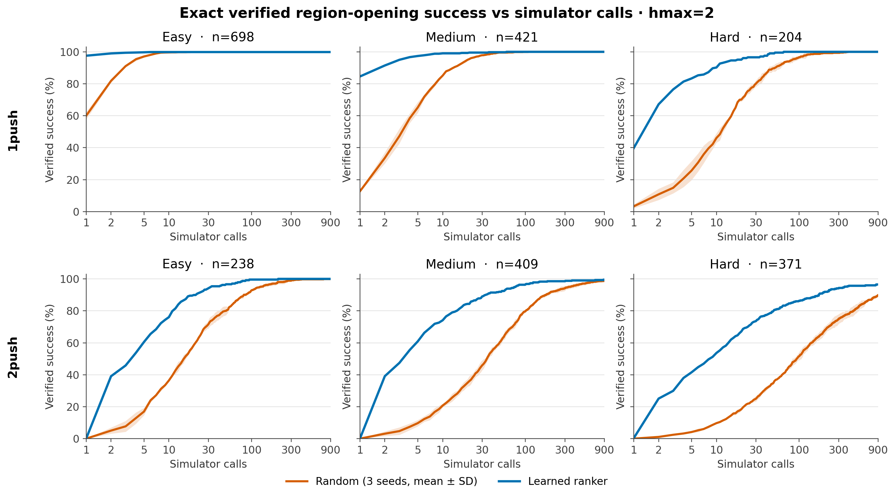

# Post-pruning canonical search — learned ranker vs seeded random at hmax=2

**Read [docs/problem_and_approach.md](../../problem_and_approach.md) first.** The model is a ranker that orders pushes for a simulator-verified search; this experiment measures whether it finds a verified opening with fewer simulator calls than random after the adopted search pruning.

## Hypotheses

With no-op child deduplication and jam-depth pruning enabled, the setup-only Colossus ranker will beat a three-seed random ranker in simulator calls on every easy/medium/hard tier of both canonical eval sets; allowing `hmax=2` on the 1-push set will also measure whether cheap two-push detours rescue ranker misses without changing the one-opening problem.

## Plan

Run the registered `namo_testset_v1` one-push key (1,323 episodes) and pure-two-push key (1,018 episodes) on Amarel with the same search: `hmax=2`, budget 900, `combine=q`, failure discount `conf` with `tau=0.15`, no-op dedupe on, and jam-depth pruning on. Evaluate the deterministic setup-only checkpoint once and random ordering at seeds 7000/8000/9000. Aggregate solve@{1,2,5,10,30,100,300,900} and simulator calls by easy/medium/hard/all; 1-push uses the fixed per-episode solve-rate bins (hard <0.05, medium <0.30, easy otherwise) and 2-push uses the registered fixed divisions file.

## Run

Committed implementation `2d8b040`, orchestration stamp `45899ba`, pilot record `aa26174`, and launcher correction `a8ccc6d`. A dedicated Amarel clone avoided the existing dirty checkout. Scratch was quota-full, so the checksum-matched setup-only checkpoint and outputs live under `/cache/home/dm1487/eval{_inputs,}/postprune_hmax2/`; checkpoint SHA256 is `3a43f5ea5fe5e553abbb1bb099f657699dda82cc2b08e079bd6a54677fc2c2b6`. The first binding build and smoke exposed that `scripts/amarel/activate.sh` changes the working directory back to the old clone; no eval ran. Rebuilding after activation with an explicit `cd` produced the dedicated-clone binding in job 59505171. Four one-scene target-box smokes (59505238–59505241) then passed for model/random × 1push/2push and recorded `hmax=2`, `dedupe_noop=true`, `prune_jam_depth=true`. The 12-scene pilots (59505343–59505346) completed in 37–38 seconds for 1push and 3:36–4:29 for 2push.

The first production matrix was jobs 59505724–59505731. Row-count validation accepted all four 2push arrays (59505725/59505727/59505729/59505731) but rejected the 1push arrays: Slurm's `--export=ALL` had inherited a stale 112-scene `MANIFEST`. The launcher now clears `MANIFEST` explicitly and sizes arrays by scene keys rather than episode counts. A first repair attempt (59507205–59507208) then exposed 882 legacy symlink paths absent on Amarel. A checksum-stamped derived key (`b19a2e500f9a035897626512bd2073b317374f486438bcd1c754b6bd45039652`) rewrites only those paths to their identical canonical XML targets already present on Amarel; it preserves all 991 scenes, 1,323 episodes, records, and difficulty labels. Clean 1push arrays 59507679–59507682 completed with zero failures. The final aggregator verified 1,323/1,018 rows per arm, unique episode keys, identical search settings across horizons, `hmax=2`, no-op dedupe on, and jam-depth pruning on.

## Result

Random entries are mean ± sample standard deviation over RNG seeds 7000/8000/9000; the model is deterministic and ran once. Difficulty is fixed, not terciles: 1push uses easy/medium/hard counts 698/421/204 from the registered solve-rate thresholds, and 2push uses registered divisions with counts 238/409/371. `s2s` is average simulator calls among solved episodes.

### 1push eval, search allowed up to two pushes

| tier | arm | n | @1 | @2 | @5 | @10 | @30 | @100 | @300 | @900 | s2s |
|---|---|---:|---:|---:|---:|---:|---:|---:|---:|---:|---:|
| easy | model | 698 | 97.6 | 99.0 | 99.7 | 99.9 | 99.9 | 99.9 | 99.9 | 99.9 | 1.0 |
| easy | random | 698 | 60.0±2.3 | 81.8±1.2 | 97.1±0.7 | 99.6±0.1 | 99.9±0.0 | 99.9±0.0 | 99.9±0.0 | 99.9±0.0 | 1.8±0.1 |
| medium | model | 421 | 84.6 | 91.4 | 97.4 | 99.0 | 99.5 | 100.0 | 100.0 | 100.0 | 1.6 |
| medium | random | 421 | 12.7±0.5 | 33.6±3.5 | 65.2±3.4 | 85.1±0.6 | 97.9±0.5 | 99.9±0.1 | 100.0±0.0 | 100.0±0.0 | 6.4±0.2 |
| hard | model | 204 | 39.7 | 67.2 | 83.3 | 90.2 | 96.6 | 100.0 | 100.0 | 100.0 | 4.6 |
| hard | random | 204 | 3.3±1.2 | 10.8±3.6 | 25.7±6.0 | 46.1±3.0 | 80.1±2.1 | 96.6±1.0 | 99.3±0.3 | 100.0±0.0 | 23.0±1.0 |
| all | model | 1,323 | 84.5 | 91.7 | 96.4 | 98.1 | 99.2 | 99.9 | 99.9 | 99.9 | 1.8 |
| all | random | 1,323 | 36.2±1.5 | 55.5±1.8 | 75.9±1.5 | 86.8±0.5 | 96.2±0.3 | 99.4±0.2 | 99.8±0.0 | 99.9±0.0 | 6.6±0.3 |

### Pure-2push eval

| tier | arm | n | @1 | @2 | @5 | @10 | @30 | @100 | @300 | @900 | s2s |
|---|---|---:|---:|---:|---:|---:|---:|---:|---:|---:|---:|
| easy | model | 238 | 0.0 | 39.1 | 60.5 | 76.1 | 94.1 | 99.6 | 100.0 | 100.0 | 9.8 |
| easy | random | 238 | 0.0±0.0 | 5.0±1.9 | 17.0±2.3 | 36.4±0.5 | 71.6±2.7 | 92.9±0.5 | 98.9±0.7 | 99.9±0.2 | 34.4±2.2 |
| medium | model | 409 | 0.0 | 39.1 | 60.9 | 74.1 | 89.0 | 96.6 | 98.5 | 99.5 | 17.7 |
| medium | random | 409 | 0.0±0.0 | 3.1±1.5 | 9.7±2.0 | 20.7±1.2 | 45.9±3.1 | 79.9±0.9 | 94.2±1.6 | 98.8±0.9 | 71.4±1.7 |
| hard | model | 371 | 0.3 | 25.1 | 41.5 | 53.6 | 73.6 | 86.3 | 94.1 | 96.5 | 39.8 |
| hard | random | 371 | 0.0±0.0 | 1.1±0.3 | 4.1±0.4 | 9.7±0.5 | 25.0±1.8 | 51.6±2.5 | 74.7±3.0 | 89.8±0.6 | 157.3±13.5 |
| all | model | 1,018 | 0.1 | 34.0 | 53.7 | 67.1 | 84.6 | 93.5 | 97.2 | 98.5 | 23.7 |
| all | random | 1,018 | 0.0±0.0 | 2.8±1.0 | 9.4±1.4 | 20.3±0.5 | 44.3±2.1 | 72.6±0.6 | 88.2±1.9 | 95.8±0.5 | 91.7±4.4 |

The largest separation is where ordering matters most. On hard 1push, model versus random is 83.3% versus 25.7±6.0% by five simulator calls and 4.6 versus 23.0±1.0 calls per solved episode. On hard 2push, it is 73.6% versus 25.0±1.8% by 30 calls, 96.5% versus 89.8±0.6% by 900, and 39.8 versus 157.3±13.5 calls per solved episode. The model reaches saturation sooner on every tier; 1push equality at the 900-call ceiling does not erase its large early-budget and simulator-efficiency advantage.

### Plots

These curves are computed from every episode's exact solve index at all integer budgets 1–900; they are not interpolated from the eight reported table cutoffs. Separate publication-size figures: [1push PNG](../plots/postprune_hmax2/success_vs_sims_1push.png), [1push PDF](../plots/postprune_hmax2/success_vs_sims_1push.pdf), [2push PNG](../plots/postprune_hmax2/success_vs_sims_2push.png), and [2push PDF](../plots/postprune_hmax2/success_vs_sims_2push.pdf). The combined figure is also available as [PDF](../plots/postprune_hmax2/success_vs_sims_both_horizons.pdf).

No wall-time comparison is claimed because the arms were parallel Slurm arrays rather than interleaved on one microarchitecture-pinned node. Machine-independent simulator calls are the comparison substrate here. Aggregates are archived locally at `/common/users/dm1487/scratch_namo/eval/postprune_hmax2/full/agg_{model,random_s7000,random_s8000,random_s9000}.json` and on Amarel under `/cache/home/dm1487/eval/postprune_hmax2/full/`.

## Verdict

**Accept.** With the adopted no-op dedupe and jam-depth pruning defaults, the learned ranker beats seeded random ordering in simulator efficiency on every fixed difficulty tier of both registered eval sets at `hmax=2`. This is the intended success criterion: the perfect simulator still verifies every candidate, while the learned heuristic puts useful pushes much earlier in the search.
