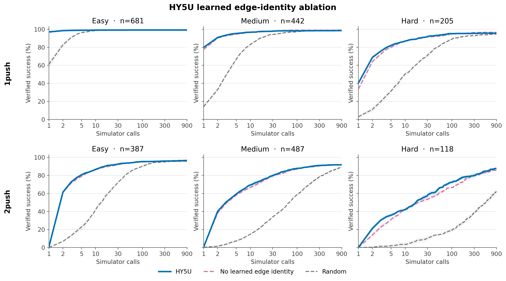

# HY5U learned edge-identity ablation

**Read [docs/problem_and_approach.md](../../problem_and_approach.md) first.** HY5U is a search heuristic that ranks candidate pushes; the simulator remains the verifier.

## Hypothesis

The learned identity assigned to each of the 60 contact slots contributes useful ordering beyond the contact's Fourier coordinates. It should matter especially at the four object corners, where two distinct face contacts have exactly the same contact pixel but execute different push directions.

## Plan

Train `HY5U-no-edge-ID` on the exact HY5U `hybrid_train_v1.h5` with the room-grouped split, setup target 0.5, unreachable-cell regression weight 0.1, complete ranking loss, 51-bin HL-Gauss head, 12 epochs, batch 256, learning rate 3e-4, and seeds 1/2/3. Remove only the learned `Embedding(60)`; retain Fourier contact coordinates, the sampled local scene feature, scene cross-attention, inter-contact self-attention, and the complete HY5U loss.

Run one full epoch on the target training box before releasing the three seeds. Require finite training and validation losses, a checkpoint, strict reload, and the `eval_scorer-load check` marker.

After training, evaluate all three seeds on the canonical fixed-physics-v3 1-push and 2-push populations using `hmax=2`, simulator budget 900, `prior=model`, `agg=mean5`, raw `q`, discount off, no-op deduplication on, and jam-depth pruning on. Reuse the registered HY5U and Random results; do not rerun either baseline. Report solve@1 for 1-push and solve@5 for 2-push by easy/medium/hard/overall, plus complete success-versus-simulator-call curves. Do not compare wall time because this is not a pinned-hardware timing run.

## Run

The target-box smoke ran on Westeros GPU 0 and passed in 1,716 seconds. It completed one full epoch at batch 256, wrote both validation and last checkpoints, passed strict reload and the scorer-load postcheck, and measured peak training allocation within the 11 GB card. The first attempt to release all three full seeds then stopped before starting any model because the new parallel-seed branch called `run_one` without a dynamically scoped `phase`; `set -u` caught the unbound variable before output directories or checkpoints were created. The dependent handoff saw that the training supervisor exited without `FLEET DONE` and correctly submitted nothing to Amarel.

The measured smoke implies roughly 5.7 hours for 12 epochs if epoch cost remains linear; the full seeds run concurrently, so the expected training wall time is 5.5–7.5 hours after restart. The Amarel evaluation remains chained behind training and has its own smoke gate.

The corrected full training started on Westeros at 2026-09-05 22:59 EDT with seeds 1/2/3 running concurrently on GPUs 0/1/2. All three completed epoch 2 without failure by 2026-09-06 00:17 EDT, with best validation losses 0.4085/0.4154/0.4020. A target-box iLab RTX 4500 Ada smoke completed successfully in 29:12, essentially matching rather than beating the 28:36 Westeros smoke, so the in-progress runs stayed on Westeros.

The Amarel full evaluation launcher was resized before handoff. The manifests contain 997 one-push and 958 two-push rooms per seed, covering 1,328 and 992 episodes. Three seeds expose 5,865 room workers, each evaluating all object/goal episodes in its room. The launcher now uses one CPU per room-seed pair, split into 115 array tasks per seed with 17 workers each: 5,865 useful CPUs, the maximum available parallelism below the 6,720-CPU user cap. The earlier 36 tasks by 21 workers per seed would have used only 2,268 CPUs.

The launcher also gates each submission against Amarel's 500-task per-user queue cap. This prevents another live array from causing a partial architecture-evaluation submission; seed arrays enter the queue as slots become available, while already accepted seeds may run concurrently.

### Recovery on 2026-09-06

All three Westeros trainings finished successfully by 04:08 EDT and selected epoch 11 (validation losses 0.3355/0.3344/0.3364). The handoff transferred and SHA256-verified all checkpoints, but stopped when seed 2 submission hit `QOSMaxSubmitJobPerUserLimit`. Its queue gate used compressed `squeue` output, counting each pending array as one job; the corrected gate uses `squeue -r` to count individual tasks.

Seed 1 array `61256744` completed all 115 tasks with zero worker errors, but produced only 1,247 one-push and 966 two-push rows. The stable shard summaries report 59 and 25 rooms skipped as already open. This is not a file-visibility race: the handoff advanced NAMO to `84e296c0`, which includes the later change of `config/wavefront_inflation.yaml` from 5 mm to 1 mm. That evaluation cannot be compared to the registered 5 mm HY5U/Random controls. The original outputs remain under `eval/hy5u_arch_no_edge_20260905` as a noncanonical attempt.

Recovery uses an isolated checkout based on the successful architecture evaluation commit `26f3ced0`, with only the current architecture launcher and its corrected task accounting added. It retains the same Sage `ceff4bf`, checkpoints, Amarel bindings, 5 mm configuration, canonical manifests, and search policy as the completed architecture controls. A new target-box smoke gates all three full seeds in fresh `eval/hy5u_arch_no_edge_20260906_recovery` output. The preceding one-room-worker campaign took at most 7:26 per task; allow approximately 10–30 minutes of execution after queueing for the 5 mm recovery, with the existing two-hour task limit. Full strict aggregation must accept 1,328/992 rows per seed before reporting.

Recovery commit `62790aab` was committed before submission. Smoke `61264661` gates seed arrays `61264662`, `61264664`, and `61264666`; aggregate jobs are `61264663`, `61264665`, and `61264667`. The queue regression check reproduced 480 queued tasks and verified that a 115-task submission waits until capacity is available. The live launch counted the three arrays as 115 tasks each and accepted every seed.

At 17:30 EDT, 119/345 full tasks had completed, 222 were running, and four were terminally preempted by SLURM: seed 2 tasks 70–72 and seed 3 task 46. Their scheduler records had already left `scontrol`, so recovery submits those exact four bundles as new arrays using the same committed evaluator and configuration. Partial files for only those bundles are moved to a separate audit directory before retry; other tasks continue untouched. The observed elapsed time exceeds the original 10–30 minute estimate, so that estimate is withdrawn.

## Result

All three seeds passed strict aggregation on exactly 1,328 one-push and 992 two-push episodes at 5 mm clearance, with no duplicate episode keys or mixed search settings. Search uses hmax=2, budget 900, mean5 aggregation, raw q, discount off, no-op deduplication and jam-depth pruning. Tables show solve percentages, mean ± sample SD across three seeds. Only simulator-call comparisons are made.

| model | 1push easy@1 | medium@1 | hard@1 | all@1 |
|---|---:|---:|---:|---:|
| HY5U | 97.1±0.5 | 79.8±0.3 | 40.2±1.2 | 82.5±0.4 |
| No learned edge identity | 96.7±0.6 | 77.6±1.1 | 33.5±2.7 | 80.6±0.6 |
| Random | 61.1±4.6 | 14.1±1.7 | 2.9±0.8 | 36.5±2.8 |

| model | 2push easy@5 | medium@5 | hard@5 | all@5 |
|---|---:|---:|---:|---:|
| HY5U | 80.6±1.6 | 59.3±0.6 | 35.9±2.1 | 64.8±0.8 |
| No learned edge identity | 79.1±0.9 | 58.0±0.8 | 31.1±1.3 | 63.0±0.8 |
| Random | 22.8±3.5 | 7.2±1.7 | 2.0±1.3 | 12.7±2.0 |

Learned contact identity helps most on hard episodes. Removing it lowers hard one-push solve@1 from 40.2% to 33.5% (−6.7 points), and hard two-push solve@5 from 35.9% to 31.1% (−4.8 points). Overall losses are 2.0 and 1.8 points, respectively. The two-push solve@900 ceiling is unchanged at approximately 93.1% versus 93.0%, so the effect is ordering efficiency. The no-edge model still substantially beats Random on every tier at these budgets. This supports keeping learned edge identity; this experiment does not isolate whether its gain comes specifically from disambiguating corner contacts.

All 345 required bundles completed successfully: 341 original tasks and four replacements (`61265859_[70-72]`, `61265860_46`). Partial preempted outputs remain in the remote `preempted_attempts/` directory. Raw rows and per-seed aggregates are mirrored under `$NAMO_SCRATCH/eval/hy5u_arch_no_edge_20260906_recovery/full/HY5U_no_edge_s{1,2,3}/`; `provenance.json` records checkpoint, binary, and configuration hashes. The optional curve JSON export initially stopped the monitor after plot generation because it requires a time axis too; rerunning the existing plotter with the intended simulator-call axis produced the final comparison JSON and all plots.

## Verdict

Keep learned edge identity. Its measured contribution is smaller overall than the global-readout or ranking-loss effects, but clear on hard one-push episodes and beneficial on hard two-push episodes. Corner-specific attribution remains untested.
