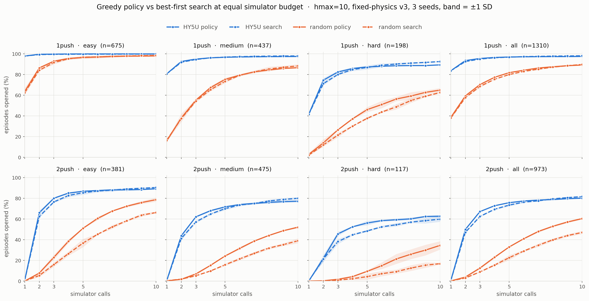

# HY5U as a policy: what the ranker is worth with the search switched off

**Read [docs/problem_and_approach.md](../../problem_and_approach.md) first.** HY5U is the ranker that orders which pushes the search tries. This card removes the search entirely and asks what the ranker's own first choice is worth, executed for real.

## Question

Run the ranker as a policy: score the live state, take its top push, simulate it for real, check whether the region opened, repeat up to K times. No simulate-and-undo, no queue, no backtracking, so the ranker never gets a second guess at the same state. How far does that get on the canonical v3 one-push and two-push populations at K=5 and K=10, split by difficulty?

## Definition

Policy mode is `scripts/sandbox/eval_reactive_argmax.py`: push *i* is `argmax Q(s_{i-1}, ., H)` over the reachable pushes of the labeled blocking object at the live state, executed with `env.step`, graded by the canonical region criterion (`goal_open_pts`, at least 20 of the 100 s0-sampled goal-region points reachable). Early stop on open, or when the candidate pool empties. Cost is exactly the push index, one simulator call per push.

Two properties of the harness that shape the run:

- **One rollout at `--max-pushes 10` answers K=5 and K=10 both.** Each leaf records `opened_at`, the push index the region opened at (0 = never), so cumulative open@1 through open@10 come from the same trajectory. A separate K=5 job would be a duplicate.
- **`--h` is inert here.** `live_scorer.score_ctx` only passes a budget token when `network.budget_cond` is set; HY5U reports `budget_cond=False`, confirmed in the smoke, so the first-push query budget changes nothing.

## Plan
_(Claude, 2026-08-22)_

**Population.** Fixed-physics v3, identical to the registered search rows: 1,328 one-push episodes (easy 681 / medium 442 / hard 205) and 992 genuine two-push (387 / 487 / 118), resolved through `namo.eval_sets`. Tiers by the same rule `agg_search_eval.py` uses: `bin_of(solve_rate)` for one-push, the `division` field for two-push.

**Arms.** HY5U seeds 1/2/3 and uniform random seeds 7000/8000/9000, both horizons, K=10. Random makes no model call, and beating random is the success bar.

**Box.** Amarel `main`, one CPU per shard, `scripts/slurm/policy_argmax_amarel.slurm`. Amarel's `.so` carries `src_tree=9ca4a6e` / `cpp_tree=7e6e802`, byte-identical to this checkout's C++ trees and to the build that produced the v3 search numbers. Nothing between `d32ec06` (the v3 eval commit) and this run touches `src/`, `include/`, `best_first_search.py`, or `live_scorer.py`.

**Validation gates.**

1. One-push policy open@1 must reproduce the registered search solve@1. Same quantity: with `combine=q` the search's first pop is the argmax of the same pool at the same state.
2. Two-push policy open@1 must be near zero, by construction.
3. Episode counts must land on the population minus a small skip count, with zero unmatched rows.

## Run
_(Claude, 2026-08-22)_

Three campaigns on Amarel `main`, 192 tasks each (16 shards per leg per arm), all 576 tasks COMPLETED, zero failures.

| campaign | what | output |
|---|---|---|
| 60754573-8 | policy, K=10, no jam guard | `eval/policy_v3_20260822/` |
| 60754805-10 | policy, K=10, jam guard on | `eval/policy_v3_jamguard_20260822/` |
| 60755003-8 | best-first search, `hmax=10 sim_budget=10` | `eval/search_h10_b10_20260822/` |

Sizing came from a smoke (jobs 60754561/2, one middle shard per leg per arm): 81-85 s per ~10-xml shard, of which ~70 s is torch import plus checkpoint load and only 7-11 s is rollout. A push costs ~0.2 s, so the worst K=10 episode is ~3.5 s and there is no straggler to shard around. Median task in the full run was 133 s.

**Gate 1 passed exactly.** On the common episode set, one-push policy open@1 and search solve@1 are both 83.7±0.3, and per tier 97.9 / 80.7 / 41.6 in both harnesses. Before intersecting the populations the counts already matched to a tenth of an episode (661.0 / 352.5 / 82.3 policy against 661.0 / 352.6 / 82.3 search). The two harnesses pick the same first push. Gate 2: two-push open@1 is 0.4%, matching the search. Gate 3: zero unmatched rows in every aggregation.

**Common episode set.** Policy mode skips 18 one-push and 19 two-push episodes the search harness keeps, so every number below is scored on the intersection, 1,310 one-push and 973 two-push, for the same reason `aquaman_agg_common.py` exists.

**Two things had to be fixed before the numbers meant anything.**

*The policy locked up.* Replaying 20 failed easy-two-push episodes with per-step logging: 2.2 distinct pushes across 10 steps, 8.75 of 10 pushes moving the object under 5 mm, and 45% of episodes picking the identical push all ten times. Hard one-push was worse, 1.95 distinct and 50%. The mechanism is a hard cycle. A jammed push leaves the state untouched, so re-ranking that identical state returns the identical argmax, forever. The random arm never stalls (6.4 distinct, 0% single-push), which is why it overtook HY5U on easy two-push at ten pushes in the unguarded run. Random is not ranking better, it just cannot get stuck. The search has `dedupe_noop` and `prune_jam_depth` for exactly this; policy mode had no equivalent. Ported as a per-state ban list, cleared when the object actually moves, which is the search opening a fresh child board. Effect on the identical episodes: unchanged through push 3, then hard two-push at ten calls 42.7 → 62.7 and hard one-push 75.8 → 89.4.

*The depth caps did not match.* The registered search runs `hmax=2` and cannot emit a plan longer than two pushes at any budget, while the policy runs to ten. So policy open@k against the registered solve@k is only like-for-like at k≤2. The `hmax=10 sim_budget=10` legs fix that, and they cost less than the registered run because every episode stops by ten calls.

## Result + Verdict
_(Claude, 2026-08-22)_ Numbers on the common set, three seeds, mean ± sample SD. Both methods spend one simulator call per push, so open@k and solve@k sit on one budget axis.

**1push (n=1310)**

| tier | n | method | @1 | @2 | @3 | @5 | @10 |
|---|---:|---|---:|---:|---:|---:|---:|
| easy | 675 | HY5U policy | 97.9±0.5 | 99.6 | 99.8 | 100.0 | 100.0 |
| easy | 675 | HY5U search | 97.9±0.5 | 99.3 | 99.6 | 99.8 | 99.9 |
| medium | 437 | HY5U policy | 80.7±0.3 | 92.7 | 95.0 | 96.7 | 97.5 |
| medium | 437 | HY5U search | 80.7±0.3 | 91.9 | 94.6 | 96.9 | 98.0 |
| hard | 198 | HY5U policy | 41.6±1.2 | 74.6 | 82.5 | 87.4 | 89.4 |
| hard | 198 | HY5U search | 41.6±1.2 | 71.2 | 80.1 | 86.9 | 92.6 |
| all | 1310 | HY5U policy | 83.7±0.3 | 93.5 | 95.5 | 97.0 | 97.5 |
| all | 1310 | HY5U search | 83.7±0.3 | 92.6 | 95.0 | 96.8 | 98.2 |
| all | 1310 | random policy | 38.5±1.5 | 59.4 | 70.4 | 81.8 | 89.2 |
| all | 1310 | random search | 38.1±1.6 | 57.7 | 68.6 | 80.0 | 89.7 |

**2push (n=973)**

| tier | n | method | @2 | @3 | @5 | @10 |
|---|---:|---|---:|---:|---:|---:|
| easy | 381 | HY5U policy | 66.1±2.1 | 80.1 | 86.8 | 89.2 |
| easy | 381 | HY5U search | 62.4±1.6 | 76.5 | 85.4 | 90.4 |
| medium | 475 | HY5U policy | 43.8±1.1 | 62.1 | 71.7 | 77.2 |
| medium | 475 | HY5U search | 41.2±1.7 | 57.2 | 70.0 | 80.0 |
| hard | 117 | HY5U policy | 21.9±3.2 | 45.6 | 56.1 | 62.7 |
| hard | 117 | HY5U search | 21.4±3.0 | 38.2 | 48.4 | 59.8 |
| all | 973 | HY5U policy | 49.9±0.7 | 67.1 | 75.7 | 80.1 |
| all | 973 | HY5U search | 47.1±0.8 | 62.5 | 73.4 | 81.6 |
| all | 973 | random policy | 3.9±0.9 | 12.5 | 32.9 | 60.4 |
| all | 973 | random search | 3.0±0.7 | 8.8 | 22.6 | 47.0 |

_(Regenerate with `scripts/rl_loop/plot_policy_vs_search.py`; per-point means and SDs in `policy_vs_search.json` beside it.)_

**Verdict [on numbers].**

**The queue buys nothing under about five simulator calls, and the dive buys a little.** At matched depth and budget the greedy policy leads best-first search from k=2 to k=5 on every tier of both horizons, by 2.8 to 4.6 points on two-push all. The search overtakes by k=10 on most tiers (two-push all 81.6 against 80.1). The crossover sits between 5 and 10 calls, which is the shape you would expect: committing to a chain is efficient while calls are scarce, and rollback only earns its cost once there is budget to spend on it.

**The exception is hard two-push, where the policy leads the whole way** and the search never catches it inside ten calls: 45.6 against 38.2 at three, 56.1 against 48.4 at five, 62.7 against 59.8 at ten. On the tier where openings are rarest, spending every call on depth beats spreading them across siblings.

**Diving is a two-push phenomenon, not a general one.** Random policy against random search is near-identical on one-push (89.2 vs 89.7 at ten) and a rout on two-push (60.4 vs 47.0 all, 34.5 vs 16.8 hard). A two-push episode needs depth by definition, and a randomly-ordered queue spends most of a ten-call budget at depth 1.

**hmax=10 over hmax=5 is worth 4.4 points on two-push all** (75.7 → 80.1) and 0.5 on one-push. In the unguarded run the same comparison read 62.7 → 63.3, which was the lock-up, not the horizon.

**The ranker still carries the result.** HY5U policy against random policy at five calls: two-push all 75.7 vs 32.9, hard 56.1 vs 9.4. Removing the search does not remove the need for the ordering.

## Next

The policy tops out at what ten calls can reach; the registered `hmax=2` search at budget 900 gets two-push all to 93.0. A fair large-budget comparison would need the search at `hmax=10` with a real budget, which this card did not run.

Worth testing: whether the jam guard helps the *search* too. It has `dedupe_noop` per board, but a jammed edge learned on one board is not carried to another.

## Discussion
_(you <-> Claude — ask here; I answer inline, dated `**[who YYYY-MM-DD]**`. Newest at the bottom.)_
