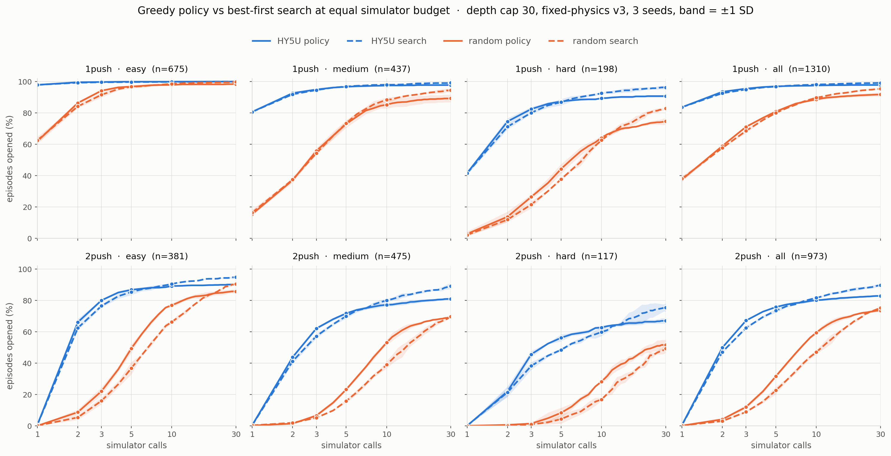

# HY5U as a policy: what the ranker is worth with the search switched off

**Read [docs/problem_and_approach.md](../../problem_and_approach.md) first.** HY5U is the ranker that orders which pushes the search tries. This card removes the search entirely and asks what the ranker's own first choice is worth, executed for real.

## Question

Run the ranker as a policy: score the live state, take its top push, simulate it for real, check whether the region opened, repeat up to K times. No simulate-and-undo, no queue, no backtracking, so the ranker never gets a second guess at the same state. How far does that get on the canonical v3 one-push and two-push populations at K=5 and K=10, split by difficulty?

## Definition

Policy mode is `scripts/sandbox/eval_reactive_argmax.py`: push *i* is `argmax Q(s_{i-1}, ., H)` over the reachable pushes of the labeled blocking object at the live state, executed with `env.step`, graded by the canonical region criterion (`goal_open_pts`, at least 20 of the 100 s0-sampled goal-region points reachable). Early stop on open, or when the candidate pool empties. Cost is exactly the push index, one simulator call per push.

Two properties of the harness that shape the run:

- **One rollout at `--max-pushes 10` answers K=5 and K=10 both.** Each leaf records `opened_at`, the push index the region opened at (0 = never), so cumulative open@1 through open@10 come from the same trajectory. A separate K=5 job would be a duplicate.
- **`--h` is inert here.** `live_scorer.score_ctx` only passes a budget token when `network.budget_cond` is set; HY5U reports `budget_cond=False`, confirmed in the smoke, so the first-push query budget changes nothing.

## Plan
_(Claude, 2026-08-22)_

**Population.** Fixed-physics v3, identical to the registered search rows: 1,328 one-push episodes (easy 681 / medium 442 / hard 205) and 992 genuine two-push (387 / 487 / 118), resolved through `namo.eval_sets`. Tiers by the same rule `agg_search_eval.py` uses: `bin_of(solve_rate)` for one-push, the `division` field for two-push.

**Arms.** HY5U seeds 1/2/3 and uniform random seeds 7000/8000/9000, both horizons, K=10. Random makes no model call, and beating random is the success bar.

**Box.** Amarel `main`, one CPU per shard, `scripts/slurm/policy_argmax_amarel.slurm`. Amarel's `.so` carries `src_tree=9ca4a6e` / `cpp_tree=7e6e802`, byte-identical to this checkout's C++ trees and to the build that produced the v3 search numbers. Nothing between `d32ec06` (the v3 eval commit) and this run touches `src/`, `include/`, `best_first_search.py`, or `live_scorer.py`.

**Validation gates.**

1. One-push policy open@1 must reproduce the registered search solve@1. Same quantity: with `combine=q` the search's first pop is the argmax of the same pool at the same state.
2. Two-push policy open@1 must be near zero, by construction.
3. Episode counts must land on the population minus a small skip count, with zero unmatched rows.

## Run
_(Claude, 2026-08-22)_

Five campaigns on Amarel `main`, 1,056 tasks, all COMPLETED, zero failures.

| campaign | what | output |
|---|---|---|
| 60754573-8 | policy, K=10, no jam guard | `eval/policy_v3_20260822/` |
| 60754805-10 | policy, K=10, jam guard on | `eval/policy_v3_jamguard_20260822/` |
| 60755003-8 | best-first search, `hmax=10 sim_budget=10` | `eval/search_h10_b10_20260822/` |
| 60757899-904 | policy, K=30, jam guard on | `eval/policy_v3_k30_20260822/` |
| 60757905-62 | best-first search, `hmax=30 sim_budget=30` | `eval/search_h30_b30_20260822/` |

Sizing came from a smoke (jobs 60754561/2, one middle shard per leg per arm): 81-85 s per ~10-xml shard, of which ~70 s is torch import plus checkpoint load and only 7-11 s is rollout. A push costs ~0.2 s, so the worst K=10 episode is ~3.5 s and there is no straggler to shard around. Median task in the full run was 133 s.

**Gate 1 passed exactly.** On the common episode set, one-push policy open@1 and search solve@1 are both 83.7±0.3, and per tier 97.9 / 80.7 / 41.6 in both harnesses. Before intersecting the populations the counts already matched to a tenth of an episode (661.0 / 352.5 / 82.3 policy against 661.0 / 352.6 / 82.3 search). The two harnesses pick the same first push. Gate 2: two-push open@1 is 0.4%, matching the search. Gate 3: zero unmatched rows in every aggregation.

**Common episode set.** Policy mode skips 18 one-push and 19 two-push episodes the search harness keeps, so every number below is scored on the intersection, 1,310 one-push and 973 two-push, for the same reason `aquaman_agg_common.py` exists.

**Two things had to be fixed before the numbers meant anything.**

*The policy locked up.* Replaying 20 failed easy-two-push episodes with per-step logging: 2.2 distinct pushes across 10 steps, 8.75 of 10 pushes moving the object under 5 mm, and 45% of episodes picking the identical push all ten times. Hard one-push was worse, 1.95 distinct and 50%. The mechanism is a hard cycle. A jammed push leaves the state untouched, so re-ranking that identical state returns the identical argmax, forever. The random arm never stalls (6.4 distinct, 0% single-push), which is why it overtook HY5U on easy two-push at ten pushes in the unguarded run. Random is not ranking better, it just cannot get stuck. The search has `dedupe_noop` and `prune_jam_depth` for exactly this; policy mode had no equivalent. Ported as a per-state ban list, cleared when the object actually moves, which is the search opening a fresh child board. Both flags default on for BOTH priors, so the random arm gets the identical treatment.

The guard's payoff is 4x to 20x larger for the argmax than for random, which is the lock-up mechanism confirmed from a second direction: only a deterministic policy can cycle, and random already escapes by accident. Gain at ten calls, same episodes:

| leg | tier | HY5U | random |
|---|---|---:|---:|
| 2push | all | +16.9 | +1.4 |
| 2push | hard | +19.9 | +4.6 |
| 1push | all | +4.2 | +0.2 |
| 1push | hard | +13.6 | +2.4 |

It also removes an artifact: unguarded, random beat HY5U on easy two-push at ten calls (77.0 vs 74.4). Guarded, it is 78.7 vs 89.2. That reversal was HY5U being stuck, not random ranking well.

*The depth caps did not match.* The registered search runs `hmax=2` and cannot emit a plan longer than two pushes at any budget, while the policy runs to ten. So policy open@k against the registered solve@k is only like-for-like at k≤2. The `hmax=10 sim_budget=10` legs fix that, and they cost less than the registered run because every episode stops by ten calls.

## Result + Verdict
_(Claude, 2026-08-22)_ Numbers on the common set (1,310 one-push, 973 two-push), three seeds, mean ± sample SD, depth cap 30 on both methods. Both spend one simulator call per push, so open@k and solve@k sit on one budget axis.

**1push (n=1310)**

| tier | n | method | @2 | @3 | @5 | @10 | @30 |
|---|---:|---|---:|---:|---:|---:|---:|
| easy | 675 | HY5U policy | 99.6 | 99.8 | 100.0 | 100.0 | 100.0 |
| easy | 675 | HY5U search | 99.3 | 99.6 | 99.8 | 99.9 | 100.0 |
| medium | 437 | HY5U policy | 92.7 | 95.0 | 96.7 | 97.5 | 97.8 |
| medium | 437 | HY5U search | 91.9 | 94.6 | 96.9 | 98.0 | 99.2 |
| hard | 198 | HY5U policy | 74.6 | 82.5 | 87.4 | 89.4 | 90.7 |
| hard | 198 | HY5U search | 71.2 | 80.1 | 86.9 | 92.6 | 96.3 |
| all | 1310 | HY5U policy | 93.5 | 95.5 | 97.0 | 97.5 | 97.9 |
| all | 1310 | HY5U search | 92.6 | 95.0 | 96.8 | 98.2 | 99.2 |
| all | 1310 | random policy | 59.0 | 71.2 | 80.9 | 88.6 | 91.8 |
| all | 1310 | random search | 57.7 | 68.6 | 80.0 | 89.7 | 95.5 |

(one-push open@1 = solve@1 = 83.7±0.3 for HY5U in both harnesses, per tier 97.9 / 80.7 / 41.6.)

**2push (n=973)**

| tier | n | method | @2 | @3 | @5 | @10 | @30 |
|---|---:|---|---:|---:|---:|---:|---:|
| easy | 381 | HY5U policy | 66.1 | 80.1 | 86.8 | 89.2 | 90.2 |
| easy | 381 | HY5U search | 62.4 | 76.5 | 85.4 | 90.4 | 94.8 |
| medium | 475 | HY5U policy | 43.8 | 62.1 | 71.7 | 77.2 | 81.0 |
| medium | 475 | HY5U search | 41.2 | 57.2 | 70.0 | 80.0 | 89.1 |
| hard | 117 | HY5U policy | 21.9 | 45.6 | 56.1 | 62.7 | 67.0 |
| hard | 117 | HY5U search | 21.4 | 38.2 | 48.4 | 59.8 | 75.5 |
| all | 973 | HY5U policy | 49.9 | 67.1 | 75.7 | 80.1 | 82.9 |
| all | 973 | HY5U search | 47.1 | 62.5 | 73.4 | 81.6 | 89.7 |
| all | 973 | random policy | 4.1 | 12.0 | 31.6 | 59.4 | 73.6 |
| all | 973 | random search | 3.0 | 8.8 | 22.6 | 47.0 | 75.3 |

_(Regenerate with `scripts/rl_loop/plot_policy_vs_search.py --kmax 30`; per-point means and SDs in `policy_vs_search.json` beside it. The 10-call version is at `plots/policy_vs_search/`.)_

**Consistency check across the two policy campaigns.** HY5U's K=30 run reproduces its K=10 run exactly at every k≤10 (one-push all 83.7 / 93.5 / 95.5 / 97.0 / 97.5 in both), which is what a deterministic argmax must do: the longer rollout's prefix IS the shorter rollout. The random arms differ by up to a point (one-push @1 37.5 vs 38.5) because a longer episode draws more from the same RNG stream and shifts every later episode's draws. Expected, and it bounds the run-to-run noise on the random lines.

**Verdict [on numbers].**

**The policy wins the first five calls and then saturates; the search keeps converting budget into solves.** Two-push all-tier, the policy leads by 2.8 at k=2, 4.6 at k=3 and 2.3 at k=5, is passed by k=10 (80.1 vs 81.6), and finishes 6.8 behind at k=30 (82.9 vs 89.7). One-push is the same shape with a smaller gap. The mechanism is not subtle: the policy cannot abandon a chain. Once its pushes have wrecked the state, extra calls are spent in a state no ranking can rescue, while the search can drop the branch and start elsewhere.

**The crossover is where the engineering decision lives.** Under about five calls the queue costs more than it returns, and greedy diving is the better use of a scarce verifier. Past ten, backtracking is worth its overhead. On hard two-push the crossover is later (the policy still leads at k=10, 62.7 vs 59.8) and the search only pulls clear by 30, 75.5 vs 67.0.

**Diving is a two-push phenomenon.** Random policy against random search is close on one-push at 30 calls (91.8 vs 95.5, search ahead) and level on two-push (73.6 vs 75.3), but the policy is far ahead in the 3-to-10 range on two-push (12.0 vs 8.8, 31.6 vs 22.6, 59.4 vs 47.0). A two-push episode needs depth, and a randomly-ordered queue spends its early budget at depth 1. Given enough calls the queue catches up.

**The ranker still carries the result.** HY5U policy against random policy at five calls: two-push all 75.7 vs 31.6, hard 56.1 vs 8.3. Removing the search does not remove the need for the ordering.

## Next

The policy's ceiling at 30 calls is 82.9 on two-push all, against the registered `hmax=2` search's 93.0 at budget 900. Whether the policy's ceiling is the state it ruins or simply the depth cap is untested; a K=100 rollout would separate those.

Worth testing: whether the jam guard helps the *search* too. It has `dedupe_noop` per board, but a jammed edge learned on one board is not carried to another.

## Discussion
_(you <-> Claude — ask here; I answer inline, dated `**[who YYYY-MM-DD]**`. Newest at the bottom.)_
