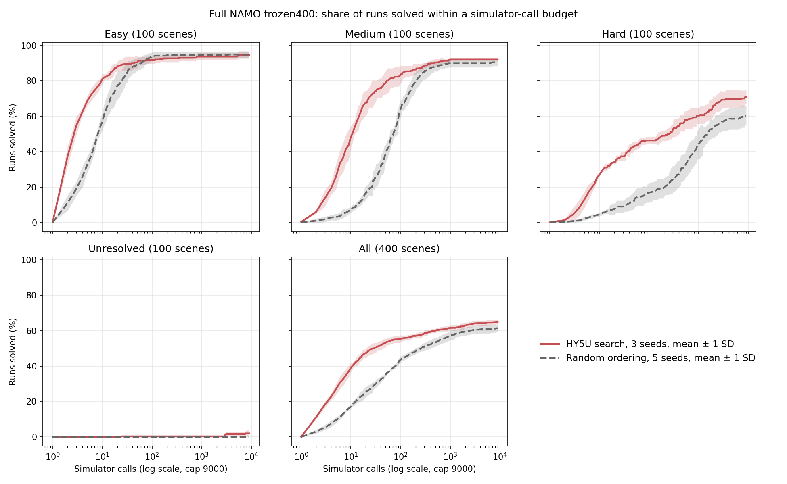

# Full NAMO rerun after the goal-picture fix

## Why

Every HY5U_s2 Full NAMO number from Tri-An's 2026-09-12 campaign drew the model's goal picture around the final XML goal, even on hops where the robot first had to open a different room. The fix binds the local goal once per opening (namo `e3621da3`, Sage `5e871ab`). Those numbers are invalid until rerun. [USER] Rerun all 400 frozen scenes with three HY5U seeds; no policy mode, no timing.

## Plan

Population: Tri-An's frozen400 Full NAMO manifest (sha256 `d534b2b6`), 100 easy, 100 medium, 100 hard, 100 unresolved. Arms: HY5U_s1, HY5U_s2, HY5U_s3 best-first search (shuffle seed 7000). The launch also ran uniform Random with shuffle seeds 7000, 8000, 9000, 10000, 11000, because the current code includes the 2026-09-12 room-finding change (`e460511c`) that Tri-An's Random runs did not have.

[USER 2026-09-14 06:27] Random dropped mid-run. The bug only touched the model's input, so Tri-An's five Random seeds (`input/full_namo/provenance/random5-outcomes.jsonl`, sha256 `18bbd86c`) and the frozen tiers stay the baseline.

Settings copy Tri-An's reference helper (`candidate_campaign.py:222-230`): 9000 simulated pushes shared across the whole problem, region depth 2, 5 push distances, 100 goal samples with 20 reachable, goal clearance on, Tri-An's `namo_config.yaml` (sha256 `a58e885f`, robot trajectory collision checks on) with its 1 mm `wavefront_inflation.yaml` (sha256 `f8ab35e1`). Untimed; per-run statistics off.

Runner: `scripts/pipeline/run_full_namo_rerun.py`, launched per scene by `scripts/slurm/full_namo_rerun.slurm`. Report: `scripts/pipeline/report_full_namo_rerun.py` (`2eb32b53`), which refuses to run unless all three HY5U arms have all 400 scenes from the expected code. CS smoke on scene 0: HY5U_s2 solved in 3 pushes, Random s7000 in 9, peak memory about 1 GB.

## Run

Amarel root `/scratch/dm1487/full_namo_rerun_20260914`. CS copy `$NAMO_SCRATCH/eval/full_namo_rerun_20260914/` with `results/<arm>/scene_NNNN.json`, the inputs, job logs, `report.json` and `report.md`. Tracking board: Notion "Full NAMO rerun".

Array `61584770` launched at `d94322c9`: 400 tasks, 8 arms per scene on 8 CPUs. Some Amarel `halk` nodes failed to read the shared checkout under load, which gave 61 Random rows a wrong source fingerprint and failed 3 tasks. `f6665e66` makes the runner write such rows to `.rejected` instead of saving them, and later jobs excluded `halk`.

At 06:26 Claude cancelled 106 tasks to drop Random. 58 of them still had HY5U runs going: a safety check printed the missing rows but did not stop the cancel. Those 58 scenes reran HY5U-only as array `61585973` at `9b1c6e51`, with the fingerprint check on. The last run finished at 07:37.

All 1,200 HY5U rows share source fingerprint `22577f4a`, binding `cc2d2e9e`, Sage scorer source `12c59973`, config `a58e885f` and inflation `f8ab35e1`; checkpoints are `ac43f004` (s1), `3cf348cf` (s2, the file Tri-An used) and `c596b09b` (s3). Zero rows were rejected. The rows record three commits (`d94322c9`, `f6665e66`, `9b1c6e51`). Between them only the runner's row check, the SLURM file and the two repo car configs changed, and this run loaded Tri-An's config copy instead of those, so the search code and inputs are the same for every row.

## Result

Success vs simulator calls: HY5U's band sits above Random's at every budget on hard and overall. On easy, Random catches up near 50 calls and stays about 1-2 points ahead until the cap; on medium the curves meet near 1000 calls. Drawn by `report_full_namo_rerun.py --plot`; bands are ±1 sample SD across seeds.

Solved, percent of runs within 9000 calls. Seed ranges in brackets.

| | easy | medium | hard | unresolved | all |
|---|---:|---:|---:|---:|---:|
| HY5U, 3 seeds | 94.7 [93-97] | 92.0 [91-93] | 71.0 [67-75] | 2.0 [1-4] | 64.9 [63.5-66.0] |
| Random, 5 seeds | 94.8 [93-97] | 90.4 [88-93] | 60.4 [56-70] | 0.0 | 61.4 [59.8-65.0] |
| HY5U_s2 before fix | 95.0 | 91.0 | 70.0 | 1.0 | 64.2 |
| HY5U_s2 after fix | 97.0 | 91.0 | 75.0 | 1.0 | 66.0 |

Median simulator calls until solved. A failed run counts as infinite, so ">9000" means most runs failed. Seed values in brackets.

| | easy | medium | hard | unresolved | all |
|---|---:|---:|---:|---:|---:|
| HY5U, 3 seeds | 3 [3, 3, 4] | 11 [12.5, 9, 11] | 245.5 [409, 148, 221] | >9000 | 28.5 |
| Random, 5 seeds | 9 [7.5-9.5] | 71.5 [61-84] | 1503.5 [795.5-2225.5] | >9000 | 256 |
| HY5U_s2 before fix | 4 | 10 | 339.5 | >9000 | 31 |
| HY5U_s2 after fix | 3 | 9 | 148 | >9000 | 21.5 |

Solved within 30 and within 300 calls, percent of runs.

| | easy @30 | medium @30 | hard @30 | easy @300 | medium @300 | hard @300 |
|---|---:|---:|---:|---:|---:|---:|
| HY5U, 3 seeds | 89.7 | 74.0 | 37.3 | 92.7 | 88.7 | 52.7 |
| Random, 5 seeds | 84.2 | 24.4 | 9.0 | 94.4 | 85.4 | 24.2 |
| HY5U_s2 before fix | 90.0 | 73.0 | 36.0 | 94.0 | 90.0 | 49.0 |
| HY5U_s2 after fix | 94.0 | 76.0 | 40.0 | 95.0 | 87.0 | 57.0 |

Per scene, who needs fewer calls: HY5U's median over 3 seeds against Random's median over 5, and HY5U_s2 after the fix against before (same seed).

| | easy | medium | hard | unresolved | all |
|---|---:|---:|---:|---:|---:|
| HY5U fewer / same / more than Random | 76 / 8 / 16 | 85 / 0 / 15 | 73 / 21 / 6 | 1 / 99 / 0 | 235 / 128 / 37 |
| s2 after fix fewer / same / more than before | 37 / 49 / 14 | 33 / 37 / 30 | 39 / 35 / 26 | 1 / 98 / 1 | 110 / 219 / 71 |

**HY5U needs far fewer simulator calls than Random on every tier Random can solve.** Median calls until solved are 3 vs 9 on easy, 11 vs 71.5 on medium and 245.5 vs 1503.5 on hard, and the seed ranges do not overlap on any of them. On hard, 37.3% of HY5U runs finish within 30 calls against 9.0% for Random (Random's best seed: 15%). Scene by scene, HY5U needs fewer calls on 235 scenes and more on 37 (sign test p < 0.001).

**The solve-rate gain is smaller and less certain.** Within the 9000-call cap, HY5U and Random tie on easy (94.7 vs 94.8) and are close on medium (92.0 vs 90.4). On hard HY5U solves 71.0% against 60.4%, but Random's own seeds span 56-70, so the best Random seed nearly matches the HY5U mean. HY5U solves 6 of 300 unresolved runs; Random's 0% there is by construction.

**The goal fix helped HY5U_s2, mostly on hard scenes.** Same checkpoint, same seed: solved scenes went from 257 to 264 (17 gained, 10 lost), and median calls on hard fell from 339.5 to 148. After the fix HY5U_s2 needs fewer calls on 110 scenes and more on 71 (p = 0.005). Easy improved (37 vs 14) and hard leaned the same way (39 vs 26, p = 0.14); medium did not move (33 vs 30). Only 131 of 400 runs are identical across the fix, while Random rows stay identical on 1,536 of 1,716 across the same code change, so the fix causes most of the difference, not the code version.

**HY5U_s1 is the weak seed on hard.** It solves 67 with median 409 calls, against 75 and 148 for s2 and 71 and 221 for s3. Tri-An's campaign used s2, the strongest seed.

Caveats:

- Random's tier numbers come from the same five runs that chose the tiers. Random is 0% on unresolved by definition, and its easy and hard numbers carry that selection too. A fresh set of Random seeds would remove this bias; this run did not do that.
- Each Random seed is one fixed push ordering reused on every scene. `best_first_region_opening.py:614,712` builds `np.random.default_rng(self.seed)` fresh for each local search, and `best_first_search.py:234` scores candidates with `rng.random()` in pool order. UNVERIFIED HYPOTHESIS: that is why seed 7000 is so much stronger on hard (70 solved) than seeds 8000-11000 (56-60).
- Random ran on the frozen code `25c921b`. Random rows this rerun saved on the new code before Random was dropped agree on solved or failed for 1,711 of 1,716 runs and have identical call counts on 1,536. Recomputing the tiers from them keeps 295 of 300 scenes (4 medium become easy, 1 easy becomes hard).
- No horizon split. Every frozen400 scene starts two hops from the goal, and Tri-An did not refresh horizon labels (`horizon_pattern: not_refreshed`).
- Simulator calls only. No wall time.
