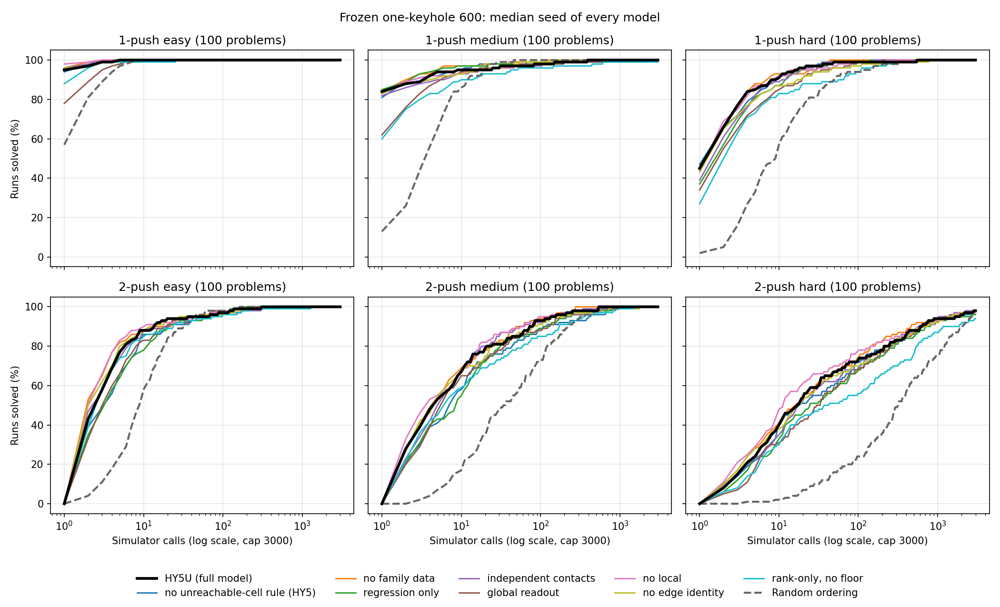

# HY5U ablations on the frozen one-keyhole 600

## Why

The registered HY5U ablations were measured on testset v3 at 5 mm, and the 5 mm results are no longer used. [USER 2026-09-14] The ablations are the one set of results to redo at 1 mm, on Tri-An's 600 one-keyhole problems, search only, and with rank-only's no-floor version added.

## Plan

Population: `one_keyhole_frozen600_20260912_v1` (manifest sha256 `bb01f360`), `canonical_1mm`. 300 one-push and 300 two-push problems, each 100 easy, 100 medium and 100 hard. Tiers come from an exhaustive per-problem certificate, expected trials E = (N+1)/(S+1): easy E <= 3, medium E <= 15, hard above.

Arms, 3 seeds each, all shuffle seed 7000: HY5U; HY5 (no unreachable-cell rule); no-family; regression-only; independent contacts; global readout; no-local; no edge identity; rank-only no-floor. The first 24 checkpoints are the exact files in `eval/policy_group_ablations_20260907/plan.json`, SHA256-checked; rank-only no-floor is `aquaman/round0/rankonly_20260912/models/HY5U_rank_only_nofloor_s{1,2,3}/checkpoints/epoch011-*.ckpt`. That is 27 arms x 600 problems = 16,200 runs. Random stays Tri-An's five uniform seeds on this set (`references-v1/random_s*`, frozen code `25c921b`).

Protocol copies Tri-An's one-keyhole campaign helper: best-first search (`eval_bestfirst._evaluate_pooled_task`), up to 2 pushes, 3000 simulator calls, mean5, raw q, discount off, no-op dedupe and jam pruning on, each problem's frozen target points and door objects, solved when 20% of the target points are reachable (`eval_m3.goal_open_pts`), Tri-An's `namo_config.yaml` (`a58e885f`) with 1 mm inflation (`f8ab35e1`), also used as the scorer's render config. Untimed, statistics on.

Runner: `scripts/pipeline/run_one_keyhole_frozen.py`, a port of Tri-An's `evaluate_frozen_one` including the certificate-v1 restore for 11 problems, launched by `scripts/slurm/one_keyhole_frozen.slurm`. Gate before the full launch: rerun HY5U_s2 on a sample and compare solved and call counts with Tri-An's `references-v1/HY5U_s2_search`, and run every arm once.

## Run

Amarel root `/scratch/dm1487/keyhole600_ablations_20260914`; CS copy `$NAMO_SCRATCH/eval/keyhole600_ablations_20260914/` with `results_amarel/`, `results_arrakis/`, the inputs, `report.json` and `report.md`. Tracking board: Notion "Full NAMO rerun", cards titled "Keyhole ablations".

Validation on Amarel before launch: HY5U_s2 on 55 sample problems matched Tri-An's saved runs on solved for all 55 and on call count for 54 (815 vs 814), and all 27 arms ran on 2 problems. A zero-push scan found 4 problems (37, 46, 77, 348, all easy) where today's room finder sees different door objects than the frozen tasks; the runner keeps the frozen objects and records the live set (`0d271566`).

Array `61591107` at `0d271566`: 480 tasks x 14 CPUs, halk nodes excluded, 08:40-09:19. 16,065 rows saved, zero rejected. The other 135 runs were refused by the identity check: on Amarel's build, 5 problems (40, 277, 373, 463, 504) do not start in the certified state. The same 5 were refused on rlab1 (SLURM `314872`) but start exactly as certified on arrakis, so those 135 runs ran there (CPU only, 16 workers, all saved). UNVERIFIED HYPOTHESIS: a system math library difference changes how those scenes settle; torch, the room snapshot, and the runner itself were each ruled out on arrakis.

All 16,200 rows share source fingerprint `22577f4a`, config `a58e885f` and inflation `f8ab35e1`. Report and plots: `scripts/pipeline/report_one_keyhole_frozen.py`.

Shared copy for plotting (2026-09-14): `/common/users/shared/robot_learning/dm1487/namo/ranking/results/ablations_fullnamo_2026-09-14/one_keyhole_600_ablations/`, with every run, Tri-An's baselines, a one-line-per-run `runs.csv` and a README; readable by tdn39. The CS scratch and Amarel copies stay in place.

## Result

Per-ablation plots against HY5U and Random, with worst-to-best seed bands, are `../plots/keyhole600_ablations_20260914/<arm>_vs_HY5U.png`.

Headline, percent of runs with worst-to-best seed in brackets. @1 and @5 mean solved within 1 and within 5 simulator calls.

| Model | 1-push hard @1 | 1-push all @1 | 2-push hard @5 | 2-push all @5 | 2-push hard median calls | Solved within 3000, all |
|---|---:|---:|---:|---:|---:|---:|
| HY5U | 44.0 [39-48] | 74.4 [71.7-76.0] | 26.3 [24-31] | 51.7 [50.3-53.3] | 16.5 | 99.7 |
| HY5, no unreachable-cell rule | 44.3 [38-48] | 73.6 [72.7-74.7] | 22.3 [20-25] | 43.9 [41.7-46.0] | 20.5 | 99.6 |
| no family data | 44.7 [43-47] | 75.1 [73.7-77.7] | 27.7 [27-28] | 54.4 [53.7-55.0] | 15 | 99.6 |
| regression only | 37.7 [36-40] | 72.6 [71.3-74.3] | 23.3 [22-24] | 43.9 [43.7-44.3] | 25.5 | 99.4 |
| independent contacts | 39.3 [38-41] | 71.9 [71.7-72.3] | 23.0 [22-24] | 49.8 [48.7-50.7] | 19.5 | 99.7 |
| global readout | 35.0 [30-41] | 59.2 [58.7-60.3] | 18.0 [13-23] | 43.8 [42.0-45.7] | 33 | 99.7 |
| no local | 44.3 [44-45] | 74.9 [74.0-76.3] | 28.0 [26-29] | 55.4 [55.3-55.7] | 12 | 99.4 |
| no edge identity | 42.0 [38-45] | 73.1 [69.7-75.3] | 27.7 [27-28] | 54.1 [52.7-56.0] | 18 | 99.5 |
| rank-only, no floor | 28.0 [24-33] | 59.1 [58.3-60.7] | 16.7 [15-19] | 45.0 [42.0-47.0] | 36.5 | 98.9 |
| Random, 5 seeds | 2.8 [0-6] | 23.5 [15.0-28.7] | 1.4 [0-4] | 11.7 [7.3-18.0] | 355 | 99.0 |

Full tables for every horizon and tier (solved within 1, 5, 30 and 3000 calls, median calls, and per-problem fewer/same/more calls against HY5U) are in `report.md`.

**Every model reaches the ceiling; the ablations differ only in how fast.** Within 3000 calls all arms solve 98.9-99.7% of runs, and every tier except 2-push hard is at or near 100%. The differences sit in the first 30 calls.

**Three ablations clearly hurt two-push problems.** On 2-push all @5, removing the unreachable-cell rule (HY5, 43.9), training with regression only (43.9) and the global readout (43.8) all fall below HY5U's worst seed (50.3). The global readout also hurts one-push problems: 59.2 at @1 against 74.4, with no seed overlap. On 2-push hard, median calls go from 16.5 for HY5U to 20.5, 25.5 and 33.

**Rank-only without the floor is the worst trained model.** 1-push all @1 59.1 against 74.4, 2-push hard @5 16.7 against 26.3, and it leaves 6% of 2-push hard runs unsolved at 3000 calls against 2% for HY5U. That is close to Random's 5.8%.

**Independent contacts costs a little.** 1-push hard @1 39.3 against 44.0 and 2-push all @5 49.8 against 51.7, with seed ranges touching HY5U's at the edges.

**Three ablations do not hurt here, and two look slightly better.** No family data (2-push all @5 54.4 [53.7-55.0]) and no local (55.4 [55.3-55.7]) sit just above HY5U's best seed (53.3); no edge identity (54.1 [52.7-56.0]) overlaps it. On one-push problems all three match HY5U.

**Against the 5 mm testset-v3 results, three findings hold and three change.** Regression-only (v3 2-push all @5 46.1 vs 64.8), no-unreachable (51.2) and global readout (42.5) were clearly worse there and still are. Edge identity no longer helps: v3 had no-edge worse on hard 1-push @1 (33.5 vs 40.2) and hard 2-push @5 (31.1 vs 35.9), and here both sit within seed noise. Independent contacts cost 5.3 points on v3 and costs 1.9 here. No-family (65.1 vs 64.8) and no-local (63.6 vs 64.8) were level with HY5U on v3 and sit slightly above it here.

Checks:

- HY5U_s2 on the rerun code matches Tri-An's frozen-code HY5U_s2 on solved for 599 of 600 problems and on call count for 594.
- Leaving out the 4 problems with changed door objects moves no arm's overall solve rate at one decimal.
- Random is Tri-An's frozen-code runs, not rerun. Unlike Full NAMO, the tiers here come from exhaustive certificates, so Random's numbers carry no tier-selection bias.
- Simulator calls only, no wall time.
