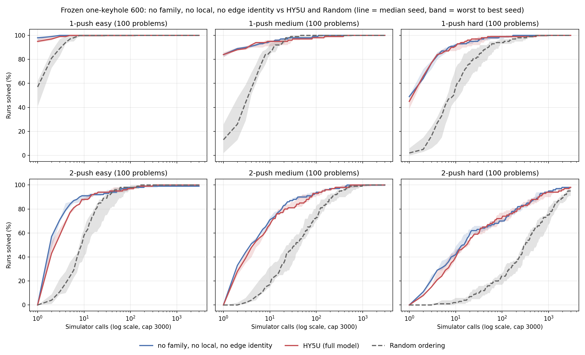
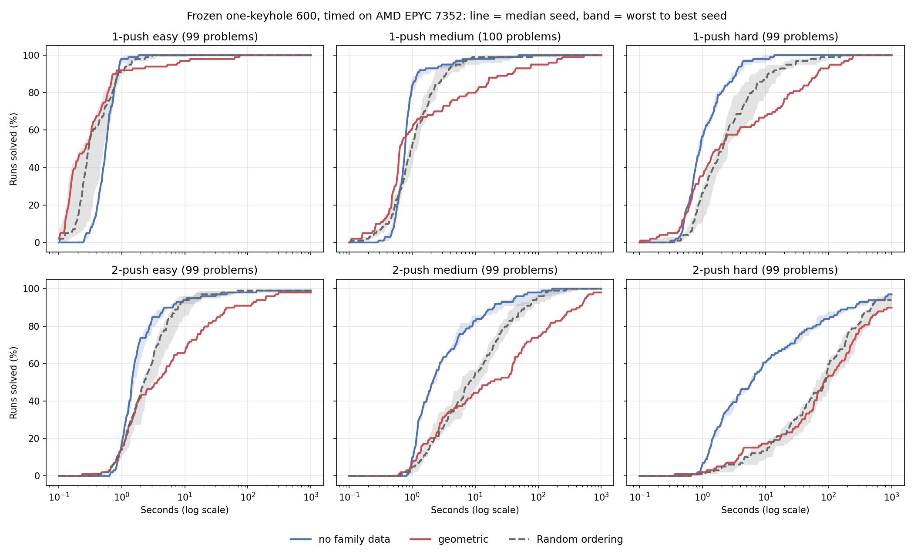
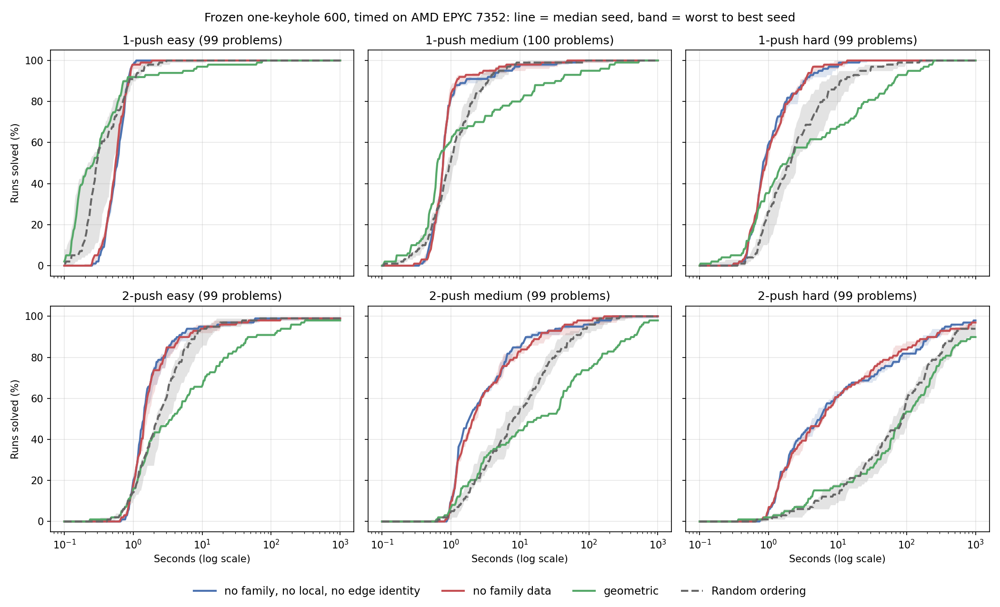

# HY5U without the family loss, local feature sampling or contact-index embedding

## Why

[USER 2026-09-15] Train a model with no family loss, no local feature sampling and no edge identity, all three at once, 3 seeds on the best GPU we can get. Run inference for this model alone on Amarel, on the 1 mm one-keyhole set with 300 1-push and 300 2-push problems at 3000 simulator calls: once for simulator calls, once timed. No HY5U or Random controls get timed. Keep a Notion kanban board. "No family" means the registered no-family ablation (family margin loss off, same data), chosen by the user over dropping family boards from the training data.

On that set each change alone matched or slightly beat HY5U on two-push problems ([EXP-2026-09-14-keyhole600-ablations](EXP-2026-09-14-keyhole600-ablations.md)). This run removes all three.

## Plan

Training copies HY5U and the single ablations: `scripts/rl_loop/run_hy5u_arch_ablations_cs.sh` arm `HY5U_no_family_local_edge` sets `EGMM_LAMBDA=0 NAMO_USE_LOCAL=0 NAMO_USE_EDGE_EMBED=0 NAMO_GLOBAL_READOUT=0`. Everything else is shared: `aquaman/round0/hybrid_train_v1.h5`, `train_q2_round2.py`, 12 epochs, batch 256, `NAMO_GAMMA=0.5`, `NAMO_UNREACH_W=0.1`, grouped episode batches kept on (as in the registered no-family arm, so only the loss changes), `RANK_LAMBDA=0.1`, `LOWER_RANK_LAMBDA=0.05`, edge self-attention on, action motion off, seeds 1-3, best validation checkpoint. One 1-epoch smoke on seed 1 runs first. With local sampling and the index embedding both off, a contact's token is only the Fourier encoding of its position; `python/tests/test_action_motion.py` checks that reordering the contacts only reorders the scores.

GPUs: arrakis RTX 6000 Ada, one seed each. The only faster GPUs we can reach, ilab4's 8 RTX 5000 Blackwell, are all in use, and Amarel's GPUs are Ada or Ampere and in maintenance. Each seed gets 4 data-loader workers instead of 6, because another user's jobs hold about 18 of arrakis's 32 cores; that changes only the random data order.

Amarel is in maintenance from 2026-09-15 08:00 to 2026-09-16 23:59, so inference moved to the CS cluster [USER 06:50, chosen over queueing on Amarel].

Sim-count test: `scripts/pipeline/run_one_keyhole_frozen.py` exactly as in the keyhole600 ablations (search, 3000 calls per problem, statistics on), on the CS cluster, with the problems a node refuses run on arrakis. Results slot into the `hy5u-ablations-keyhole600-1mm-v1` table next to HY5U, no-family, no-local, no edge identity and Random.

Timed tests [USER 06:40, 06:50]: first the registered no-family model right away, then the new model. Tri-An's timed Random and geometric keyhole runs used Amarel's Platinum 8358 nodes in his container build, so they cannot be compared with CS timings; Random seeds 7000-11000 and geometric get timed again next to no-family. The best-first search already records total, simulator and scoring time when `record_timing` is on; the keyhole runner had it off. `--timed` (commit `cf64a879`) turns timing on and statistics off and runs one unit at a time in the runner process with every thread pool at 1 and CPU scoring. `scripts/slurm/one_keyhole_timed_cs.sbatch` runs one job per node on rlab3, rlab4 and ilab3, the three idle nodes with the same CPU (AMD EPYC 7352, 2 sockets of 24 cores, 16 L3 cache groups of 3 cores). Each job starts 16 processes, each pinned to the first CPU of its own cache group. The 5,400 (problem, arm) units are shuffled with seed 20260915 and dealt across the 48 processes, so every model runs on every node at every time and background load from other users falls on all models alike. Each row records host, CPU model, pinned CPU and load average. No-family rows must match the untimed keyhole600 rows' result and call count; Random rows are checked against Tri-An's Random rows, and geometric against his geometric rows.

## Run

A first version of this card planned only no-local plus no edge identity (commit `e8f2ac4d`, arm `HY5U_no_local_no_edge`). Its smoke started at 05:44 on arrakis GPU 0, which another user had just started using, so I stopped it and relaunched on GPUs 1-3 at 05:45. [USER 05:47] stopped that run about 2 minutes in, before any model trained, and asked for the three-change model instead. Both partial smoke folders stay under `$NAMO_SCRATCH/aquaman/round0/architecture_no_local_no_edge_20260915/`.

Training: worktree `ktamp/namo-train-ablation-20260915` pinned at `fc34b320`, output `$NAMO_SCRATCH/aquaman/round0/architecture_no_family_local_edge_20260915/`, launched 06:36 with `GPU_LIST="0 4 0"` because another user held GPUs 1-3. The smoke passed at 06:49 (one epoch in 13 minutes, `EGMM_LAMBDA=0.0` in the log, scorer-load check OK) and the three seeds started. Seed 3 shared GPU 0 with seed 1 and had not finished an epoch after 15 minutes while seed 2, alone on GPU 4, had; when GPU 3 freed up I stopped seed 3, moved its partial folder to `aborted_gpu0_shared/`, and restarted it at 07:06 alone on GPU 3 with the launcher's exact environment, calling `train.slurm` directly. The supervisor log will therefore list seed 3 as failed.

Timed no-family, Random and geometric: worktree `ktamp/namo-keyhole-timed-20260915` pinned at `cf64a879` with its own copy of `build_python`, output `$NAMO_SCRATCH/eval/keyhole600_timed_cs_20260915/` (`arms.json`, `rows/`, `slot_logs/`, `logs/`), source fingerprint `ff07e56f`. That fingerprint differs from the untimed keyhole600 runs' `22577f4a` only through `scripts/pipeline/eval_full_namo_walltime.py`, which the keyhole search does not use. A 6-unit smoke on arrakis and a 27-unit smoke on rlab3 (job `328354`, problems 0, 40 and 450, all 9 arms) matched the untimed no-family call counts and Tri-An's Random call counts on every compared unit; geometric took 248 calls on problem 450 against Tri-An's 249, on both boxes. Problem 40 refused to start on rlab3, as on Amarel's build. On problem 450 rlab3 took 1.28 times Tri-An's Platinum time for Random. Full jobs started 07:03 and 07:04: `328359` rlab3 (slots 16-31), `328360` rlab4 (slots 32-47), `328362` ilab3 (slots 0-15). The remote shell on ilab2 is zsh, whose arrays start at 1, so the first submit loop failed for ilab3's slot range and shifted rlab3 and rlab4 up one range; a resubmit for ilab3 with slots 32-47 (`328361`) ran 19 seconds before I cancelled it. Units in slots 32-47 finished in those 19 seconds may have been written by ilab3 and then rewritten by rlab4, and the logs `slot_32.log` to `slot_47.log` were truncated once.

Sim-count runs of the new model: seed 2 on rlab1 (`328517`, 09:04, 48 workers) saved all 595 problems; a first try on rlab7 (`328510`) sat pending because other jobs held rlab7's memory and was cancelled. Seeds 1 and 3 (`328531`, 09:17, 48 workers, two checkpoints per worker) stalled: OpenCV in each worker started one thread per CPU, the job hit the CS per-user limit of 2,000 processes and threads, and 575 units failed with `[Errno 11] Resource temporarily unavailable` and wrote `.rejected` files without rows. Seed 2's job logged the same thread warnings but no failed unit. The retry `328537` (09:32, 12 workers) redid only the missing units and finished at 09:56 with no thread errors. Problems 40, 277, 373, 463 and 504 ran directly on arrakis for all three seeds (`logs/arrakis_refused.log`, 15 rows). Output `$NAMO_SCRATCH/eval/keyhole600_no_family_local_edge_20260915/` (`arms.json`, `results_rlab1/`, `results_arrakis/`, `untimed_cs.sbatch`, `build_report.sh`).

## Result

### Simulator calls: the new model against HY5U and the single ablations (complete 09:56)

All 600 problems for all three seeds: 595 per seed on rlab1 (job `328517` for seed 2, retry `328537` for seeds 1 and 3) and problems 40, 277, 373, 463 and 504 on arrakis. Built with `report_one_keyhole_frozen.py`, which accepts both code fingerprints (`22577f4a` for the registered ablations, `ff07e56f` here; rebuilding the registered report with the edited script reproduces every table), saved to `$NAMO_SCRATCH/eval/keyhole600_no_family_local_edge_20260915/report.{json,md}`, `runs.csv` and `plots/`. Pooled over seeds, with the worst-to-best seed range in brackets.

| | 1-push solved on call 1 | 2-push within 5 calls | hard 2-push within 5 | 2-push within 30 | median calls, 2-push / hard 2-push | solved within 3000 |
|---|---:|---:|---:|---:|---:|---:|
| HY5U | 74.4 [71.7-76.0] | 51.7 [50.3-53.3] | 26.3 [24.0-31.0] | 78.9 [78.0-79.7] | 5 / 16.5 | 99.7 |
| no family | 75.1 [73.7-77.7] | 54.4 [53.7-55.0] | 27.7 [27.0-28.0] | 79.2 [78.3-80.3] | 5 / 15 | 99.6 |
| no local | 74.9 [74.0-76.3] | 55.4 [55.3-55.7] | 28.0 [26.0-29.0] | 81.7 [79.7-83.0] | 4 / 12 | 99.4 |
| no edge identity | 73.1 [69.7-75.3] | 54.1 [52.7-56.0] | 27.7 [27.0-28.0] | 78.8 [77.7-79.7] | 5 / 18 | 99.5 |
| **no family, no local, no edge identity** | 76.7 [75.7-77.7] | 57.0 [55.7-59.0] | 32.3 [29.0-37.0] | 81.3 [80.0-82.7] | 4 / 14 | 99.4 |
| Random, 5 seeds | 23.5 [15.0-28.7] | 11.7 [7.3-18.0] | 1.4 [0.0-4.0] | 46.9 [38.0-52.0] | 36 / 355 | 99.0 |

**Against HY5U's registered rows it looks clearly better on 2-push problems.** Within 5 calls it solves 57.0% of 2-push runs against HY5U's 51.7%, and its worst seed (55.7) beats HY5U's best (53.3). On hard 2-push problems within 5 calls it reaches 32.3% against 26.3%. Problem by problem, with each side's median over seeds, it needs fewer calls than HY5U on 132 of 300 2-push problems and more on 77 (sign test p = 0.0002). On 1-push problems it solves 76.7% on the first call against 74.4%, inside HY5U's seed range.

**That comparison crosses machines, and a same-machine check shrinks the gain.** The registered arms ran on Amarel's build, this model on rlab1. Problems 303 (2-push easy) and 599 (2-push hard) fail on every CS machine for every model: the new model, no-family, Random and geometric on the EPYC 7352 timing nodes, the new model on rlab1, and no-family seed 1 on arrakis (147 and 2,613 calls, identical to its EPYC 7352 rows). Every model seed solves both on Amarel. So the new model's 99.4% solved within 3000 calls against HY5U's 99.7% is the machine, and its early-call numbers are, if anything, understated. Its only other failures are problem 501 on all three seeds and problem 430 on seed 1. HY5U was not run on the CS machines [USER: no HY5U inference], but no-family was, in the timed run below, which records the same call counts. On those 595 problems, same machines:

| | 1-push on call 1 | 2-push within 5 | hard 2-push within 5 | 2-push within 30 | solved within 3000 |
|---|---:|---:|---:|---:|---:|
| no family, no local, no edge identity | 76.5 [75.5-77.5] | 57.2 [55.9-59.3] | 32.7 [29.3-37.4] | 81.4 [80.1-82.5] | 99.4 [99.3-99.5] |
| no family | 75.2 [73.5-77.9] | 54.7 [53.5-55.9] | 28.6 [26.3-30.3] | 79.2 [78.5-80.1] | 99.4 [99.3-99.5] |

Per problem the new model needs fewer calls than no-family on 116 of 297 2-push problems and more on 97 (p = 0.22), and on 159 against 126 over all 595 (p = 0.06). **Removing local sampling and the index embedding on top of no-family keeps or slightly improves the ordering; it is not clearly better.** Most of the gap to HY5U's registered rows is the no-family change itself (54.4 against 51.7 on Amarel) plus a small further gain.

### Timed no-family, Random and geometric on the CS nodes (complete 09:03)

All 5,355 timed rows saved: 595 problems for each of 9 arms. Problems 40, 277, 373, 463 and 504 refused to start on all three nodes, as on Amarel's build and rlab1, and no other unit failed. Tables from `scripts/pipeline/report_one_keyhole_timed.py`, saved to `$NAMO_SCRATCH/eval/keyhole600_timed_cs_20260915/report.{json,md}`. Ranges run over seeds: no-family 3, Random 5, geometric 1. A failed run counts as infinite time.

Median seconds until solved:

| | easy | medium | hard | all |
|---|---:|---:|---:|---:|
| 1-push, no-family | 0.55-0.57 | 0.75-0.77 | 0.84-0.96 | 0.71-0.73 |
| 1-push, Random | 0.22-0.51 | 0.88-1.18 | 1.75-2.52 | 0.82-1.03 |
| 1-push, geometric | 0.27 | 0.64 | 1.82 | 0.62 |
| 2-push, no-family | 1.43-1.59 | 1.96-2.37 | 5.57-6.37 | 1.95-2.18 |
| 2-push, Random | 2.12-3.16 | 6.05-11.60 | 64.04-108.17 | 5.93-11.93 |
| 2-push, geometric | 3.63 | 17.15 | 83.08 | 18.21 |

Solved within 1 and within 5 seconds, percent of runs:

| | 1-push 1 s | 1-push 5 s | 2-push 1 s | 2-push 5 s | 2-push hard 5 s | 2-push hard 30 s |
|---|---:|---:|---:|---:|---:|---:|
| no-family | 76.5-82.6 | 97.3-98.0 | 9.8-12.5 | 68.0-70.7 | 45.5-47.5 | 70.7-73.7 |
| Random | 48.7-58.7 | 85.9-93.3 | 4.7-8.1 | 35.0-46.1 | 6.1-11.1 | 21.2-31.3 |
| geometric | 62.4 | 77.2 | 8.4 | 35.7 | 15.2 | 26.3 |

Solved within 3000 calls: 1-push 100% for all three; 2-push no-family 98.7-99.0, Random 96.3-98.7, geometric 95.6.

**No-family is the fastest on every 2-push tier by a wide margin.** Its median time on 2-push problems is 2 seconds against 6-12 for Random and 18 for geometric, and on hard 2-push problems 6 seconds against 64-108 and 83. Within 5 seconds it solves 46-48% of hard 2-push runs; the best Random seed solves 11%.

**On 1-push problems the gap is small, and geometric's median is lowest.** Median times are 0.6-1.0 seconds for everyone, because most 1-push problems fall on the first or second push whatever the ordering. Running the network takes 33-34% of no-family's time on easy 1-push problems, against 2% for geometric's scoring, so geometric's median of 0.62 s edges out no-family's 0.71-0.73 s. On 2-push problems scoring falls to 3-4% of no-family's time. No-family still solves the most within 1 second (77-83% against 62% and 49-59%), and it is faster on hard 1-push problems (0.84-0.96 s against 1.82 and 1.75-2.52).

Checks:

- The three nodes ran at the same speed. Median seconds per simulator call, taken over runs with at least 20 calls, differ by under 5% across rlab3, rlab4 and ilab3 for every model (Random 0.237-0.250, geometric 0.281-0.294, no-family 0.342-0.354). ilab3 carried other users' load at times (load average up to 92 on 96 threads, median 17.5), rlab3 and rlab4 stayed near our own 16 processes.
- Timed no-family rows match the untimed Amarel keyhole600 rows on 570-574 of 595 problems per seed. Per seed, 3 problems changed between solved and failed, and the other 18-22 differences are call counts split evenly between more and fewer (median difference 0 or -1). Random rows match Tri-An's untimed rows on 551-561 of 595, and geometric matches his timed rows on 532 of 595. The known cross-box difference in the state restore path (`reference_crossbox_physics_identical`) fits this pattern; I did not trace individual problems. The comparison between arms is unaffected, since every arm here ran on the same nodes and build.
- 7 rows in rlab4's slots came from the 19-second duplicate job on ilab3 (same CPU model).

### Timed new model on the same CS nodes (complete 10:04)

Jobs `328532` ilab3, `328533` rlab3 and `328534` rlab4 ran 09:17 to 10:04 with the same worktree, node job, pinning and shuffle as the first timed run: the new model's three seeds plus a repeat of no-family seed 1 (`control_no_family_s1`, same checkpoint), 2,380 units, output `$NAMO_SCRATCH/eval/keyhole600_timed_cs_20260915/run2/`. All 2,380 saved; the only failures are the same 5 refused problems. The combined report is `report_with_new_model.{json,md}`.

**The repeat reproduces the first timed run.** Control no-family seed 1 matched its first-run rows in result and calls on all 595 problems, and on the 539 runs over half a second it took 0.995 of its first time at the median (80% of problems between 0.965 and 1.018; total time 0.995). Times from the two runs compare directly. The new model's timed rows also match its untimed rlab1 rows on 595 of 595 problems per seed, so rlab1 (EPYC 7413) and the EPYC 7352 nodes give identical searches.

Median seconds until solved, seed ranges:

| | 1-push easy | 1-push medium | 1-push hard | 1-push all | 2-push easy | 2-push medium | 2-push hard | 2-push all |
|---|---:|---:|---:|---:|---:|---:|---:|---:|
| no family, no local, no edge identity | 0.56-0.60 | 0.77-0.78 | 0.81-0.86 | 0.73-0.74 | 1.40-1.44 | 1.76-1.84 | 4.18-5.82 | 1.82-2.04 |
| no family | 0.55-0.57 | 0.75-0.77 | 0.84-0.96 | 0.71-0.73 | 1.43-1.59 | 1.96-2.37 | 5.57-6.37 | 1.95-2.18 |
| Random, 5 seeds | 0.22-0.51 | 0.88-1.18 | 1.75-2.52 | 0.82-1.03 | 2.12-3.16 | 6.05-11.60 | 64.04-108.17 | 5.93-11.93 |
| geometric | 0.27 | 0.64 | 1.82 | 0.62 | 3.63 | 17.15 | 83.08 | 18.21 |

Solved within 1 second on 1-push: new model 78.9-80.2%, no-family 76.5-82.6%. Within 5 seconds on 2-push: 69.0-73.4% against 68.0-70.7%. Hard 2-push within 5 seconds: 47.5-52.5% against 45.5-47.5%.

**In seconds the new model and no-family are within a few percent of each other.** The new model is slightly faster on 2-push medium and hard problems (median 1.76-1.84 s against 1.96-2.37 s, and 4.18-5.82 s against 5.57-6.37 s) and level on 1-push. Both are far ahead of Random and geometric on every 2-push tier.

**Removing local sampling and the index embedding does not make scoring cheaper.** One network call takes 0.125 s at the median for the new model and 0.126 s for no-family, and scoring is 3-5% of total time for both over all problems. Whatever time the new model saves comes from needing fewer calls.
